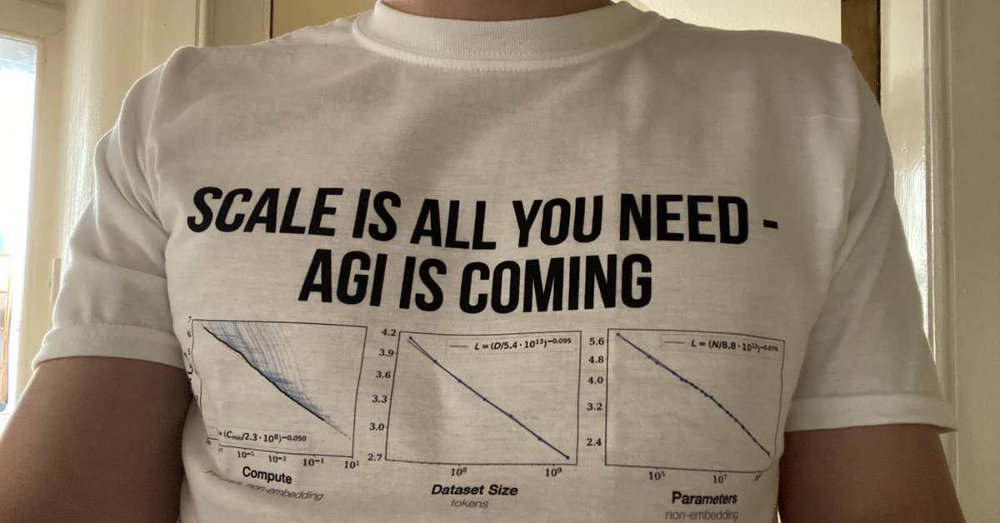
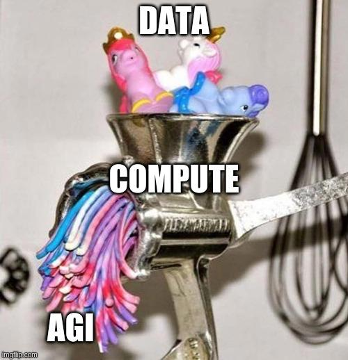

- [[newsletter-issue-9]]
	- Some think massive amounts of compute and data, and relatively few built-in rules, are the key to achieving Artificial General Intelligence (AGI), human-level intelligence.
	- 
	- Others think that AI needs to have more inbuilt rules in to achieve human level intelligence, and feeding massive amounts of compute and data into a "blank slate" isn't enough.
		- {:height 445, :width 402}
	- ### IBM Deep Blue vs Google Alpha Go Zero
		- IBM's Deep Blue chess engine was the first computer to beat a chess world champion. It heavily relied pre programmed rules, such as a database of opening moves and endgame moves chosen by chess experts
		- Google's AlphaGo was the first computer program to defeat a professional Go player.
		- Alpha Go Zero has fewer built in rules, and relies more on a technique called "reiniforcement learning", where it becomes it's own teacher by playing millions of games against itself. It starts with no knowledge about how to play the game, except basic rules