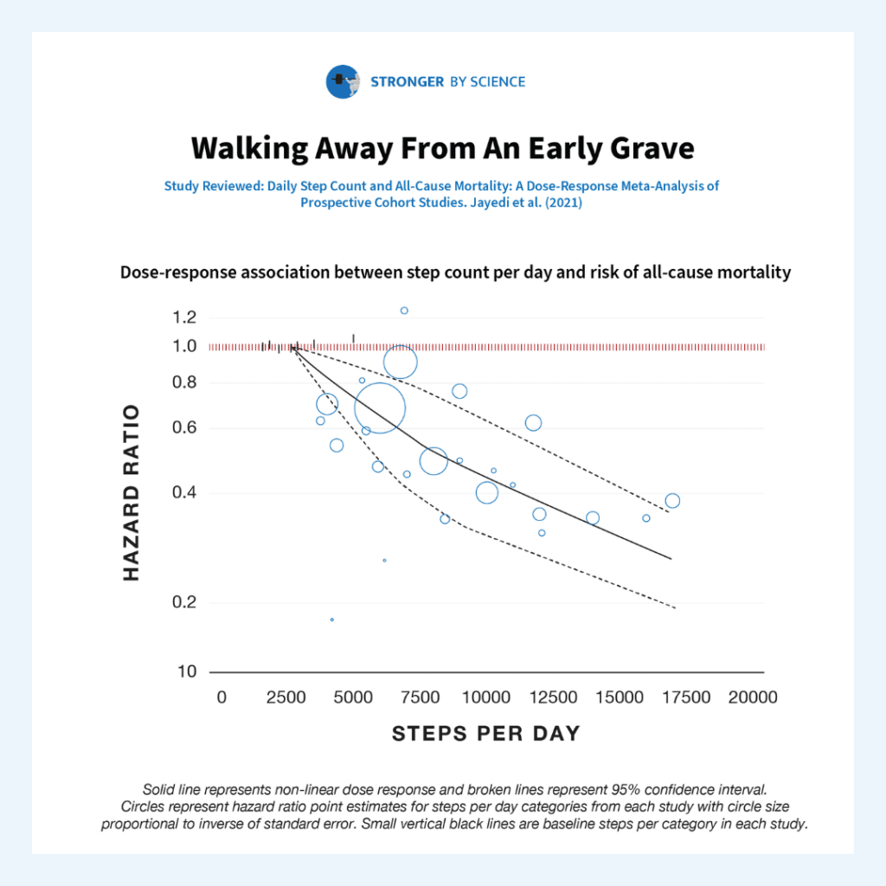

- [[newsletter/issue-11]]
	- For strength, I'm doing a bodyweight routine with resistance loop bands. I'm doing exercises like banded overhead squats, lat pull-downs and rows, and push-ups. I can feel myself getting stronger, and at my current fitness level, these workouts are still very challenging and leave me really sore the next day.
	- I used to think free weights were the only way to build muscle, since the most important aspect of
	- At one point during the SF shelter-in-place, I couldn't go anywhere in the city without a mask, which made being outside much less enjoyable. After that, I'll never talk a long walk and breath of fresh air for granted.
	- ## Dangers of being sedentary
		- When researching walking, I was shocked at how dangerous it is to be sedentary.
		- Here are some highlights from a 2021 paper ["Daily Step Count and All-Cause Mortality: A Dose-Response Meta-Analysis of Prospective Cohort Studies" by Jayedi et al.](https://pubmed.ncbi.nlm.nih.gov/34417979/) via the [Stronger by Science research spotlight](https://www.strongerbyscience.com/research-spotlight-walking/).
		- 
		- > A [recent meta-analysis](https://pubmed.ncbi.nlm.nih.gov/34417979/) sought to determine the relationship between daily step counts and all-cause mortality.
		- > The researchers found that rates of all-cause mortality were about 12% lower per 1,000 steps per day
		- > Walking 2,700 steps per day was associated with a three-fold greater risk of all-cause mortality than walking 16,000 steps per day.
		- > [Research](https://pubmed.ncbi.nlm.nih.gov/21798015/) suggests that adults in the US average ~5,100-6,500 steps per day.
		- > The present meta-analysis suggests that getting just 6,000 steps per day is associated with an all-cause mortality risk ~126% higher than the all-cause mortality risk associated with taking 16,000 steps per day.
		- > Smoking seems to be associated with ~70-80% [higher rates](https://pubmed.ncbi.nlm.nih.gov/30924901/) of [all-cause mortality](https://pubmed.ncbi.nlm.nih.gov/22688992/). Relative to people who walk 16,000 steps per day, walking just 2,700 steps per day is associated with ~200% higher rates of all-cause mortality.
		- > Higher BMIs are [associated](https://pubmed.ncbi.nlm.nih.gov/27146380/) with greater all-cause mortality risk. However, a BMI of 30 is associated with a ~4% greater all-cause mortality risk than a BMI of 23, and a BMI of 40 is associated with a ~74% greater all-cause mortality risk
		- > Thus, you could argue that being very sedentary (relative to being very active, as the standard of comparison) is a larger independent risk factor for all-cause mortality than smoking status or obesity
		-
	-