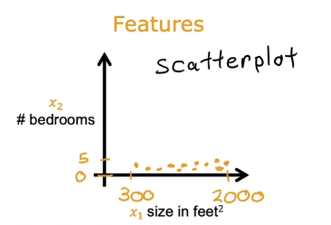
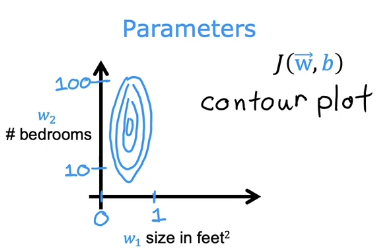
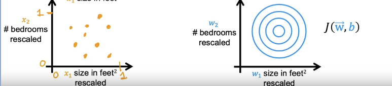
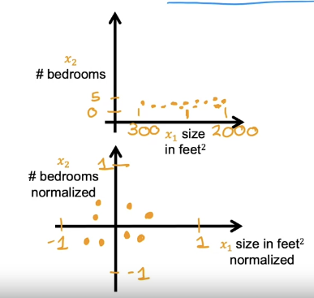
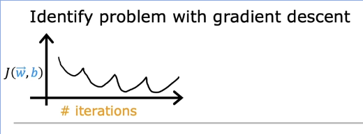
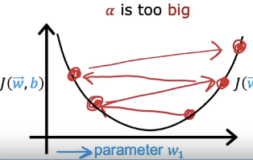

- [[deeplearning.ai/Supervised Learning/multiple-linear-regression]]
	- $x_{col}^{row}$ is the notation for features
	- TODO make flashcards for terminology
	- # Gradient descent in practice
		- ## Feature scaling
			- Consider the example of predicting the price of a house using two features
			- $x_1$ = size
				- large range, 300-2000
			- $x_2$ number of bedrooms
				- small range, 0-5
			- price = $w_1x_1 + w_2x_2 + b$
			- consider training example $x_1=2000$ , $x_2=5$, price=500k
			- What are reasonable values for $w1,w2$
			- Consider $w_1=50$, $w_2=0.1$ and $b=50$
				- $price=50*2000+.01*5+50$
				- predicted price is $100,050.5k, which is way over the true value of 500k, so it's not a good choice of parameter values
			- Consider the opposite weights $w_1=.1$, $w_2=50$ and $b=50$
				- $price=0.1*2000k+50*5+50$
				- which is 500k, which exactly predicts the true value
			- When the possible range of features is large, relative to the other features, a good model will choose a relatively small value for parameter
			- If you scatter plot the training data where the range of one of the features is much larger, you'll notice the horizontal axis is on a much larger scale
			- 
			- If you contour plot the cost function, youll notice the vertical axis has a larger range
			- This is because small changes to the narrow range, cause big changes to the cost function
			- 
			- When ranges are skewed like this, gradient descent may bounce back and forth before finding the global minimum
			- In situations like this, it's useful to scale the features
			- Scaling the features means the values range from 0-1
			- Now the features have the same range
			- 
			- This makes it easier for gradient descent to find a more direct path to the global minimum
			- ### How to scale features
				- You could divide each value by the maximum
				- So if $300 <= x_1 <= 2000$
				- Divide each value by the maximum $$\frac{x_1}{2000}$$
				- So now $0.15 <= x_{1,scaled} <= 1$
				- ### Mean normalization
					- You rescale the values centered around 0, so the values range from -1 to 1
					- 
					- First find the mean of $x_1$ and call the mean $M_1$
					- We find the mean is 600
					- $$x_1=\frac{x_1-M_1}{max-min}$$
					- In our example
					- $$x_1=\frac{x_1-600}{2000-300}$$
					- So $x_1$ now ranges from $-.18 <= x_1 <= 0.82$
				- ### Z-score normalization
					- TODO learn about standard deviation
					- TODO learn about gaussian / normal distribution
					- You calculate the standard deviation of each feature
					- Calculate the mean as well as the standard deviation
					- Standard deviation is usuallu signified by $\sigma$
					- $$x_1=\frac{x_1-M_1}{\sigma}$$
					- In this case $x_1$ ranges from $-0.67 <= x_1 <= 3.1$
				- As a rule of thumb, aim for between -1 to 1
				- Small ranges of values are ok, if it ranges from -100 to 100 you probably want to scale
				- Also, if you have a small range like -.0001 to .0001, you should rescale
				- Feature rescaling usually doesn't make things worse, so when in doubt feel free to rescale
		- ## Checking gradient descent for convergence
			- Let's learn to recognize what a well running implementation of gradient descent looks like
			- By recognizing when it's running well, it will help us choose a good learning rate $\alpha$
			- Remember the function for gradient descent
			- ((63fc3fab-4eb6-4ab7-ada2-3eb3bb8afee1))
			- difference between bold w and arrow w?
				- For representing a vector, the common notation is lower case, upright boldface type, as in **v**. The [International Organization for Standardization](https://en.wikipedia.org/wiki/International_Organization_for_Standardization) (ISO) recommends either bold italic serif, as in **v**, or non-bold italic serif accented by a right arrow, as in $\vec {v}$
			- Remember the job of gradient descent is to find parameters w and b to optimize the cost function J
			- 
			- Note, the horizontal axis is number of iterations, not a parameter
			- This graph is called the learning curve
			- Each point on the curve is a cost, with a learned value of w and b that has been learned so far
			- Ideally J should decrease after every iteration
			- If J ever increases after an iteration, it means $\alpha$ is chosen poorly, probably too large
			- We can also see after 300 iterations, the cost stops decreasing
			- When the learning curve levels off, we say gradient descent has converged
			- It's difficult to tell in advance how many iterations gradient descent needs to converge
			- ### Automatic conversion test
				- Let epison $\epsilon$ be a very small value like .001
				- If $J(\vec{w},b)$ decreases by less than $\epsilon$ in one iteration, declare convergence
				- Choosing epsilon is difficult, so you may want to look at graph instead
		- ## Choosing a learning rate
			- When looking at your learning rate, if the cost goes up and down, the learning rate may be too large.
			- {:height 201, :width 520}
			- If the learning rate is too big, the cost function may overshoot the minimum
			- 
			- Very small value of alpha should be a debugging step, since it's not effecient
			- Try a range of values, and pick one that decreases the learning rate quickly, but still converges
			-