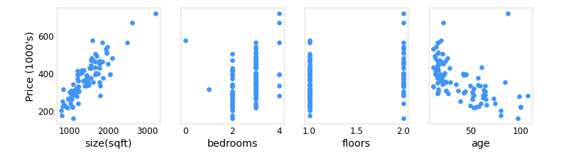

- [[deeplearning.ai/Supervised Learning/multiple-linear-regression]]
	- ## Feature scaling and learning rate lab
	  collapsed:: true
		- # Goals
			- Utilize the multiple variables routines developed in the previous lab
			- run Gradient Descent on a data set with multiple features
			- explore the impact of the *learning rate alpha* on gradient descent
			- improve performance of gradient descent by *feature scaling* using z-score normalization
		- Remember the notation
		- # ((63fc1c69-b02a-404d-a109-2c12f4de508b))
		  collapsed:: true
			- ((63fc1d44-7566-42ef-85b3-0f2cdb97a18e))
				- ((63fc1c56-34ab-425c-8520-30f954a60759))
			- ((63fc1d38-780d-4a81-a4b9-6244744b1a06))
				- ((63fc1d12-ebee-4268-b776-8caa7adaa901))
				- |$\frac{\partial J(\mathbf{w},b)}{\partial w_j}$| the gradient or partial derivative of cost with respect to a parameter $w_j$ |`dj_dw[j]`| 
				  |$\frac{\partial J(\mathbf{w},b)}{\partial b}$| the gradient or partial derivative of cost with respect to a parameter $b$| `dj_db`|
			-
		- # Predicating housing prices
			- We are predicting housing prices again based on multiple variables
			- We can plot each feature against the target price, to give an indiciation of which features have the strongest influence on the price
			- ```python
			  fig,ax=plt.subplots(1, 4, figsize=(12, 3), sharey=True)
			  for i in range(len(ax)):
			      ax[i].scatter(X_train[:,i],y_train)
			      ax[i].set_xlabel(X_features[i])
			  ax[0].set_ylabel("Price (1000's)")
			  plt.show()
			  ```
			- 
			- ### Remember gradient descent with multiple variables
				- ((63fc3fab-4eb6-4ab7-ada2-3eb3bb8afee1))
				- ((5cb7e36f-aee4-41ae-baff-90dc232b8758))
				- ((63fc4082-067a-4c88-a825-10771bedd7e5))
				- ((63fc3fea-0246-484d-9864-8e7768ab1249))
				- ((63fc4027-4f0a-474d-aa4a-ff8edb89c09e))
				- ((63fc4020-ea05-48e3-9443-1098de3f4f30))
			- The learning rate controls the size of the update to the parameters
			-
	- ## Feature Engineering
		- Choosing the right features is essential for your algorithm working well
		- Consider the depth and width of the lot size
		- instead of using depth and width as separate features, you could calculate area and use that as a feature instead
		- Creating a feature is using intuition to design new features by transforming or combining original features
		- ### Polynomial regression
			- Maybe the data doesn't show a straight line and and you want a curved one
			- You may not want a quadratic model, because the line will eventually go down
			- A cubic function will always goes up
			- $f_{\vec{w},b}(x)=w_1x+w_2x^2 + w_3x^3 + b$
			- feature scaling becomes even more important in this case
			- Another alternative is to use the square root of x
			- $f_{\vec{w},b}(x)=w_1x+w_2\sqrt{x}+ b$
			- Is less steep than cubic
			- course 2 shows different ways of choosing features
			-
			-