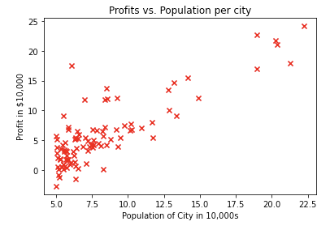

- [[deeplearning.ai/Supervised Learning/multiple-linear-regression]]
	- # Linear regression assignment [[python]]
		- What is .shape numpy
		  collapsed:: true
			- `arr = np.array([[1, 2, 3, 4], [5, 6, 7, 8]])`
				- `(2, 4)`
			- https://stackoverflow.com/questions/22053050/difference-between-numpy-array-shape-r-1-and-r
				- The best way to think about NumPy arrays is that they consist of two parts, a *data buffer* which is just a block of raw elements, and a *view* which describes how to interpret the data buffer.
				- ```
				  >>> a = numpy.arange(12)
				  >>> a
				  array([ 0,  1,  2,  3,  4,  5,  6,  7,  8,  9, 10, 11])
				  >>> a.shape
				  (12,)
				  ```
			- TODO learn numpy reshape
		- Helpful to visualize data
		- since 2d, profit and population, you can use scatter plot
		- ```python
		  # Create a scatter plot of the data. To change the markers to red "x",
		  # we used the 'marker' and 'c' parameters
		  plt.scatter(x_train, y_train, marker='x', c='r') 
		  
		  # Set the title
		  plt.title("Profits vs. Population per city")
		  # Set the y-axis label
		  plt.ylabel('Profit in $10,000')
		  # Set the x-axis label
		  plt.xlabel('Population of City in 10,000s')
		  plt.show()
		  ```
		- 
		- ## Linear Regression Refresher
			- [[deeplearning.ai/Supervised Learning/linear-regression]]
			- [[test]]
			  id:: 6406f1eb-83d3-41a7-8717-29633babc14a
			- The model function for linear regression, which is a function that maps from `x` (city population) to `y` (your restaurant's monthly profit for that city) is represented as
			- ((63bcaa99-69da-4bbe-aaac-f78cae481c4d))
			- To train A linear regression modek, find the best w and b parameters that fit your dataset
			- You can evaluate how well f and b fit your dataset using the cost function $J(w,b)$
			- The parameters w,b that fit your dataset the best are the ones that minimize the cost J
			- You can use gradient descent to find the values J(w,b) that minimize cost
		- ## Compute Cost
			- Gradient descent is repeated steps to adjust the values of (w,b) to get a smaller cost J(w,b)
			- It's helpful to monitor/graph the cost over time to monitor progress
			-
			- $$J(w,b) = \frac{1}{2m} \sum\limits_{i = 0}^{m-1} (f_{w,b}(x^{(i)}) - y^{(i)})^2$$
				- The squared term applies to the difference between the predicted value and the actual value for each example in the sum. Specifically, it means that we square the difference between the predicted value $\hat{y}^{(i)}=f_{w,b}(x^{(i)})$ and the actual value $y^{(i)}$ for each example $i$ before summing over all examples. The result of the sum is the total squared error of the model's predictions.
			- You can think of $f_{w,b}(x^{(i)})$  as the model's prediction of your restaurant's profit, as opposed to $y^{(i)}$, which is the actual profit that is recorded in the data.
			- For linear regression with one variable, the prediction of the model $f_{w,b}$ for an example $x^{(i)}$ is representented as:
			- $$ f_{w,b}(x^{(i)}) = wx^{(i)} + b$$
			- This is a straight line with intercept $b$ and slope $w$
			- ```python
			  # UNQ_C1
			  # GRADED FUNCTION: compute_cost
			  
			  def compute_cost(x, y, w, b): 
			      """
			      Computes the cost function for linear regression.
			      
			      Args:
			          x (ndarray): Shape (m,) Input to the model (Population of cities) 
			          y (ndarray): Shape (m,) Label (Actual profits for the cities)
			          w, b (scalar): Parameters of the model
			      
			      Returns
			          total_cost (float): The cost of using w,b as the parameters for linear regression
			                 to fit the data points in x and y
			      """
			      # number of training examples
			      m = x.shape[0] 
			      
			      # You need to return this variable correctly
			      total_cost = 0
			      
			      ### START CODE HERE ###
			          for i in range(m):
			          pred = w*x[i] + b
			          costi = (pred - y[i])**2
			          total_cost += costi
			          total_cost = total_cost / (2 * m)
			      ### END CODE HERE ### 
			  
			      return total_cost
			  ```
			- [[Python]] iterate over list
				- ```python
				  # Python3 code to iterate over a list
				  list = [1, 3, 5, 7, 9]
				    
				  # Using for loop
				  for i in list:
				      print(i)
				  ```
				- Use `enumerate` to get the index of the array
				- ```python
				  for idx, x in enumerate(xs):
				      print(idx, x)
				  ```
		- ## Compute Gradient Descent
			- Remember:
				- ((63fc19c1-cff0-4283-b8f3-a6bbf1e9bf8f))
					- ((63fc19c1-da89-4653-a16e-378a268c7618))
					- ((63fc19c1-78f4-402e-8c9c-42e3f22e5b9c))
					- ((63fc19c1-2a98-44ea-a4ac-df0d0874f94d))
				- ((63fc19c1-805d-4c85-8449-aac39f1fa61a))
					- ((63ca5105-a634-4e43-a44c-0b7607724217))
					- ((63ca5105-103e-460b-93d6-1371828893da))
				-
			- ```python
			  # UNQ_C2
			  # GRADED FUNCTION: compute_gradient
			  def compute_gradient(x, y, w, b): 
			      """
			      Computes the gradient for linear regression 
			      Args:
			        x (ndarray): Shape (m,) Input to the model (Population of cities) 
			        y (ndarray): Shape (m,) Label (Actual profits for the cities)
			        w, b (scalar): Parameters of the model  
			      Returns
			        dj_dw (scalar): The gradient of the cost w.r.t. the parameters w
			        dj_db (scalar): The gradient of the cost w.r.t. the parameter b     
			       """
			      
			      # Number of training examples
			      m = x.shape[0]
			      
			      # You need to return the following variables correctly
			      dj_dw = 0
			      dj_db = 0
			      
			      ### START CODE HERE ###
			      for i in range(m):
			          predict = w * x[i] + b - y[i]
			          dj_db += predict
			          dj_dw += predict * x[i]
			          
			      dj_dw = dj_dw/m
			      dj_db = dj_db/m
			      
			      ### END CODE HERE ### 
			  
			      return dj_dw, dj_db
			  ```