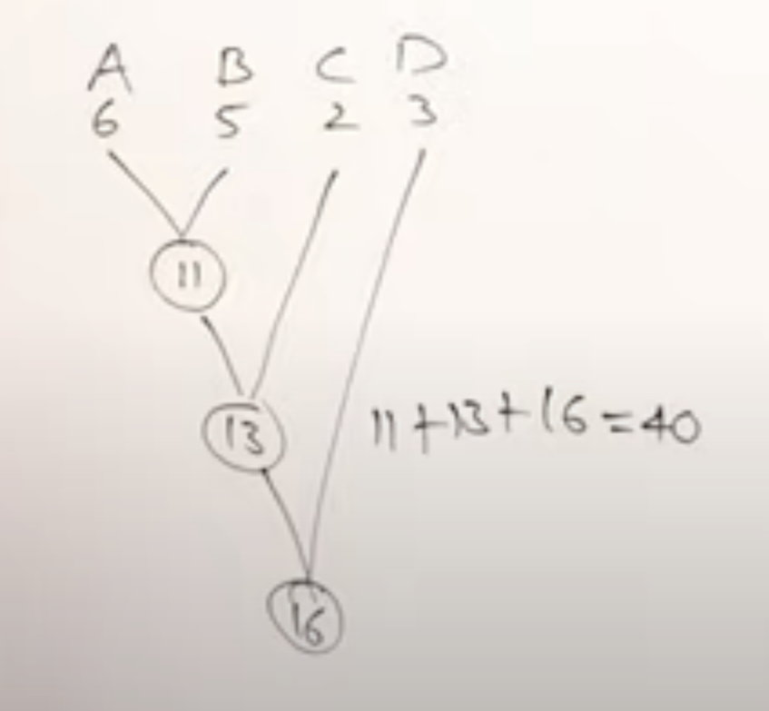
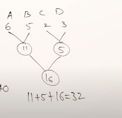
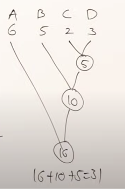
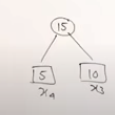
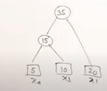
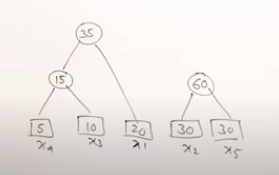
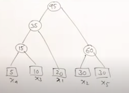

- [[abdul bari algorithms/greedy]]
  collapsed:: true
	- {{video https://youtu.be/HHIc5JZyenI}}
	- This can be solved with the greedy method
	- Think about having two sorted lists and combining them into a third sorted list
	- `a=[3,8,12,20]`
	- `b=[5,9,11,16]`
	- Merged is `c=[3,5,8,9,11,12,16,20]`
	- The total time is $O(m+n)$
	- What happens if you have more than two lists?
	- Consider merging two lists, then mergin in another and so own
	- Consider lists of different sizes, a=sizE 6, b = size 5, c = size 2, d = size 3
	- {:height 471, :width 500}
	- Total time spent merging is `11 + 13 + 16 + 40`
	- 
	- 11 + 5 + 16 = 32 total time
	- 
	- 16 + 10 + 5 = 31 total time
	- {{youtube-timestamp 285}} You always select the two smallest lists to merge first, which will reduce the total merging time
	- Consider lists of the following sizes `x1=20, x2=30, x3=10,x4=5,x5=30`
	- {{youtube-timestamp 371}} First sort the lists by increasing size
	- Select the smallest pairs of arrays:
	- select the two smallest ,which are x4 and x3, merge into a new list of size 15
	- 
	- {{youtube-timestamp 387}} Now we have a new array of size 15, and the others.
	- We merge 20, with the newly merged array 15, since it's the smallest, and get a newly merged array of 35
	- 
	- {{youtube-timestamp 414}} Now we merge the two arrays of size 30, into a new array of 60
	- 
	- {{youtube-timestamp 430}} Then we combine the final two merged arrays into a final list of size 95
	- 
	- {{youtube-timestamp 438}} What is the total cost of merging?
	- 15 + 35 + 95 + 60 = 205
	-
- [[test]]