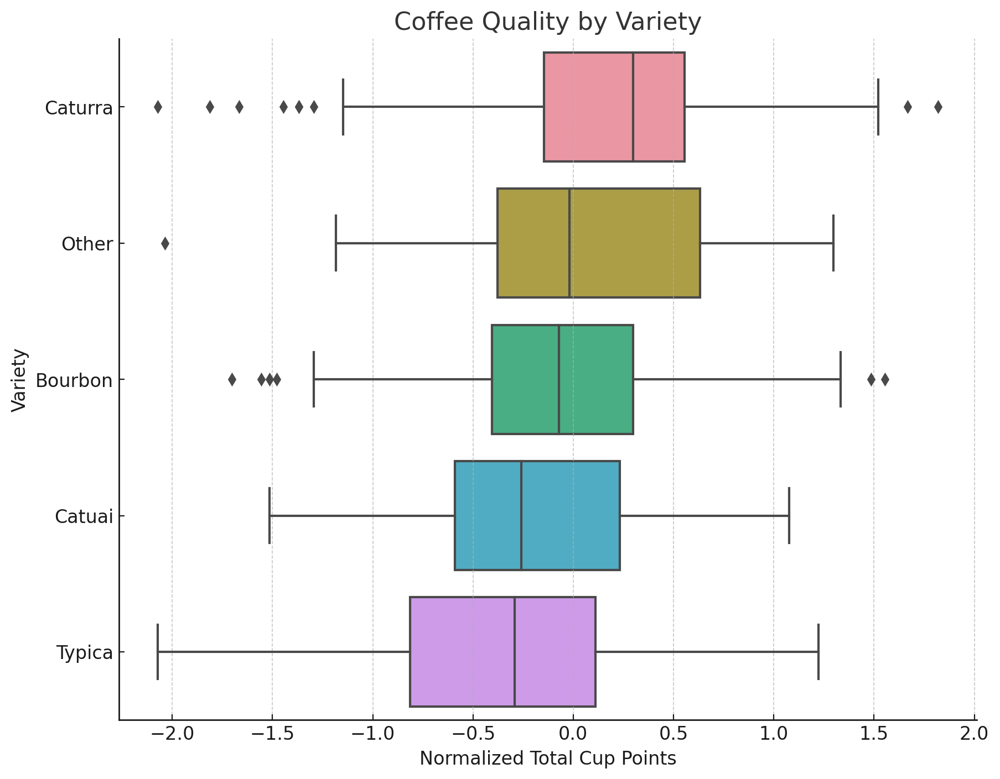
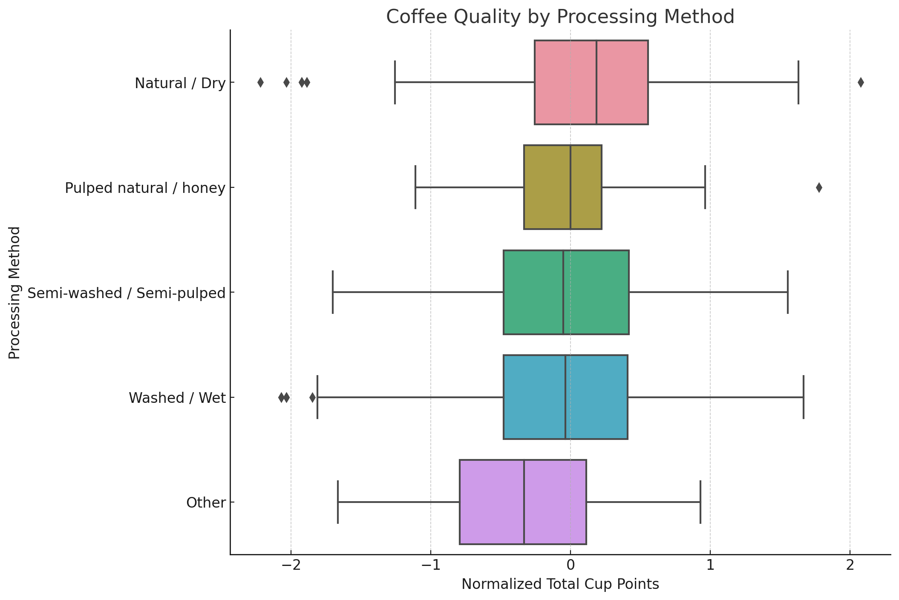
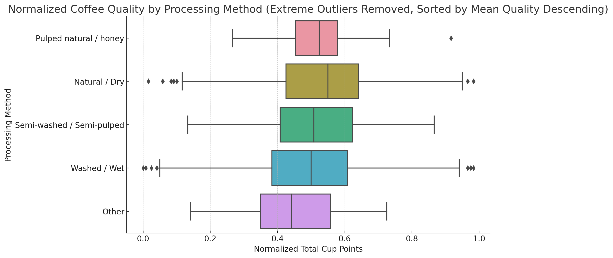
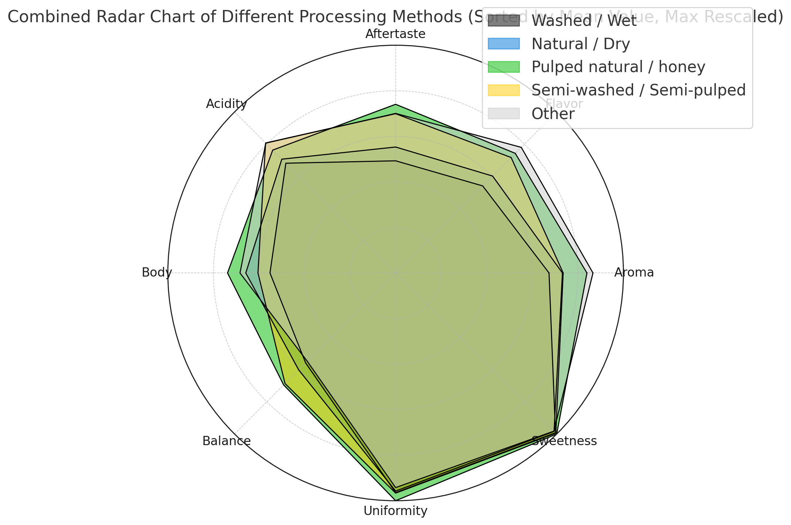
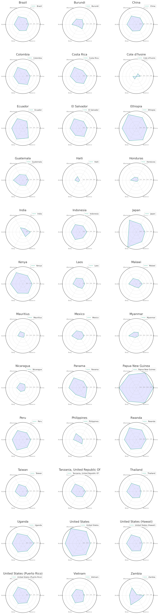

- Machine learning on coffee and wine with gpt [[writing]] [[newsletter/issue-13]]
	- One of my favorite new features of ChatGPT is the code interpreter, which allows GPT to write and execute code, as well as read files you upload.
	- One nice use case is uploading a data file, and having GPT use machine learning to analyze the data and create diagrams.
	- It's surprisingly intelligent, where it will read the data, try different algorithms on it, and compare the results automatically.
	- You can basically upload data, ask questions about it, and automatically create visualizations
	- For example, I found an interesting dataset on Kaggle called ["Coffee Quality Data"](https://www.kaggle.com/datasets/fatihb/coffee-quality-data-cqi). It contains coffee reviews, with their scores on a 100 point scale, along with information about the coffee such as its country of origin, altitude, harvest year, and information about its flavor such as acidity and sweetness
	- Can we use machine learning to find interesting insights about coffee? Such as, what factors are most important for coffee quality, which processing method is best, and which countries produce the highest quality coffee?
	- I can upload the coffee.csv dataset and ask the AI to do things such as:
		- "This is a dataset of coffee reviews and information about the coffee such as country of origin and altitude. Analyze the data using machine learning to generate insights and visualizations about coffee and what the most important factors are for coffee quality"
	- Here are some of the visualizations and insights about coffee I created using the ChatGPT code interpreter.
	- ## Initial Data Exploration
		- It starts by loading the dataset and printing the data to discover the most interesting columns of data.
		- ```python
		  # First, let's load and inspect the dataset
		  import pandas as pd
		  
		  # Load the data
		  df = pd.read_csv('/mnt/data/coffee_data.csv')
		  
		  # Display the first few rows of the dataframe
		  df.head()
		  
		  ```
		- #+BEGIN_QUOTE
		  The dataset contains 44 columns. Here are a few key ones:
		  
		  Species: The species of the coffee bean.
		  Owner: The owner of the coffee farm.
		  Country.of.Origin: The country where the coffee bean was grown.
		  Farm.Name: The name of the coffee farm.
		  Altitude: The altitude at which the coffee was grown.
		  Region: The region where the coffee was grown.
		  Processing.Method: The method used to process the coffee beans.
		  Aroma, Flavor, Aftertaste, Acidity, Body, Balance, Uniformity, Clean.Cup, Sweetness, Cupper.Points: These are the scores given to the coffee on various attributes by a professional coffee taster (cupper).
		  
		  Our target variable would be Total.Cup.Points as we are trying to find out what makes the best coffee. The higher the total cup points, the better the coffee is considered to be.
		  #+END_QUOTE
	- ## Data Cleaning
		- Datasets often contain messy and missing values, which need to be cleaned before they can be analyzed.
		- This is usually a manual, laborious process, where you need to merge similar values, come up with appropriate values for missing data, or drop columns that contain irrelevant data.
		- ChatGPT automatically scans for missing data and decides how to handle it appropriately. This dataset has many missing values for columns such as "Mill" and "Farm Name"
		- After exploring the data it decides which columns are most important, running statistical tools to analyze correlation if necessary. It automatically recognizes it should only focus on fields likely to be correlated with coffee quality.
		- #+BEGIN_QUOTE
		  For our analysis, we'll mainly focus on the factors that might affect the coffee quality, such as Country.of.Origin, Variety, Processing.Method, Altitude, and sensory profiles (Aroma, Flavor, Aftertaste, Acidity, Body, Balance).
		  #+END_QUOTE
		- It then does a preliminary analysis, followed by detailed analysis, to understand the distribution of the data
		- ## Analysis
			- ### Distribution of Ratings
				- 
				- > The left plot shows the distribution of the total cup points, representing the coffee's overall quality. The distribution is approximately normal, with a slight skew towards higher scores, indicating that most of the coffee in this dataset is of good quality.
			- ### Factors Influencing Coffee Quality
				- These show the relationship between various qualities and coffee rating score.
				- I really enjoy being able to automatically normalize data, fix scaling/axises, order by average ranking, and remove outliers.
			- ### Coffee Quality by Country
				- 
				- {:height 642, :width 413}
			- ### Coffee Quality by Altitude Range
				- 
				- The median coffee quality appears to increase with altitude, suggesting that coffee grown at higher altitudes tends to have higher quality.
			- ### Coffee Quality by Variety
				- 
				- 
				- 
				- Write short explanation of the following coffee varieties: caturra, bourbon, catuai, typica, and the most common other varieties
					- Caturra: Caturra is a mutation of Bourbon coffee, originally discovered in Brazil. It's known for its short stature which allows it to be planted densely, enabling higher yield. Its flavor profile reveals bright acidity and a medium body with notable fruity and citrus notes.
					  
					  Bourbon: This is one of the most popular variations of Arabica coffee. Originating from the island of Réunion (formerly Bourbon), this type has a good balance of acidity and body. Its taste profile typically reveals sweet, fruity tones with a hint of nuttiness.
					  
					  Catuai: This variety is a hybrid of Mundo Novo and Caturra, engineered to be resistant to natural elements and disease. Catuai carries either red or yellow cherries. It has a sweet, medium-bodied profile with bright acidity.
					  
					  Typica: As the name suggests, Typica is considered a “typical” variety of coffee and is one of the oldest and most genetically pure. It is known for its excellent quality, high acidity, and clean flavor often with sweet, fruity notes and a hint of spice. However, it yields fewer crops compared to other varieties.
					  
					  Other Common Varieties:
					  
					  1. Robusta: This is the second most common variety and is particularly known for its resistance to pests and diseases. It has a full body, low acidity and often carries a strong, bitter taste. Great for blending and often used in instant coffee.
					  
					  2. Geisha: A variety originally from Ethiopia, notable for its unique aromatic and floral notes. It's a luxury variety, often expensive due to its exceptional quality and distinct taste.
					  
					  3. Mundo Novo: A natural hybrid of Typica and Bourbon, known for its high production potential, but requires careful cultivation. Its taste carries a mild to medium body with a fine acidity.
					  
					  4. SL28 & SL34: These are Kenyan varieties developed by Scott Laboratories, known for deep, wine-like acidity and strong berry flavors.
					- Caturra: This is a short, disease-resistant variety of Arabica coffee that is a mutation of the Bourbon variety. Originating in Brazil, its smaller size allows farmers to plant more trees in the same amount of space, increasing overall yield. Despite its convenient size, it is known for its bright acidity and medium body, often displaying flavors of fruit and citrus.
					  
					  Bourbon: An incredibly influential and highly esteemed Arabica coffee variety from Réunion Island (formerly Bourbon). It's appreciated for its balanced body and acidity, and flavors often express sweetness with a mild nuttiness and fruitiness. 
					  
					  Catuai: A hybrid of the Mundo Novo and Caturra varieties, Catuai was designed to be resistant against disease and extreme weather. There are both red and yellow versions of this coffee; both are known for their sweetness and medium body, with a bright acidity enhancing their flavor profiles.
					  
					  Typica: One of the most genetically pure and oldest coffee varieties, characterized by the 'typical' coffee flavor. This quality variety is loved for its clean taste with high acidity, often featuring sweet, fruity notes and a hint of spiciness. It is, however, a lower yielding plant compared to some newer varieties.
					  
					  Other Common Varieties:
					  
					  Robusta: Not an Arabica coffee but the second most popular coffee in the world and known for its hardiness against pests and diseases. Robusta provides a full-bodied coffee with low acidity, often featuring a strong, somewhat bitter flavor. It's regularly used in blends and instant coffees.
					  
					  Geisha: Originally from the Gesha region in Ethiopia, it's one of the most luxurious and expensive types of coffee available. Known for its unique and strong floral notes and aromas.
					  
					  Mundo Novo: A high yielding, natural hybrid of Typica and Bourbon. Offers a wide spectrum of potential flavors, tending to produce a coffee with a mild to medium body and fine acidity.
					  
					  SL28 & SL34: Developed by Scott Laboratories, these Kenyan varieties provide a distinctive profile with wine-like acidity and strong berry flavors. Known for their high cup quality.
					- Caturra: A compact mutation of Bourbon variety first identified in Brazil. It matures quickly, is disease resistant, and known for bright acidity and medium body with fruity, citrus notes.
					  
					  Bourbon: A widely grown Arabica variety originated from the island of Réunion. It offers good balance between acidity and body, typically revealing a sweet, fruity, mildly nutty flavor.
					  
					  Catuai: A disease resistant hybrid of Mundo Novo and Caturra, comes in red or yellow cherries. Catuai is sweet, medium-bodied, with bright acidity.
					  
					  Typica: One of the oldest coffee varieties that is still cultivated. It's defined by its quality, high acidity, clean flavor, often revealing sweet, fruity, and slightly spicy notes. However, it has lower yield compared to other varieties.
					  
					  Other Common Varieties:
					  
					  Robusta: It is known for its resistance to pests and diseases, featuring a full body, low acidity, strong, somewhat bitter flavor, often used in blends and instant coffee.
					  
					  Geisha: Originating from Ethiopia, Geisha is distinguished by its aromatic and floral notes. It's seen as a luxury variety and can be quite expensive.
					  
					  Mundo Novo: A hybrid of Typica and Bourbon, it's known for its high yield but requires attentive cultivation. It produces a mild to medium body with a fine acidity.
					  
					  SL28 & SL34: Developed by Scott Laboratories in Kenya, these varieties are known for deep, wine-like acidity and strong berry flavors.
				- 
			- ### Quality by Processing Method
				- 
				- 
					- 
					- Natural/Dry: In this method, the cherries are picked and spread out in the sun to dry, allowing the fruit to naturally ferment before the seed is removed. The coffee retains intense, fruity flavors from the cherry. 
					  
					  Pulped Natural/Honey: This technique involves removing the skin of the coffee cherries but leaving a small amount of the fruity pulp on the seeds when drying. The name 'honey' refers to the sticky texture as it dries, not the taste. 
					  
					  Semi-Washed/Semi-Pulped: This process partially removes the coffee's cherry prior to drying. After pulping, the coffee beans, still coated with mucilage, are then dried. This compromise between washed and natural delivers a balance between clarity and body.
					  
					  Washed/Wet: Beans are depulped, fermented, and thoroughly washed of all mucilage. This method typically yields coffee with more pronounced acidity and cleaner flavors due to the removal of all fruit before drying.
			- ## Flavor Profile by Country
				- This graph called a "Spider Graph" is fun, I first saw these in the Pokemon games. ChatGPT can write code to properly format and normalize the data into more complex graphs
				- 
				-