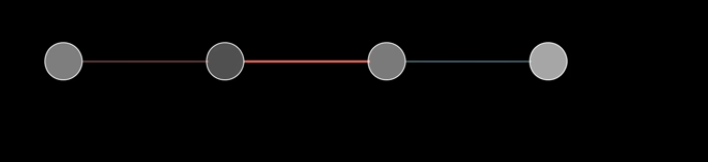
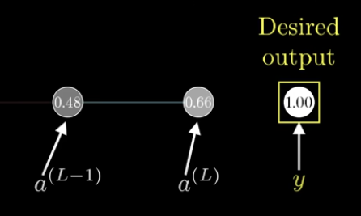
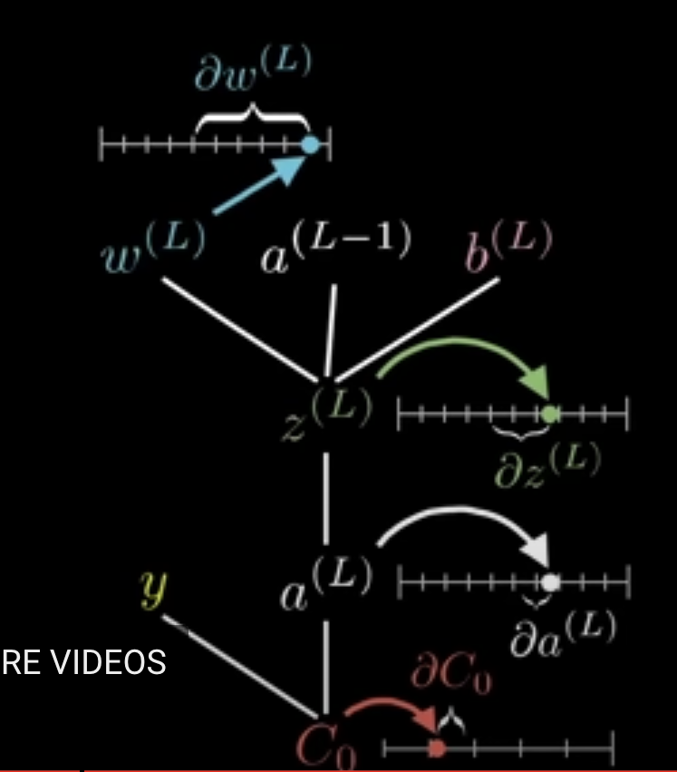
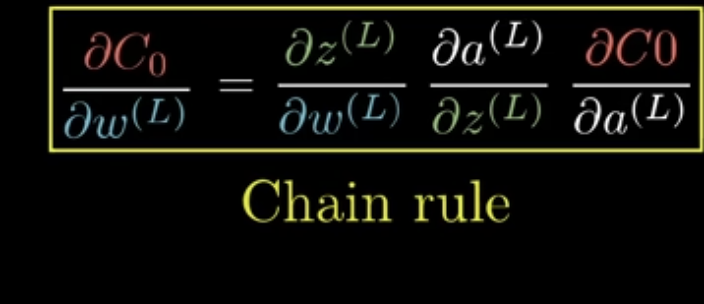
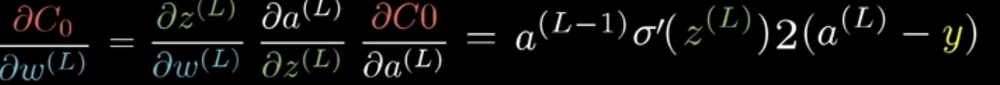
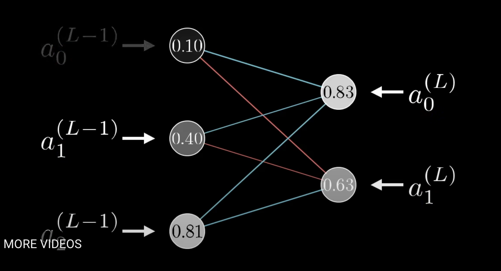
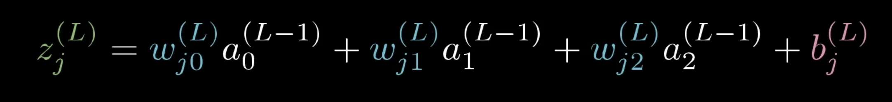
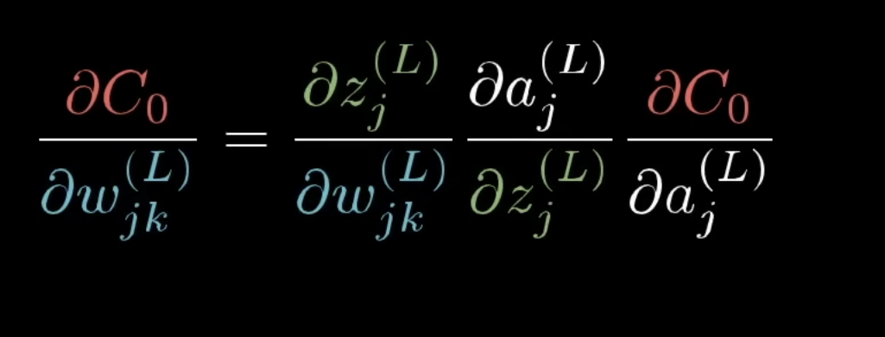
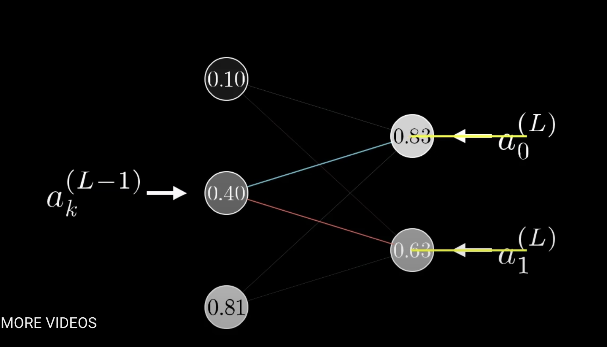
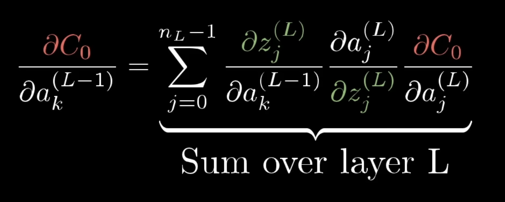

- # Backpropagation calculus
	- {{video https://www.youtube.com/watch?v=tIeHLnjs5U8&t=9s}}
	- Neural network with three nodes
	- 
	- Consider an extremely simple network with three neurons
	- $C(w_1,b_1,w_2,b_2, w_3, b_3)$
	- Three weights and three biases
	- How sensitive is the cost function to these biases
	- Focus on the connection between last two neurons
	- $a^{(L)}$ activation of last neuron has superscript L, so last has superscript L, second to last is $a^{(L-1)}$
	- Not exponents, just designators
	- {{youtube-timestamp 83}} Let's say we want the last activation y to be 1.0
	- 
	- The cost is of the training network is $C_0=(a^{(L)}-y)^2$
	- In this case $(0.66 - 1.00)^2$
	- The last activation is determined by a weight, times the previous neurons activation, plus a bias
	- $z^{(L)}=w^{(L)}a^{(L-1)}+b^{(L)}$
	- Give a special name to this weighted sum as $z^{(L)}$
	- We put this into the sigma function (or relu)
	- $\sigma(...)$
	- so $a^{(L)}=\sigma(z^{(L)})$
	- Weight, previous activation, and bias together are used to compute z, which we plug into sigma to get a
	- And if we know the desired output y, we can compute the cost
	- How sensitive is the cost function to changes in our weight?
	- $\frac{\partial C_0}{\partial w^{(L)}}$ this is calculus derivative for how sensitive the cost is to changes in w
	- w depends on z, which depends on
	- The weight affects z
	- z affects a
	- and a affects the cost
	- 
	- 
	- The cost function is $C_0=(a^{(L)}-y)^2$ and we find its derivative with respect to a
	- $\frac{\partial C_0}{\partial a^{(L)}}=2(a^{(L)}-y)$
	- $\frac{\partial a^{(L)}}{\partial z^{(L)}}=\sigma(z^{(L)})$
	- $\frac{\partial z^{(L)}}{\partial w^{(L)}}=a^{(L-1)}$
		- Remember originally was $z^{(L)}=w^{(L)}a^{(L-1)}+b^{(L)}$ and we take the derivative
	- So full expression is
	- 
	- The amount the weight nudge influences the final output  depends on how strong the previous neuron is
	- {{youtube-timestamp 313}} This is the cost for a single training example
	- To find the full cost, we need to average all the training examples
	- $$\frac{\partial C}{\partial w^{(L)}}=\frac{1}{n} \sum_{k=0}^{n} \frac{\partial C_k}{\partial w^{(L)}}$$
	- {{youtube-timestamp 419}} What about multiple neurons
	- Instead of the activation of a neuron just depending on L, it will also be affected by multiple neurons
	- 
	- So it depends on $a_0^{(L-1)}$ etc you have multiple neurons
	- With multiple neurons per layer, the cost is the sum of all the differences, squared
	- $$C_0=\frac{1}{n} \sum_{j=0}^{n_L-1} (a_j^{(L)}-y_j)^2$$
	- 
	- The activation of a neuron in one layer, depends on the neurons weight, times the activation of the neuron in the previous layer
	- Then you sum them all up to get the activation
	- The derivative of the cost function descriving sensitivity to a specific weight is almost the same with multiple neurons, as it is with one neuron
	- 
	- However, the derivative describing the sensitivity to the activations in the previous layer is different
	- This is because the activation affects multiple output neurons, and the multiple neurons each affect the cost, so you have to sum up
	- For example a_k influences a_0 and a_1, and you have to add them up
	- 
	- 
	- These determine the gradient, which shows you how to adjust the weights during gradient descent
	-