- # Overview
	- Machine learning is a method of teaching computers to do things without explicit programming.
	- AI and machine learning is estimated to create an additional 13 trillion US dollars of value annually by the year 2030
- # Supervised vs Unsupervised Learning
	- In the 1950s Arthur Samual wrote a program that played checkers against itself
	- There two main types of machine learning are supervised learning and unsupervised learning.
	- ## Supervised Learning
		- Supervised learning learns from data **labeled** with the right answers
		- Right answer means the correct label y for a given input x
		- By seeing correct pairs of input x and desired output label y that the learning algorithm eventually learns to take just the input alone without the output label and gives a reasonably accurate prediction or guess of the output
		- ### Regression
			- You may use regression to predict a number, such as house price based on square feet.
			- You may use a straight light, curved line, or something more complicated
			- 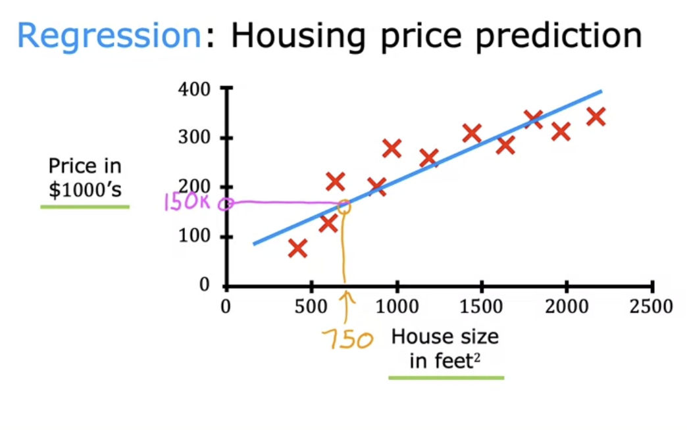
		- ### Classification
			- Instead of predicting a number like regression, classification predict categories, like malignient or beignine when predicting cancer
			- There can be be two or more categories.
			- 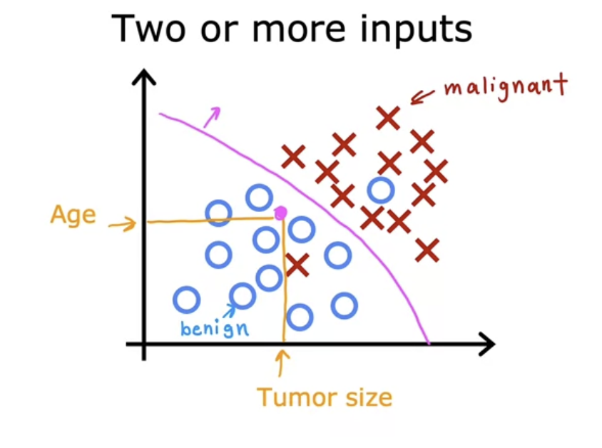
	- ## Unsupervised Learning
		- Unsupervised learning finds structure in unlabeled data, You don't give it the right answer
		- For example, grouping news articles into the same story or discovering marketing segments of customers
		- Clustering groups similar data together
		- Anomaly Detection is finding unusual data points
		- Dimensionality reduction compresses data using fewer numbers
	- ## Jupyter Notebooks
		- Environment to code and experiment with machine learning
- # Linear Regression Model
	- 
	- Linear regression model is fitting a straight line to your data
	- Example: predicting the price of the house based on the size of the house
	- Regression models predicts numbers
	- supervised learning model data has "right answers"
	- 
	- ## Terminology
		- 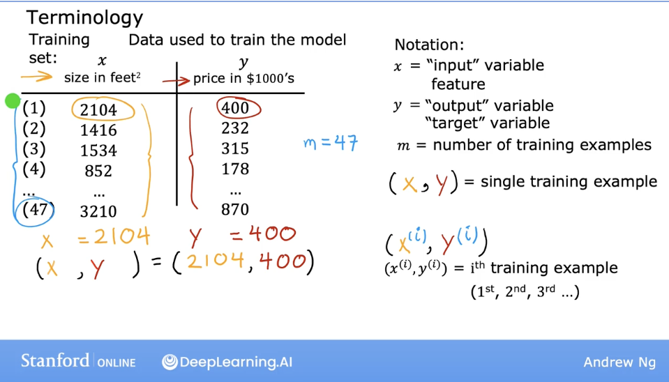
		- ### Training Set
			- Data used to train the model
			- #### Notation
				- x = input variable, also called feature
				- y = output variable, also called target variable
				- m = number of training examples
				- (x,y) = single training example
				- $(x^{(i)}, y^{(i)})$ = ith training example, 1st, 2nd, third etc.
- # Regression Model
	- ## Linear Regression With One Variable
	  collapsed:: true
		- **Training set** includes input features and output targets
		- You feed the training set into the learning algorithm, and it produces a function, which takes a new input and output an estimate or prediction.
		- $f(x)=\hat{y}$
		- $\hat{y}$ is notation for a prediction, the estimated value of y
		- $y$ is the actual true value from the training set, called the output or target variable, whereas $\hat{y}$ is the prediction
		- The true price of your house is unknown until you sell it, for example
		- $f$ is called the model
		- How do we represent $f$? A straight line is one way
		- $f_{w,b}(x)=wx+b$
		- Simplified way of writing $f_{w,b}(x)$ is $f(x)$
		- You can also use curves instead of straight lines.
		- Another name for linear model with one variable is **univariate linear regression**
	- ## Model Representation Lab
	  collapsed:: true
		- NumPy is a popular library for scientific computing
		- Matplotlib is a popular library for plotting data
		- ### Python String Formatting
		  collapsed:: true
			- ```python
			  name = 'John'
			  age = 21
			  
			  # An example of an f-string
			  print(f'My name is {name} and I am {age} years old.')
			  
			  # Formatting with braces
			  print("I have {0} apples and {1} oranges".format(2, 3)) 
			  
			  2. Using the format function: 
			   "I have {} apples and {} oranges".format(2, 3)
			  ```
		- ### Matplotlib scatter plot
		  collapsed:: true
			- The function arguments `marker` and `c` show the points as red crosses (the default is blue dots).
			- ```python
			  import matplotlib.pyplot as plt
			  # Plot the data points
			  plt.scatter(x_train, y_train, marker='x', c='r')
			  # Set the title
			  plt.title("Housing Prices")
			  # Set the y-axis label
			  plt.ylabel('Price (in 1000s of dollars)')
			  # Set the x-axis label
			  plt.xlabel('Size (1000 sqft)')
			  plt.show()
			  ```
			- 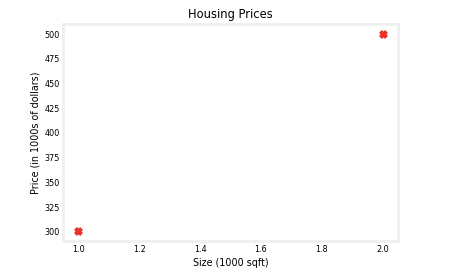
		- ### Matplotlib line plot
		  collapsed:: true
			- ```python
			  tmp_f_wb = compute_model_output(x_train, w, b,)
			  
			  # Plot our model prediction
			  plt.plot(x_train, tmp_f_wb, c='b',label='Our Prediction')
			  
			  # Plot the data points
			  plt.scatter(x_train, y_train, marker='x', c='r',label='Actual Values')
			  
			  # Set the title
			  plt.title("Housing Prices")
			  # Set the y-axis label
			  plt.ylabel('Price (in 1000s of dollars)')
			  # Set the x-axis label
			  plt.xlabel('Size (1000 sqft)')
			  plt.legend()
			  plt.show()
			  ```
			- 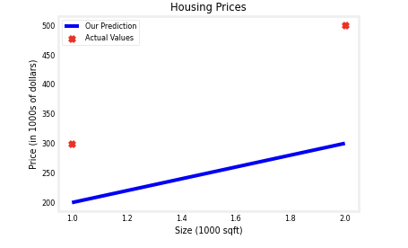
	- ## Cost Function
	  collapsed:: true
		- The cost function tells us how well the model is doing so we can get it to do it better
		- in model $f_{w,b}(x)$ $w,b$ are called coefficients or weights
		- Depending on the values wb, the function is different, which generates a different function on the graph
		- 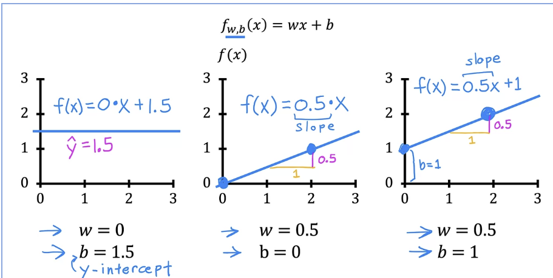
		- You want your line to fit the data, or mostly pass through it
		- When you have training data, for every $x^{(i)}$ there is a $y^{(i)}$ as well as a $\hat{y}^{(i)}$
		- We want to find $w,b$ so that for every $x^{(i)}$ there the predicted value $\hat{y}^{(i)}$ is close to the actual value $y^{(i)}$
		- ### Squared error cost function
			- Most common cost function for regression problems
			- $J(w,b) = \frac{1}{2n}\sum_{i=1}^{n}(\hat{y}^{(i)}- y^{(i)})^2$
			- Also can be written as $J(w,b) = \frac{1}{2n}\sum_{i=1}^{n}(f_{w,b}(x) - y^{(i)})^2$
	- ## Cost Function Intuition
		- We want to find values for $w,b$ that fit the training data
		- In other words, we want the line to go through the data points
		- We have a cost function, which shows us the difference between the model's predictions and the true values
		- our goal is to minimize find values $w,b$ that minimize the cost function
		- Let's simplify the linear regression model to $f_w(x)=w*x$, which is basically setting $b=0$ in the original equation
		- Our simplified cost function then looks like:
		- $J(w) = \frac{1}{2n}\sum_{i=1}^{n}(f_{w}(x) - y^{(i)})^2$
		- (no b, since it's just 0)
		- So now we just focus on minmizing $J(w)$
		- Let's graph the simplified model side by side with the cost function
		- $f_w(x)$ depends on the value of $x$ when sing a fixed $w$
		- $J(w)$ depends only on the value of w
		- Let's try calculating the cost when w=1
		- $f_w(x)=1*x$
		- Which basically means $y=x$
		- $J(w) = \frac{1}{2n}\sum_{i=1}^{n}(w*x^{(i)} - y^{(i)})^2$
		- 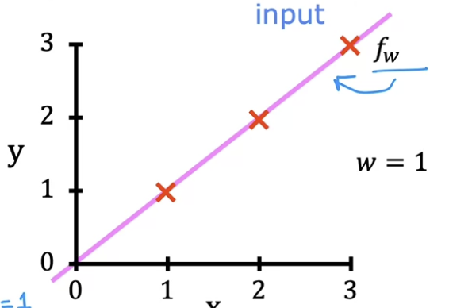
		- Some test values from the dataset could be $(0,0),(1,1),(2,2), (3,3)$
		- In each of these $(w*x^{(i)} - y^{(i)})=0$
		- $J(w) = \frac{1}{2m}(0^2+0^2+0^2)$
		- So for this dataset, when $w=1$ the cost is 0
		- We can plot the cost function as well
		- In the cost function graph, $J(w)$ (the cost) is the y axis and $w$ is the x axis
		- In this example, when $w=1$ the cost is 0, so we can plot it
		- 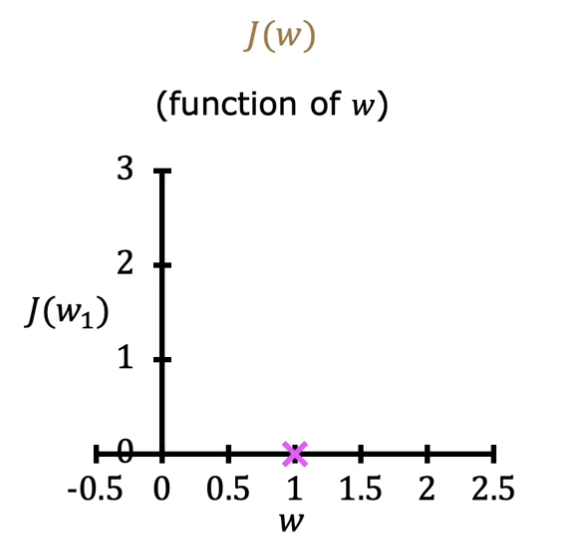
		- Now let's try w=.5
		- It misses most of the data points, so it has a higher error
		- 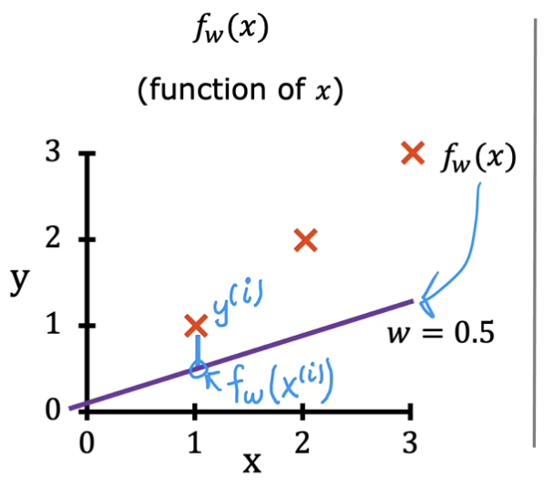
		- So our error is $(.5-1)^2+(1-2)^2 + (1.5 -3)^2) = 3.5$
		- Plugging into the cost function is $J(w) = \frac{1}{2*3}[3.5] = .58$
		- Let's plot the new cost .58
		- 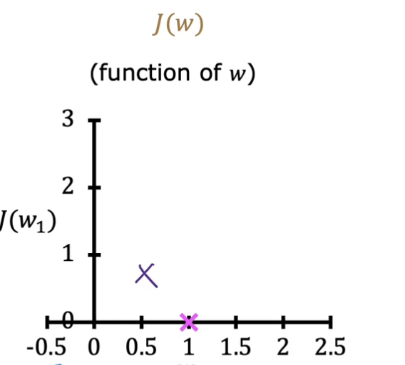{:height 480, :width 524}
		- Now let's try w=0
		- When w=0, then $f(x)=0$, a horizontal line at 0, on the x axis
		- So our cost function is  $J(w) = \frac{1}{2m}(1^2 + 2^2 + 3^2) = \frac{1}{6}[14] = 2.3$
		- We plot this cost function value where w=0
		- 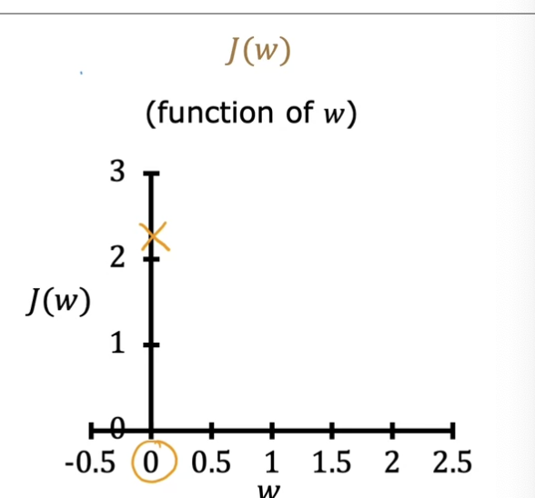
		- We can continue to plot these to trace what the cost function $J(w)$ looks like
		- 
		- How can we choose the value of w that fits the data best? We choose w to minimize the cost function $J(w)$
		- In this case, w=1 has the lowest cost
	- ## Visualizing the Cost Function
		- Before, we visualized the cost function using just one parameter, w and not b
		- It looked like this, and was a graph with the cost on the y axis, and the various values of w on the x axis.
		- 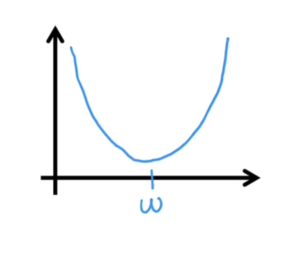
		- To visualize the cost function based on two different parameters, we have a 3d graph
		- 
		- Every point on the surface is a choice of w and b
		- Contour plot is another way of showing this
		- 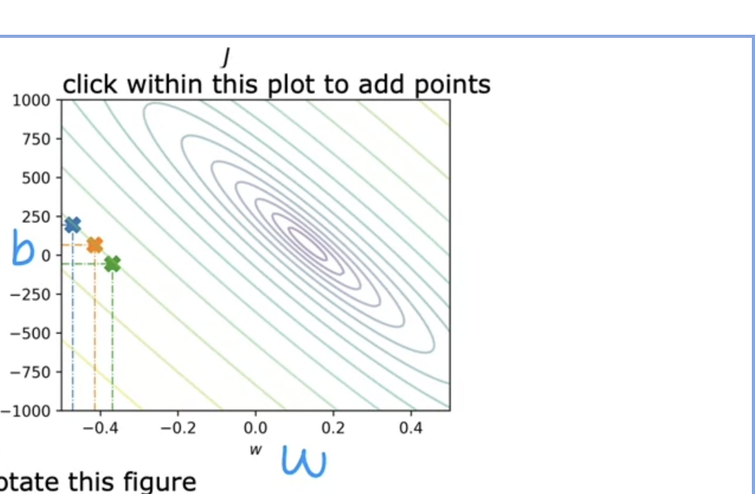
		- Within a band of the ellipse ellipse, the points are at the same height
		- The center has the lowest point
		-
	-