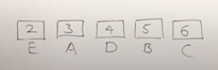
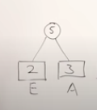
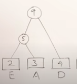
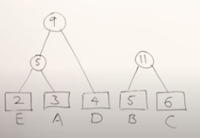
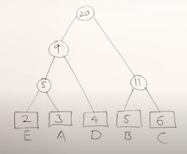
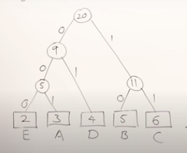
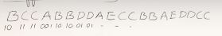

- # Huffman Coding - Greedy
	- {{video https://youtu.be/co4_ahEDCho}}
	- Huffman coding is a compression algorithm
	- It is variable sized encoding
	- Consider compressing this message `BCCABBDDAECCBBAEDDCC`
	- Length is 20
	- Ascii codes are 8 bits
	- A is ascii code 65, and it's binary form is 01000001
	- {{youtube-timestamp 183}} Can we use our own codes instead of ascii?
	- We're not using all the ascii codes
	- Do we need 8 bits for representing just a few characters?
	- |Character|Count|Code|
	  |--|--|--|
	  |A|3|000|
	  |B|5|001|
	  |C|6|010|
	  |D|4|011|
	  |E|2|100|
	- If we have just 1 bit, we can only represent 2 symbols
	- If we have 2 bits, we can represent 4 symbols
	- Since we have 5 symbols, we need 3 bits, which can represent 8 combinations
	- {{youtube-timestamp 370}} 20 characters, with 3 bits per character is 60 bits
	- How will the receiver know what codes are used?
	- {{youtube-timestamp 423}} We also need a table of codes to decode, How big is the table?
	- We need to use original ascii codes in the table
	- 5 symbols, using 8 bit ascii, totals to 40 bits
	- and also 5 3 bit codes , is 15
	- so 55 bits to represent decoding table
	- and the msg itself is 60 bits, so the table and the msg together is 115 bits
	- This was using fixed sized codes
	- ## Variable Sized Codes
		- {{youtube-timestamp 521}} What if we used smaller codes for the most frequent characters?
		- {{youtube-timestamp 579}} Alphabets should be arranged in increasing order of their count
		- 
		- First merge the smallest two ones
		- 
		- {:height 174, :width 152}
	- Now 5 and 6 are the two minimum, so combine
	- 
	- Combine last two remaining
	- 
	- Mark left edges as 0 and right edges as 1
	- 
	- For each alphabet, follow the root to the tree
	- So a is 001
	- Here's how you can encode the message
	- 
		- |Character|Count|Code| Size|
		  |--|--|--|--|
		  |A|3|001| 3x3=9|
		  |B|5|10| 5x2=10 |
		  |C|6|11| 6x2 = 12|
		  |D|4|01| 4x2 = 8|
		  |E|2|000| 2x3=6|
	- Total size of message is 45 bits
	- {{youtube-timestamp 715}} Notice the codes are different sizes
	- There could be codes with only one bit, but not in this example
	- {{youtube-timestamp 844}} How big is the table?
	- 8 bits of ascii code and 5 ascii codes is 40 bits
	- totaling bits of codes, 12
	- so 52 bits for table
	- message = 45 bits, and table is 52 bits, so total size is 97 bits
	- The fixed size encoding was 115 bits
	- {{youtube-timestamp 976}} How can we do decoding?
	- You must have a tree for decoding
	- Start from root and follow path to find leaf, which is the letter