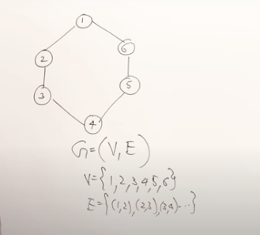
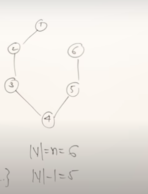
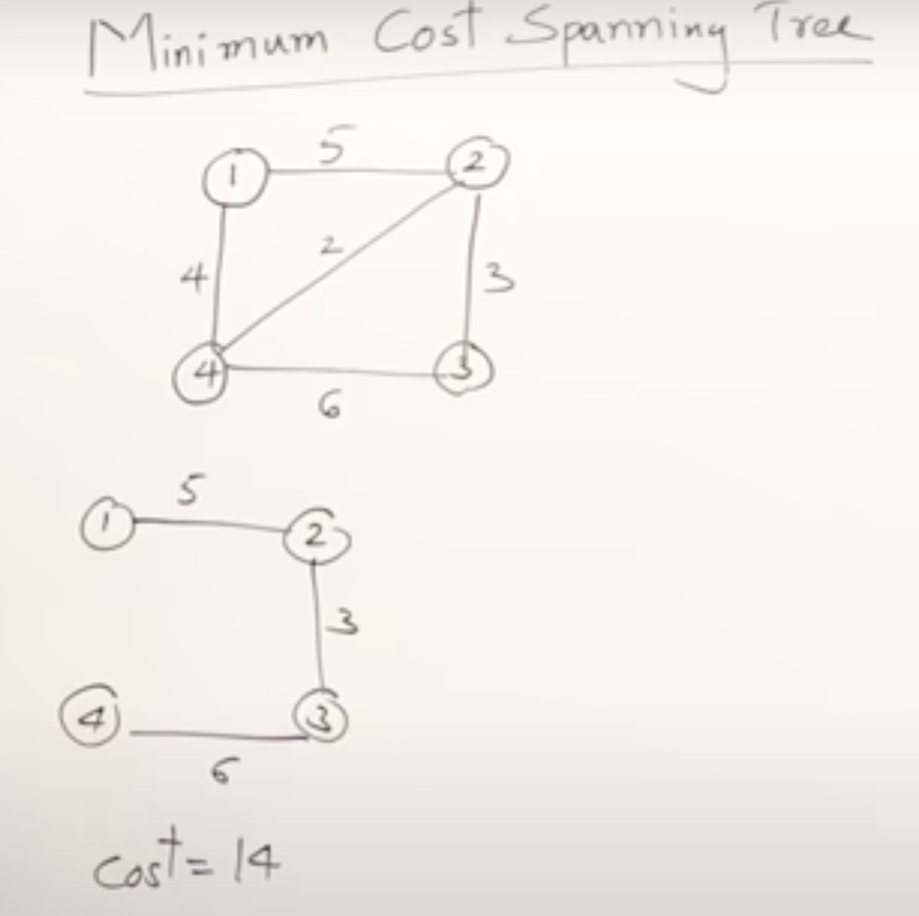
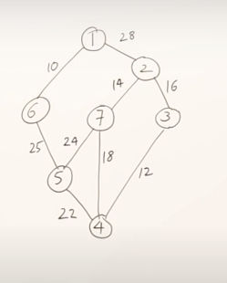
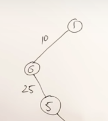
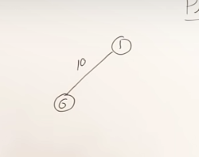
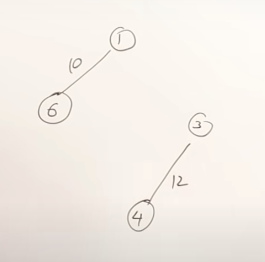
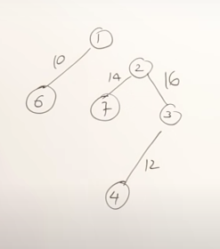
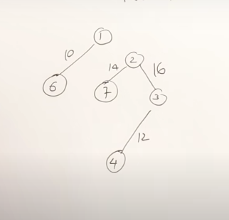
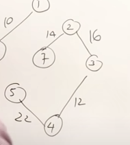

- {{video https://youtu.be/4ZlRH0eK-qQ}}
- Minimum Cost Spanning Tree
	- Consider this graph, represented by set of vertices and edges
	- 
	- A spanning tree is a subgraph of a graph
	- So you take a subset of edges, but take all vertices
	- How many edges are there?
	- The minimum number of edges is n-1 edges, so if you have 6 vertices you have 5 edges
	- {{youtube-timestamp 106}} And it's a tree, so there's no cycle
	- 
	- So a minimum spanning tree has all vertices and n-1 edges
	- {{youtube-timestamp 179}} How many different spanning trees can you generate from a graph?
	- If there are 6 edges, then you can have 6 different spanning trees
	- {{youtube-timestamp 289}} Forumula for number of spanning trees from graph
	- take edges, and C of edges you need and subtract number of cycles
	- 7C5-cycles for above
	- {{youtube-timestamp 315}} Weighted graph
		- What spanning trees are possible? And what are their costs?
		- 
		- With weighted graphs, we can compute different spanning trees, with different costs.
		- How can we find the minimum cost spanning tree?
		- We could use brute force
		- {{youtube-timestamp 466}} Or we could use greedy prims or kruskals algorithm
	- ## Prim's Algorithm
		- Select minimum cost edge
		- Always select minimum cost edge, but only ones that are connected to existing vertices
		- ### Example graph
			- 
			- Select minimum edge
			- 
			- Select smallest connected weight
			- {{youtube-timestamp 550}} We can select either 25 or 28 which are connected, so we pick, 25, which is smaller
			- 
			- Algorithm is: select smallest edge, then keep connecting the smallest connected edge
			- Note: we cannot find spanning tree for non connected graphs
		- ### Kruskal's Method
		  collapsed:: true
			- Always select minimum cost edge
			- 
			- Select 10
			- 
			- {{youtube-timestamp 738}} Select 3->4 (12)
			- 
			- {{youtube-timestamp 743}} 2->7 (cost 14)
			- 
			- Select 2->3 (cost 16)
			- 
			- 7->4 is the next minimum edge, but would form a cycle, so we exclude it, and skip
			- now check 4->5 (22)
			- 
			- Next minimum is 7->5 but it would form a cycle, so we skip
			- Continue, until made spanning tree
			- Kruskal's works for non connected graphs, gives spanning trees for each component
		- ### Time Complexity
		  collapsed:: true
			- ### Kruskals
				- Has to always select minimum cost edges
				- Selects v-1 edges
				- $\theta(V*E) = \theta(n^2)$
				- but can keep edges in min heap, to reduce time complexity to log(n) to search for mimimum cost edge
				- So with min heap, time complexity is $\theta(n*log(n))$
			-
		- ## Missing edges
			- If you hide some edges, you can make a spanning tree
			- What would be the values for the missing edges that would make a minimum spanning tree
			- Need to be careful it doesn't introduce cycles
			- 
			-