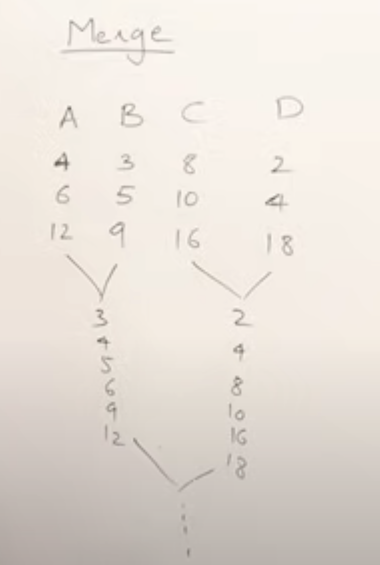
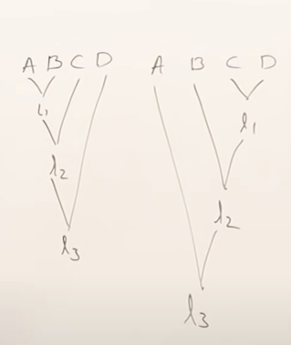

- # Two way merge sort - iterative
	- {{video https://youtu.be/6pV2IF0fgKY}}
	- ## Merge list
		- {{youtube-timestamp 23}} Merging is combining two sorted lists into a single sorted list
		- `a=[2,8,15,18]`
		- `b=[5,9,12,17]`
		- How can we combine them into a new sorted list `c`?
		- Create an index pointer for `a`,`b`, and `c`
		- {{youtube-timestamp 84}} Compare `a[i]` with `b[j]`
		- If `a[i]` is smaller than `b[j]`, copy `a[i]` into `c[k]` , then increment `i` and `k`
		- Repeat, and compare `a[i]` with `b[j]`, this time `b[j]` is smaller, so copy `b[j]` into `c[k]` and increment `j` and `k`.
		- Eventually, one of the lists will finish. When this happens, copy the remaining elements over from the unfinished list.
		- {{youtube-timestamp 221}} What is the time taken by this process? If one list has m elements, and the other has n elements, the time complexity is Θ(m+n), which is simplified to Θ(n)
		- ### Algorithm for merge(a,b)
			- ```js
			  function merge(a,b){
			    const i = 0;
			    const j = 0;
			    const k = 0;
			    const c = [];
			    while (i <= a.length && j <= b.length)
			    if (a[i] < b[j]){
			      c[k]=a[i];
			      i++;
			    } else {
			      c[k]=b[j];
			      j++;
			    }
			    k++
			  }
			  //copy remaining elements from a
			  for (; i<=a.length; i++){
			    c[k]=a[i];
			    k++;
			  }
			  //copy remaining elements from b
			  for (; j<=b.length; j++){
			    c[k]=b[j];
			    k++;
			  }
			  ```
		- ### Merging multiple lists - k-way-merge
			- `a=[4, 6, 12]`
			- `b=[3, 5, 9]`
			- `c=[8, 10, 16]`
			- `d=[2,4,18]`
			- {{youtube-timestamp 632}} it's called 4-way merge, k-way-merge, etc
			- There are multiple ways of doing this:
			- {{youtube-timestamp 622}} The first way is to merge the pairs of lists, then merge the merged lists
			- So we merge `a` and `b`, then we merge `c` and `d`, then we merge the merged lists
			- 
			- {{youtube-timestamp 688}} Or we can merge one list, then keep merging additional lists into it one at a time
			- 
	- ## 2-way merge sort iterative
		- {{youtube-timestamp 777}} `a=[9,3,7,5,6,4,8,2]`
		- We need two sorted arrays for merging, but we can assume each element in the array is a single item list. In this there are 8 lists containing a single element. When there's a single element, the list is already sorted
		- We do two way merging, which is merging two lists at a time
		- {{youtube-timestamp 876}} Select first two "lists" `9 and 3` and merge into new list `[3,9]`
		- Continue first pass
		- `7 and 5` => `[5,7]`
		- `6 and 4` => `[4,6]`
		- `8 and 2` => `[2,8]`
		- {{youtube-timestamp 934}} So our first pass lists are `[3,9] [5,7] [4,6] [2,8]`
		- If there was a 9th element, it would be in a single item list
		- When we merge two lists, we store in a separate array
		- Now we merge our four lists
		- `[3,9] [5,7]` => `[3,5,7,9]`
		- `[4,6] [2,8]` => `[2,4,6,8]`
		- {{youtube-timestamp 1042}} Now in our third pass we merge the two sorted lists into the final list
		- `[3,5,7,9]` , `[2,4,6,8]` => `[2,3,4,5,6,7,8,9]`
		- {{youtube-timestamp 1112}} What is the time complexity? each pass does n amount of work
		- Each pass we reduce the number of lists by half. In this example there are 8 elements and 3 passes
		- 8 elements divided by 2 is 4, then 4 divided by 2 is 2, then 2 elements divided by 2 is 1, then we stop
		- So when we divide by two each time, we do n work $log(n)$ times, so the time complexity is $n*log(n)$