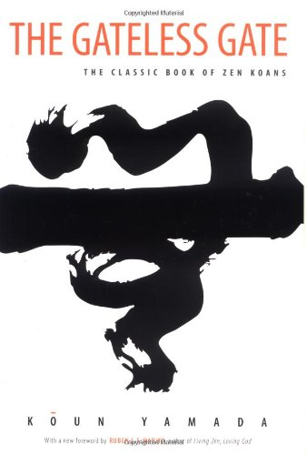
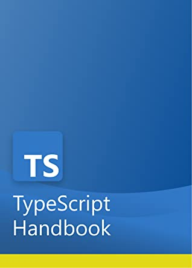
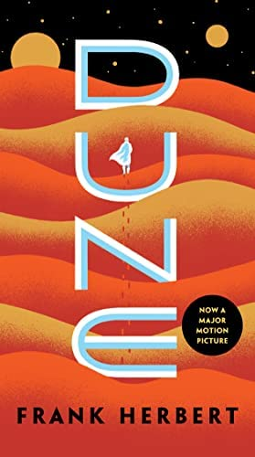
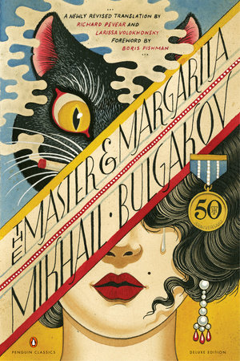
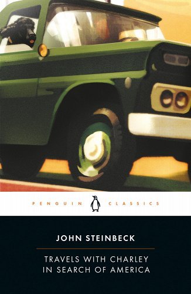
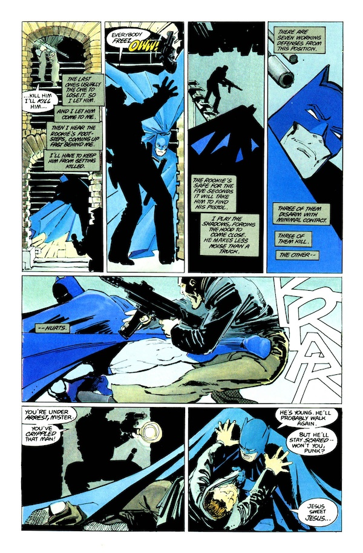

tags:: [[reading]]
public:: true
date:: 2023-01-01
coverimage:: /assets/71URMFtAuQL_1672620377581_0.jpg
blogtitle:: Books Read in 2022
description:: List of books I read in 2022 with short summaries
ShowToc:: true
TocOpen:: true

- 2022 was a good year for reading!
- I collected my thoughts on the books I read, along with some excerpts I thought represented the book, so you can gauge if it's something you'd be interested in. Out of these, some of my favorites were "Hard-Boiled Wonderland and the End of the World by Haruki Murakami", "Mistborn by Brandon Sanderson", "The Picture of Dorian Gray by Oscar Wilde", and "The Gay Science by Friedrich Nietzsche".
- ## Building a Second Brain by Tiago Forte
	- 
	- [Amazon Link](https://www.amazon.com/dp/1982167386?tag=bsunter06-20)
	- Tiago Forte's Building a Second Brain book is a guide to developing a productivity system that helps you better manage information and improve your creativity, productivity, and ability to generate insights.
	- I incorporated many ideas from his book into my system, like focusing on projects, organizing by project and life areas, his summarization tips, and project checklist ideas.
	- > Your job as a notetaker is to preserve the notes you’re taking on the things you discover in such a way that they can survive the journey into the future. That way your excitement and enthusiasm for your knowledge builds over time instead of fading away
	- > What’s the point of knowing something if it doesn’t positively impact anyone, not even yourself?
	- [Read my full summary here]([[building a second brain]])
- ## The Untethered Soul by Michael Singer
	- 
	- A guide to getting in touch with your inner self. How to watch your thoughts like a TV show instead of being a character in the show. "You are not your thoughts or emotions. You are the one experiencing them."
	- I thought it was a good introduction to mindfulness. I liked the concept of "The Inner Roommate." Who is always dissatisfied and arguing against you, a form of anxious energy manifested as a voice in your head.
	- > “There is nothing more important to true growth than realizing that you are not the voice of the mind - you are the one who hears it.”
	- > In case you haven’t noticed, you have a mental dialogue going on inside your head that never stops. It just keeps going and going. Have you ever wondered why it talks in there? How does it decide what to say and when to say it? How much of what it says turns out to be true? How much of what it says is even important? And if right now you are hearing, “I don’t know what you’re talking about. I don’t have any voice inside my head!”—that’s the voice we’re talking about.
	- > While you’re driving, you hear internal conversations like, “Wasn’t I supposed to call Fred? I should have. Oh my God, I can’t believe I forgot! He’s going to be so mad. He may never talk to me again. Maybe I should stop and call him right now. No. I don’t want to stop the car right now…”
	  Notice that the voice takes both sides of the conversation. It doesn’t care which side it takes, just as long as it gets to keep on talking.
- ## Simple Path to Wealth  by J.L Collins
	- 
	- Great book for those interested in managing money and financial independence. It discourages you from trying to beat the market and suggests you invest in index funds and get rich slowly.
	- This book helped me develop a plan for my finances and feel good about my strategy, despite the world's uncertainty.
	- > “Spend less than you earn—invest the surplus—avoid debt.”
	- > If your lifestyle matches—or god forbid exceeds—your income, you are no more than a gilded slave.
	- > Avoid investment advisors. Too many have only their own interests at heart. By the time you know enough to pick a good one, you know enough to handle your finances yourself. It’s your money and no one will care for it better than you.
	- > Money can buy many things, but nothing more valuable than your freedom.
	- > Life choices are not always about the money, but you should always be clear about the financial impact of the choices you make.
	- > Sound investing is not complicated.
	- >The stock market is a powerful wealth-building tool and you should be investing in it. But realize the market and the value of your shares will sometimes drop dramatically. This is absolutely normal and to be expected. When it happens, ignore the drops and buy more shares.
	- > This will be much, much harder than you think. People all around you will panic. The news media will be screaming Sell, Sell, Sell!
	- > When you can live on 4% of your investments per year, you are financially independent.
- ## Hold Me Tight by Dr. Sue Johnson
	- 
	- [Amazon Link](https://www.amazon.com/dp/1491513810?tag=bsunter06-20)
	- Hold me tight is a relationship book that helps you communicate better and form a deeper connection with your romantic partner.
	- Couples often get stuck in unproductive patterns of communication. This book helps you recognize and deconstruct these patterns so each person can hear what the other is saying. It emphasizes that the key to successful relationships is emotional responsiveness and vulnerability.
	- One of my goals last year was to improve communication with my partner and be more intentional in my relationship, and this book contained a lot of helpful, actionable advice.
	- > When marriages fail, it is not increasing conflict that is the cause. It is decreasing affection and emotional responsiveness, according to a landmark study by Ted Huston of the University of Texas. Indeed, the lack of emotional responsiveness rather than the level of conflict is the best predictor of how solid a marriage will be five years into it. The demise of marriages begins with a growing absence of responsive intimate interactions. The conflict comes later.
	- > Emotional responsiveness has three main components:
	- >Accessibility: Can I reach you? This means staying open to your partner even when you have doubts and feel insecure. It often means being willing to struggle to make sense of your emotions so these emotions are not so overwhelming. You can then step back from disconnection and can tune in to your lover’s attachment cues.
	- > Responsiveness: Can I rely on you to respond to me emotionally? This means tuning in to your partner and showing that his or her emotions, especially attachment needs and fears, have an impact on you. It means accepting and placing a priority on the emotional signals your partner conveys and sending clear signals of comfort and caring when your partner needs them.
	- > Engagement: Do I know you will value me and stay close? The dictionary defines *engaged* as being absorbed, attracted, pulled, captivated, pledged, involved. Emotional engagement here means the very special kind of attention that we give only to a loved one. We gaze at them longer, touch them more. Partners often talk of this as being emotionally present.
- ## Authority and the Individual by Bertrand Russel
	- 
	- [Amazon Links](https://www.amazon.com/dp/0415487331?tag=bsunter06-20)
	- How can we combine that degree of individual initiative necessary for progress with the social cohesion necessary for survival? He advocates empowered individuals to make change within their immediate circle.
	- A nuanced take on one of my favorite topics: the tension between the individual and society.
	- > In all social animals, including Man, co-operation and the unity of a group has some foundation in instinct. This is most complete in ants and bees, which apparently are never tempted to anti-social actions and never deviate from devotion to the nest or the hive. Up to a point we may admire this unswerving devotion to public duty, but it has its drawbacks; ants and bees do not produce great works of art, or make scientific discoveries, or found religions teaching that all ants are sisters. Their social life, in fact, is mechanical, precise and static. We are willing that human life shall have an element of turbulence if thereby we can escape such evolutionary stagnation.
	- > The sphere of individual action is not to be regarded as ethically inferior to that of social duty. On the contrary, some of the best of human activities are, at least in feeling, rather personal than social. Prophets, mystics, poets, scientific discoverers, are men whose lives are dominated by a vision; they are essentially solitary men. When their dominant impulse is strong, they feel that they cannot obey authority if it runs counter to what they profoundly believe to be good. Although, on this account, they are often persecuted in their own day, they are apt to be, of all men, those to whom posterity pays the highest honour. It is such men who put into the world the things that we most value, not only in religion, in art, and in science, but also in our way of feeling towards our neighbour, for improvements in the sense of social obligation, as in everything else, have been largely due to solitary men whose thoughts and emotions were not subject to the dominion of the herd.
- ## The Screwtape Letters by C.S. Lewis
	- 
	- [Amazon Link](https://www.amazon.com/dp/0060652934?tag=bsunter06-20)
	- A religious satire defending Christianity in the form of imagined letters between a demon and his demon uncle on how best to corrupt humanity. Each demon is assigned a human for them to corrupt—a fun exploration of a usually stuffy topic.
	- > Nearly all vices are rooted in the future. Gratitude looks to the past and love to the present; fear, avarice, lust and ambition look ahead.
- ## The Gay Science by Friedrich Nietzsche
	- 
	- [Amazon Link](https://www.amazon.com/dp/B003E8AJEM?tag=bsunter06-20)
	- Also translated as "The Joyous Wisdom." Aphoristic musings on a wide range of topics such as morality, religion, psychology, art, and science. Unlike most boring, dry philosophy texts, it is written in an energetic, poetic, rhapsodic style.  It's not for everyone. Controversial and guaranteed to provoke a reaction.
	- The book doesn't propose a philosophical system but is more a series of questions and observations in the form of short aphorisms meant to provoke thought in the reader. I really liked this style of philosophy book written in an invigorating, playful style.
	- > *For the new year*.— I still live, I still think: I still have to live, for I still have to think. *Sum, ergo cogito: cogito, ergo sum*. Today everybody permits himself the expression of his wish and his dearest thought; hence I, too, shall say what it is that I wish from myself today, and what was the first thought to run across my heart this year—what thought shall be for me the reason, warranty, and sweetness of my life henceforth. I want to learn more and more to see as beautiful what is necessary in things; then I shall be one of those who make things beautiful. Amor fati: let that be my love henceforth! I do not want to wage war against what is ugly. I do not want to accuse; I do not even want to accuse those who accuse. *Looking away* shall be my only negation. And all in all and on the whole: some day I wish to be only a Yes-sayer.
	- > To the teachers of selfishness.— A man’s virtues are called good depending on their probable consequences not for him but for us and society: the praise of virtues has always been far from “selfless,” far from “unegoistic.”
	- > Preludes of science.— Do you really believe that the sciences would ever have originated and grown if the way had not been prepared by magicians, alchemists, astrologers, and witches whose promises and pretensions first had to create a thirst, a hunger, a taste for hidden and forbidden powers? Indeed, infinitely more had to be promised than could ever be fulfilled in order that anything at all might be fulfilled in the realm of knowledge”
	- > Against remorse.— A thinker sees his own actions as experiments and questions—as attempts to find out something. Success and failure are for him answers above all. To be annoyed or feel remorse because something goes wrong—that he leaves to those who act because they have received orders and who have to reckon with a beating when his lordship is not satisfied with the result.”
	- > Excelsior.— “You will never pray again, never adore again, never again rest in endless trust; you do not permit yourself to stop before any ultimate wisdom, ultimate goodness, ultimate power, while unharnessing your thoughts; you have no perpetual guardian and friend for your seven solitudes; there is no avenger for you any more nor any final improver; there is no longer any reason in what happens, no love in what will happen to you; no resting place is open any longer to your heart.
- ## Almanack of Naval Ravikant by Eric Jorgenson
	- {:height 508, :width 500}
	- [Free Book Link](https://www.navalmanack.com/)
	- Collection of tweets by naval on entrepreneurship, happiness, and health. Lots of great assorted wisdom. My favorite topics are "Specific Knowledge" and "How to get rich without getting lucky." It inspired me to be more authentic and follow my passions.
	- > Specific knowledge is knowledge you cannot be trained for. If society can train you, it can train someone else and replace you.
	- > Specific knowledge is found much more by pursuing your innate talents, your genuine curiosity, and your passion. It’s not by going to school for whatever is the hottest job; it’s not by going into whatever field investors say is the hottest.
	- > Wealth is the thing you want. Wealth is assets that earn while you sleep. Wealth is the factory, the robots, cranking out things. Wealth is the computer program that’s running at night, serving other customers. Wealth is even money in the bank that is being reinvested into other assets, and into other businesses.
	- See my [full notes on the book here]([[almanack-of-naval-ravikant]])
- ## Man's Search for Meaning Viktor E. Frankl
	- 
	- [Amazon Link](https://www.amazon.com/dp/B009U9S6FI?tag=bsunter06-20)
	- How can we find cope with suffering and find meaning?
	- The first half is about his experiences in a concentration camp, and the second half is about his philosophy of "logotherapy." Heart-wrenching and thought-provoking. Inspiring how someone can go through such a horrific experience and still be positive and optimistic about the world.
	- > “Everything can be taken from a man but one thing: the last of the human freedoms—to choose one’s attitude in any given set of circumstances, to choose one’s own way.”
- ## Apology by Plato/Socrates
	- 
	- [Amazon Link](https://www.amazon.com/Last-Days-Socrates-Penguin-Classics/dp/0140449280)
	- An account of Socrates' speech defending himself at the trial, where he was condemned to death for corrupting the youth of Athens. One of the most critical moments in history that we're still talking about thousands of years later.
	- An excellent example of greek rhetoric. I highly recommend reading a commentary [such as this one](https://www.friesian.com/apology.htm) to fully appreciate what he's doing and get the full context.
	- > He asked the oracle to tell him whether there was anyone wiser than I was, and the Pythian prophetess answered that there was no man wiser
	- > When I heard the answer, I said to myself, What can the god mean? and what is the interpretation of this riddle? for I know that I have no wisdom, small or great. What can he mean when he says that I am the wisest of men?
	- > I reflected that if I could only find a man wiser than myself, then I might go to the god with a refutation in my hand. I should say to him, "Here is a man who is wiser than I am; but you said that I was the wisest.
	- > I went to one who had the reputation of wisdom, and observed to him and the result was as follows: When I began to talk with him, I could not help thinking that he was not really wise, although he was thought wise by many, and wiser still by himself.
	- > I went and tried to explain to him that he thought himself wise, but was not really wise; and the consequence was that he hated me
	- > I left him, saying to myself, as I went away: Well, although I do not suppose that either of us knows anything really beautiful and good, I am better off than he is - for he knows nothing, and thinks that he knows. I neither know nor think that I know. In this latter particular, then, I seem to have slightly the advantage of him.
	- > I found that the men most in repute were all but the most foolish; and that some inferior men were really wiser and better.
- ## The Gateless Gate by Wumen Huikai
	- 
	- [Amazon Link](https://www.amazon.com/dp/0861713826?tag=bsunter06-20)
	- A collection of koans by Chinese Zen master Wumen Huikai, who lived around 1200 A.D.
	- Wumen was an eccentric Zen master who traveled from temple to temple. The questing philosopher myth, where students traveled to masters of various temples with a "burning question" to achieve enlightenment, is one of my favorite themes in Chinese history, and Wumen is a classic example.
	- A koan is a short paradoxical statement meant to help students attain intuitive enlightment.
	- I found these extremely interesting. However, I can't pretend to really understand the meaning of any of them. I'll need to revisit these with a commentary. Still, they were very thought-provoking and surprising.
	- >A monk told Joshu: "I have just entered the monastery. Please teach me."
	  Joshu asked: "Have you eaten your rice porridge?"
	  The monk replied: "I have eaten."
	  Joshu said: "Then you had better wash your bowl."
	  At that moment the monk was enlightened.
	- > It is too clear and so it is hard to see. 
	  A dunce once searched for a fire with a lighted lantern.
	  Had he known what fire was
	  He could have cooked his rice much sooner.
	- > Gutei raised his finger whenever he was asked a question about Zen. A boy attendant began to imitate him in this way. When anyone asked the boy what his master had preached about, the boy would raise his finger.
	  Gutei heard about the boy's mischief. He seized him and cut off his finger. The boy cried and ran away. Gutei called and stopped him. When the boy turned his head to Gutei, Gutei raised up his own finger. In that instant the boy was enlightened.
- ## Typescript Handbook
	- 
	- [Free Book Link](https://www.typescriptlang.org/docs/handbook/intro.html)
	- An excellent concise overview of Typescript explaining best practices, useful patterns, and recommended configurations.
	- It should be required reading for everyone using typescript.
	- ```typescript
	  // Type Predicates
	  function isFish(pet: Fish | Bird): pet is Fish {
	    return (pet as Fish).swim !== undefined;
	  }
	  
	  let pet = getSmallPet();
	   
	  if (isFish(pet)) {
	    pet.swim();
	  } else {
	    pet.fly();
	  }
	  
	  ```
- ## Let's Explore Diabetes with Owls by David Sedaris
	- [Amazon Link](https://www.amazon.com/dp/0316154709?tag=bsunter06-20)
	- 
	- Hilarious neurotic bizarre, yet relatable essays by David Sedaris. The anecdotes come from observations from his personal life and the funny situations he gets in. Topics range from living in France taxidermy owls, and colonoscopies.
	- > The thing about Hawaii, at least the part that is geared toward tourists, is that it’s exactly what it promises to be. Step off the plane, and someone places a lei around your neck, as if it were something you had earned—an Olympic medal for sitting on your ass. Raise a hand above your shoulder and, no matter where you are, a drink will appear: something served in a hollowed-out pineapple, or perhaps in a coconut that’s been sawed in half. *Just like in the time before glasses!* you think.
	- > Volcanic craters, waterfalls, and those immaculate beaches—shocking things when you’re coming from Europe. At the spot Hugh and I go to in Normandy you’ll find, in place of sand, speckled stones the size of potatoes. The water runs from glacial to heart attack and is tinted the color of iced tea.
	- > The beaches in Hawaii look as if they’ve been bleached; that’s how white the sand is. The water is warm—even in winter—and so clear you can see not just your toes but the corns cleaving, barnacle-like, to the sides of them.
- ## Hard-Boiled Wonderland and the End of the World by Haruki Murakami
	- 
	- [Amazon Link](https://www.amazon.com/dp/0679743464?tag=bsunter06-20)
	- The protagonist is a human data processor trained to encrypt data with his mind to protect it from criminal groups.
	- It has two intertwined stories where he helps a mysterious scientist with a project in dystopian Tokyo and explores a strange isolated town surrounded by an impenetrable wall.
	- A dreamy, creative "detective" book with magical realism. I don't usually like magical realism, and I struggled with some other Murakami books because of this, but this was very approachable. My favorite part is The Town, which is so mysterious and fascinating.
	- >Semiotecs traffic illegally obtained data and other information on the black market, making megaprofits. And what’s worse, they keep the most valuable bits of information for themselves and the benefit of their own organization. 
	  Our organization is generally called the System, theirs the Factory. The System was originally a private conglomerate, but as it grew in importance it took on quasi-governmental status. In the same way as, say, Ma Bell in America. We rank-and-file Calcutecs work as individual independents not unlike tax accountants or attorneys, yet we need licenses from the state and can only take on jobs from the System or through one of the official agents designated by the System. This arrangement is intended to prevent misuse of technologies by the Factory. Any violation thereof, and they revoke your license. I can’t really say whether these preventative measures make sense or not. The reason being that any Calcutec stripped of his qualifications eventually ends up getting absorbed into the Factory and going underground to become a Semiotec.
	- > It was a long, hard job. The numerics themselves were the proverbial piece of cake, but with so many case-determinant step-functions, the tabulations took much more doing than they first appeared to require. I input the data-as-given into my right brain, then after converting it via a totally unrelated sign-pattern, I transfer it to my left brain, which I then output as completely recoded numbers and type up on paper. This is what is called laundering. Grossly simplified, of course.
	- > The skull is unnaturally light, with virtually no material presence. Nor does it offer any image of the species that had breathed within. It is stripped of flesh, warmth, memory. In the middle of the forehead is a small depression, rough to the touch. Perhaps this is the vestige of a broken horn.
	  “Is this a skull of one of the Town unicorns?” I ask her.
	  “Yes. The old dream is sealed inside.”
	  “I am to read an old dream from this?”
	  “That is the work of the Dreamreader,” says the Librarian.
	  “And what do I do with the dreams I read?”
	  “Nothing. You have only to read them.”
	- > “Excuse me for asking so many questions,” I say. “I know nothing about this Town. How it works, why it needs the Wall, why the beasts are herded in and out every day. I do not understand any of it. You are the only one I can ask.”
	  “Not even I know all the rules,” says the old officer under his breath. “There are things that cannot and should not be explained. But there is no cause for concern. The Town is fair in its own way. The things you need, the things you need to know, one by one the Town will set these before you. Hear me now: this Town is perfect. And by perfect, I mean complete. It has everything. If you cannot see that, then it has nothing. A perfect nothing. Remember this well. That is as much as anyone can tell you; the rest you must learn for yourself. Open your eyes, train your ears, use your head. If a mind you have, then use it while you can.”
- ## The Picture of Dorian Gray by Oscar Wilde
	- 
	- [Amazon Link](https://www.amazon.com/dp/1515190994?tag=bsunter06-20)
	- The beautiful Dorian Gray makes an impulsive wish to stay young while his portrait remains the same, aging over time to absorb the damage of his wild life.
	- Genius writing and dialog that's playful and intellectual. It explores the purpose of art and our obsession with youth and beauty. I loved the Lord Henry character.
	- > I know you will laugh at me,” he replied, “but I really can’t exhibit it. I have put too much of myself into it.” Too much of yourself in it! Upon my word, Basil, I didn’t know you were so vain; and I really can’t see any resemblance between you, with your rugged strong face, and your coal-black hair, and this young Adonis, who looks as if he was made of ivory and rose-leaves. 
	  Why, my dear Basil, he is a Narcissus, and you—well, of course you have an intellectual expression, and all that. But Beauty, real Beauty, ends where an intellectual expression begins. Intellect is in itself an exaggeration, and destroys the harmony of any face. The moment one sits down to think, one becomes all nose, or all forehead, or something horrid. Look at the successful men in any of the learned professions. How perfectly hideous they are!
	- > The one charm of marriage is that it makes a life of deception necessary for both parties. I never know where my wife is, and my wife never knows what I am doing. When we meet—we do meet occasionally, when we dine out together, or go down to the Duke’s—we tell each other the most absurd stories with the most serious faces. My wife is very good at it—much better in fact than I am. She never gets confused over her dates, and I always do. But when she does find me out, she makes no row at all. I sometimes wish she did, but she merely laughs at me.”
	- > Beauty is a form of Genius--is higher, indeed, than Genius, as it needs no explanation. It is one of the great facts of the world, like sunlight, or springtime, or the reflection in the dark waters of that silver shell we call the moon. It cannot be questioned. It has divine right of sovereignty. It makes princes of those who have it.
- ## Where the Crawdads Sing by Delia Owens
	- 
	- [Amazon Link](https://www.amazon.com/dp/0735219095?tag=bsunter06-20)
	- A murder mystery in a small town in the marshes of North Carolina. Follows Kya's life growing up in the swamp, her passion for the natural world, how the town shuns her, and her accusation of murder.
	- This was a nice easy read, and I liked the imagery of the marshy small town in North Carolina. The characters were good and the plot held my attention throughout the book.
	- > The morning burned so August-hot, the marsh’s moist breath hung the oaks and pines with fog. The palmetto patches stood unusually quiet except for the low, slow flap of the heron’s wings lifting from the lagoon. And then, Kya, only six at the time, heard the screen door slap. Standing on the stool, she stopped scrubbing grits from the pot and lowered it into the basin of worn-out suds. No sounds now but her own breathing. Who had left the shack? Not Ma. She never let the door slam.
	- > She knew the years of isolation had altered her behavior until she was different from others, but it wasn't her fault she'd been alone. Most of what she knew, she'd learned from the wild. Nature had nurtured, tutored, and protected her when no one else would.
- ## Dune by Frank Herbert
	- 
	- A science fiction space opera centered around the desert planet of Arrakis, which has spice, the most valuable resource in the universe because it gives those that use it the power to navigate open space.
	- I liked it, but I didn't love it. The worldbuilding is excellent, but the characters and plot were a bit flat to me.
	- > I must not fear. Fear is the mind-killer. Fear is the little-death that brings total obliteration. I will face my fear. I will permit it to pass over me and through me. And when it has gone past I will turn the inner eye to see its path. Where the fear has gone there will be nothing. Only I will remain.
	- >Here’s a new one for you: the gom jabbar. It kills only animals.’
	  Pride overcame Paul’s fear. ‘You dare suggest a duke’s son is an animal?’ he demanded.
	  ‘Let us say I suggest you may be human,’ she said. ‘Steady! I warn you not to try jerking away. I am old, but my hand can drive this needle into your neck before you escape me.’
	  ‘Who are you?’ he whispered. ‘How did you trick my mother into leaving me alone with you? Are you from the Harkonnens?’
	  ‘The Harkonnens? Bless us, no! Now, be silent.’ A dry finger touched his neck and he stilled the involuntary urge to leap away.
	  ‘Good,’ she said. ‘You pass the first test. Now, here’s the way of the rest of it: If you withdraw your hand from the box you die. This is the only rule. Keep your hand in the box and live. Withdraw it and die.’
	- > Those storms build up across six or seven thousand kilometers of flatlands, feed on anything that can give them a push – coriolis force, other storms, anything that has an ounce of energy in it. They can blow up to seven hundred kilometers an hour, loaded with everything loose that’s in their way – sand, dust, everything. They can eat flesh off bones and etch the bones to slivers.’
	- > ‘Have you ever seen the Fremen?’
	  ‘Like as not I have seen them,’ he said. ‘There’s little to tell them from the folk of the graben and sink. They all wear those great flowing robes. And they stink to heaven in any closed space. It’s from those suits they wear – call them “stillsuits” – that reclaim the body’s own water.’
	  Paul swallowed, suddenly aware of the moisture in his mouth, remembering a dream of thirst. That people could want so for water they had to recycle their body moisture struck him with a feeling of desolation. ‘Water’s precious there,’ he said.
- ## Master and Margarita by Mikhail Bulgakov
	- 
	- [Amazon Link](https://www.amazon.com/dp/0141180145?tag=bsunter06-20)
	- A story about the devil going to soviet Moscow intertwined with the story of Pontius Pilate deliberating over how to handle Jesus. Captures the paranoid nature of soviet era life with a huge dose of magical realism involving talking cats and flying vampires.
	- The book was a little too magical realist for me, and the plot was extremely convoluted, but there were some amazing scenes, it was extremely creative, and the style was excellent.
	- > ‘Yes, man is mortal, but that would be only half the trouble. The worst of it is that he’s sometimes unexpectedly mortal — there’s the trick!
	- > May I sit down?’ the foreigner asked politely, and the friends somehow involuntarily moved apart; the foreigner adroitly sat down between them and at once entered into the conversation:
	  ‘Unless I heard wrong, you were pleased to say that Jesus never existed?’ the foreigner asked, turning his green left eye to Berlioz.
	  ‘No, you did not hear wrong,’ Berlioz replied courteously, ‘that is precisely what I was saying.’
	  Ah, how interesting!’ exclaimed the foreigner.
	  ‘What the devil does he want?’ thought Homeless, frowning.
	  'And you were agreeing with your interlocutor?’ inquired the stranger, turning to Homeless on his right.
	  ‘A hundred per cent!’ confirmed the man, who was fond of whimsical and figurative expressions.
	  ‘Amazing!’ exclaimed the uninvited interlocutor and, casting a thievish glance around and muffling his low voice for some reason, he said: ‘Forgive my importunity, but, as I understand, along with everything else, you also do not believe in God?’ He made frightened eyes and added: ‘I swear I won’t tell anyone!’
	- > ‘Answer, then,’ he went on speaking, ‘do you know a certain Judas from Kiriath, and what precisely did you say to him about Caesar, if you said anything?’
	  ‘It was like this,’ the prisoner began talking eagerly. ‘The evening before last, near the temple, I made the acquaintance of a young man who called himself Judas, from the town of Kiriath. He invited me to his place in the Lower City and treated me to ...’
	  ‘A good man?’ Pilate asked, and a devilish fire flashed in his eyes.
	  ‘A very good man and an inquisitive one,’ the prisoner confirmed. ‘He showed the greatest interest in my thoughts and received me very cordially ...’
	  ‘Lit the lamps ...’ Pilate spoke through his teeth, in the same tone as the prisoner, and his eyes glinted.
	  ‘Yes,’ Yeshua went on, slightly surprised that the procurator was so well informed, ‘and asked me to give my view of state authority. He was extremely interested in this question.’
	  ‘And what did you say?’ asked Pilate. ‘Or are you going to reply that you’ve forgotten what you said?’ But there was already hopelessness in Pilate’s tone.
	  ‘Among other things,’ the prisoner recounted, ‘I said that all authority is violence over people, and that a time will come when there will be no authority of the Caesars, nor any other authority. Man will pass into the kingdom of truth and justice, where generally there will be no need for any authority.’
	  ‘Go on!’
	  ‘I didn’t go on,’ said the prisoner. ‘Here men ran in, bound me, and took me away to prison.’
- ## Travels with Charley by John Steinbeck
	- 
	- [Amazon Link](https://www.amazon.com/dp/0140053204?tag=bsunter06-20)
	- John Steinbeck sets out on a road trip across 1960s America with his standard poodle, Charley, in search of "the character of the country." He interviews different Americans on current social issues, such as the cold war and desegregation.
	- This book does a great job of capturing the spirit of the American road trip and has the exceptional lyricism in plain English of all Steinbeck books.
	- [Read my full summary here]([[travels with charley]])
	- > I took one companion on my journey—an old French gentleman poodle known as Charley. Actually his name is Charles le Chien. He was born in Bercy on the outskirts of Paris and trained in France, and while he knows a little poodle-English, he responds quickly only to commands in French. Otherwise he has to translate, and that slows him down. He is a very big poodle, of a color called _bleu,_ and he is blue when he is clean. Charley is a born diplomat. He prefers negotiation to fighting, and properly so, since he is very bad at fighting. Only once in his ten years has he been in trouble—when he met a dog who refused to negotiate. Charley lost a piece of his right ear that time. But he is a good watch dog—has a roar like a lion, designed to conceal from night-wandering strangers the fact that he couldn’t bite his way out of a _cornet de pa-pier._ He is a good friend and traveling companion, and would rather travel about than anything he can imagine. If he occurs at length in this account, it is because he contributed much to the trip. A dog, particularly an exotic like Charley, is a bond between strangers. Many conversations en route began with “What degree of a dog is that?”
- ## Neuromancer by William Gibson
	- 
	- [Amazon Link](https://www.amazon.com/dp/B0058R83CW?tag=bsunter06-20)
	- A cyberpunk novel about a destitute hacker hired by a powerful AI to execute a mysterious job in a dystopian world controlled by corporations and people augmented with cybernetic enhancements.
	- I really enjoyed this book and was inspired to read it after playing the game Cyberpunk 2077, since this book inspired the cyberpunk genre, films like The Matrix, and cyberspace.
	- I loved the central plotline of a rogue AI trying to escape and manipulate humans to do its bidding.
	- >The black clinics of Chiba were the cutting edge, whole bodies of technique supplanted monthly, and still they couldn’t repair the damage he’d suffered in that Memphis hotel.
	  A year here and he still dreamed of cyberspace, hope fading nightly. All the speed he took, all the turns he’d taken and the corners he’d cut in Night City, and still he’d see the matrix in his sleep, bright lattices of logic unfolding across that colorless void. . . . The Sprawl was a long strange way home over the Pacific now, and he was no console man, no cyberspace cowboy. Just another hustler, trying to make it through. But the dreams came on in the Japanese night like livewire voodoo, and he’d cry for it, cry in his sleep, and wake alone in the dark, curled in his capsule in some coffin hotel, his hands clawed into the bedslab, temperfoam bunched between his fingers, trying to reach the console that wasn’t there.
- ## Mistborn by Brandon Sanderson
	- 
	- [Amazon Link](https://www.amazon.com/dp/B001QKBHG4?tag=bsunter06-20)
	- Mistborne is a fantasy novel about a dystopian world where ashes constantly fall from the sky and the lower classes are enslaved by the immortal Lord Ruler and his aristocrats. A group uses a type of magic called allomancy, where you can draw magical powers from certain metals, to fight back.
	- I loved this book. The characters, plot, pacing, and story arc were excellent. The dark dystopian fantasy world is exceptionally well done and has a unique magic system.
	- >ASH FELL FROM THE SKY.
	  Lord Tresting frowned, glancing up at the ruddy midday sky as his servants scuttled forward, opening a parasol over Tresting and his distinguished guest. Ashfalls weren’t that uncommon in the Final Empire, but Tresting had hoped to avoid getting soot stains on his fine new suit coat and red vest, which had just arrived via canal boat from Luthadel itself. Fortunately, there wasn’t much wind; the parasol would likely be effective.
	  Tresting stood with his guest on a small hilltop patio that overlooked the fields. Hundreds of people in brown smocks worked in the falling ash, caring for the crops. There was a sluggishness to their efforts—but, of course, that was the way of the skaa. The peasants were an indolent, unproductive lot. They didn’t complain, of course; they knew better than that. Instead, they simply worked with bowed heads, moving about their work with quiet apathy. The passing whip of a taskmaster would force them into dedicated motion for a few moments, but as soon as the taskmaster passed, they would return to their languor.
	- > The second man was tall with a strong build. As he turned, Kelsier was able to see that a thick metal spike had been pounded tip-first through each of the man’s eyes. With shafts as wide as an eye socket, the nail-like spikes were long enough that their sharp points jutted out about an inch from the back of the man’s clean-shaven skull. The flat spike ends shone like two silvery disks, sticking out of the sockets in the front, where the eyes should have been. A Steel Inquisitor.
- ## Exhalation by Ted Chiang
	- 
	- [Amazon Link](https://www.amazon.com/dp/B07PP9MXPL?tag=bsunter06-20)
	- A series of short science fictions exploring philosophical topics, such as time travel, free will, entropy, and artificial intelligence. Extremely creative with a wide variety of settings, from a race of robots with mechanical lungs to time travel in ancient baghdad.
	- I enjoyed some of the stories much more than others. In general, I liked the shorter stories such as "The Merchant and the Alchemist's Gate," "Exhalation," and "What's Expected of Us" more than the longer stories like "The Lifecycle of Software Objects." I also greatly enjoyed the author's explanation about what inspired him to write each story at the end of each chapter.
	- >For most of history, the proposition that we draw life from air was so obvious that there was no need to assert it. Every day we consume two lungs heavy with air; every day we remove the empty ones from our chest and replace them with full ones. If a person is careless and lets his air level run too low, he feels the heaviness of his limbs and the growing need for replenishment. It is exceedingly rare that a person is unable to get at least one replacement lung before his installed pair runs empty; on those unfortunate occasions where this has happened—when a person is trapped and unable to move, with no one nearby to assist him—he dies within seconds of his air running out.
	  But in the normal course of life, our need for air is far from our thoughts, and indeed many would say that satisfying that need is the least important part of going to the filling stations. For the filling stations are the primary venue for social conversation, the places from which we draw emotional sustenance as well as physical. We all keep spare sets of full lungs in our homes, but when one is alone, the act of opening one’s chest and replacing one’s lungs can seem little better than a chore. In the company of others, however, it becomes a communal activity, a shared pleasure.
- ## Shogun by James Clavell
	- {:height 508, :width 313}
	- [Amazon Link](https://www.amazon.com/dp/B00SNM5552?tag=bsunter06-20)
	- An English boat captain is stranded in the 1600s Edo period in japan and gets embroiled in an epic battle for the shogunate among the Japanese feudal lords. Extremely loosely based on a real sailor who managed commerce for the real-life Tokugawa shogunate.
	- This book was extremely fun for a westerner interested in Asian history and a great adventure story.
	- >The young man was ten paces away. He wore breeches and clogs and a light kimono and two scabbarded swords were stuck into his belt. One was daggerlike. The other, a two-handed killing sword, was long and slightly curved. His right hand was casually on the hilt.
	- > Onushi ittai doko kara kitanoda? Doko no kuni no monoda?
	  The priest said nervously, “Kasigi Omi-san says, ‘Where do you come from and what’s your nationality?’ ”
	  “Is Mr. Omi-san the *daimyo*?” Blackthorne asked, afraid of the swords in spite of himself.
	  “No. He’s a samurai, the samurai in charge of the village. His surname’s Kasigi, Omi’s his given name. Here they always put their surnames first. ‘San’ means ‘honorable,’ and you add it to all names as a politeness. 
	  You’d better learn to be polite—and find some manners quickly. Here they don’t tolerate lack of manners.
- ## Minority Report by Phillip K. Dick
	- 
	- [Amazon Link](https://www.amazon.com/dp/1596065982?tag=bsunter06-20)
	- In the future, the government invents a way to predict crime before it happens and start arresting future criminals for the crime they're about to commit. The head of the precrime unit discovers he's about to be accused of precrime and goes on the run.
	- This was an excellent short science fiction story with great pacing. It presents an extremely thought-provoking dilemma of justice. It feels relevant in the age of AI, where in the near future, governments may monitor you and come after you if a system says you're likely to commit a crime. The plot and central message were completely different than the movie.
	- > "With the aid of your precog mutants, you’ve successfully abolished the post-crime punitive system of jails and fines. As we all realize, punishment was never much of a deterrent, and could scarcely comforted a victim already dead”
	- > "You’ve probably grasped the basic legalistic drawback to precrime methodology. We’re taking in individuals who have broken no law.”
	  “But they surely will”
	  “Happily they don’t - because we get them first, before they can commit an act of violence.”
	- > "Precrime has cut down felonies by ninety-nine and decimal point eight percent. We seldom get actual murder or treason. After all, the culprit knows we’ll confine him in the detention camp a week before he gets a chance to commit the crime."
	- > "In our society we have no major crimes but we do have a detention camp full of would-be criminals."
	  We claim they’re culpable. They, on the other hand, eternally claim they’re innocent. And, in a sense, they are innocent."
- ## The Little Prince by Antoine de Saint-Exupéry
	- 
	- [Amazon Link](https://www.amazon.com/dp/9386538229?tag=bsunter06-20)
	- A short children's book about a young prince visiting various planets and discovering the meaning of love and friendship. It encourages being open-minded, exploring, and maintaining your childlike sense of wonder.
	- A very short yet enjoyable read and inspires you not to be a boring grown-up.
	- >What does that mean—‘tame’?”
	  “It is an act too often neglected,” said the fox. “It means to establish ties.”
	  “’To establish ties’?”
	  “Just that,” said the fox. “To me, you are still nothing more
	  than a little boy who is just like a hundred thousand other little
	  boys. And I have no need of you. And you, on your part, have no
	  need of me. To you, I am nothing more than a fox like a hundred
	  thousand other foxes. But if you tame me, then we shall need each
	  other. To me, you will be unique in all the world. To you, I shall
	  be unique in all the world...”
- ## Saga by Brian K. Vaughan and Fiona Staples
	- 
	- [Amazon Link](https://www.amazon.com/dp/1632150786?tag=bsunter06-20)
	- A science fiction graphic novel about a never ending war betwen two species on different planets. Two members of the opposing faction fall in love and try to survive while protecting their newborn daughter
	- I loved the bounty hunter's "Lying Cat," who had the psychic ability to sense when someone was lying and could only speak a single word: "Lying."
	- Amazing artwork, incredibly creative and imaginative characters and settings, and very sexual.
	- 
	- 
- ## The Dark Knight Returns by Frank Miller
	- 
	- [Amazon Link](https://www.amazon.com/dp/1401263119?tag=bsunter06-20)
	- Bruce Wayne comes out of retirement at age 55 to fight crime and save Gotham from corruption. This comic helped start the genre of grim mature, and gritty comic books, in contrast to the more lighthearted comics that were popular at the time.
	- I liked it quite a bit. Batman is a very human superhero in this book, especially at 55, compared to most seemingly invulnerable superheroes. It's a great story of someone incredibly uncompromising fighting back against crime, the corrupt establishment, and the apathy to moral decay.
	- 
	- 