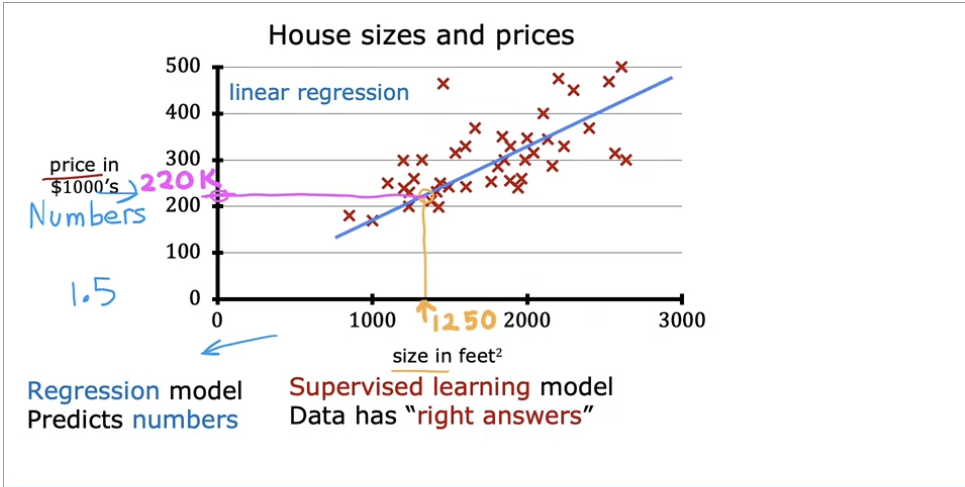
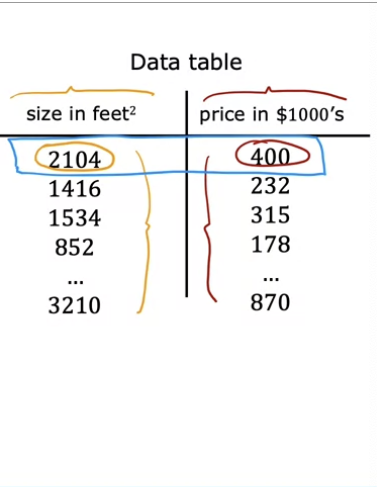
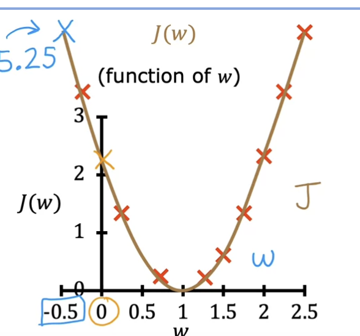
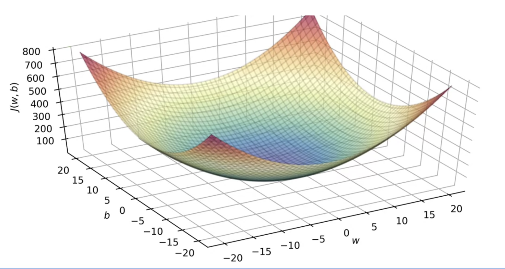
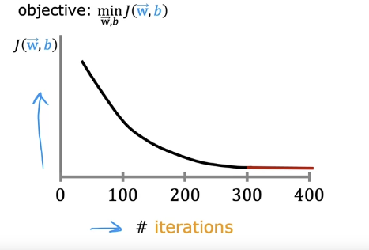
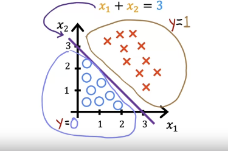
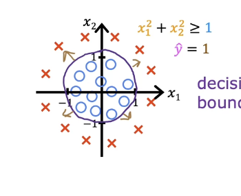
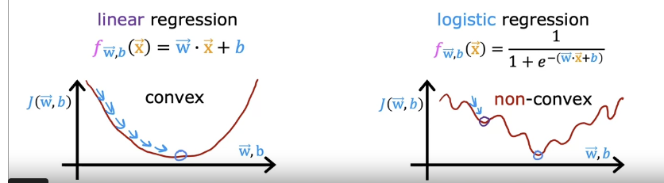
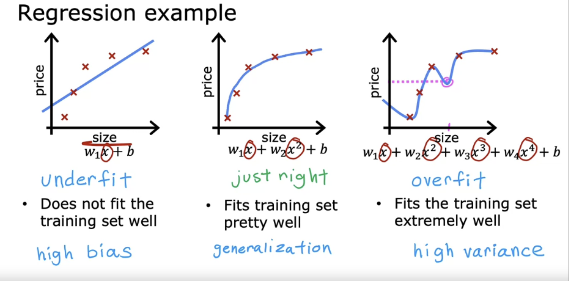

- # Linear Regression
  collapsed:: true
	- Linear regression predicts a number
	- Linear regression is fitting a straight line to your data
	- 
	- Linear regression is supervised learning, where you have a training set that has the "right answers"
	- 
	- ## Terminology
		- $x$ is the input variable or feature
		- $y$ is the output variable or target variable
		- $(x^{(i)}, y^{(i)})$ = ith training example
		- Training set includes input features and output targets
		- $f$ is called the model
		- $\hat{y}$ is notation for a prediction, the estimated value of y
		- $f(x)=\hat{y}$
		- A Linear model with one variable is **univariate linear regression**
		- In model $f_{w,b}(x)$ $w,b$ are called coefficients or weights, also called the parameters of the model
	- ## Linear Regression with One Variable
	  collapsed:: true
		- You feed the training set into the learning algorithm, and it produces a function, which takes a new input and output an estimate or prediction.
		- $f_{w,b}(x)=wx+b$
		- Can represent this with a straight line or curved lines
	- ## Cost Function
		- The cost function evaluates the performance of the model
		- It tells us the difference between the predicted and actual values
		- ### Squared Error Cost Function
			- Most common cost function for regression problems
			- $$J(w,b) = \frac{1}{2n}\sum_{i=1}^{n}(\hat{y}^{(i)}- y^{(i)})^2$$
			- Also can be written as
			- $$J(w,b) = \frac{1}{2n}\sum_{i=1}^{n}(f_{w,b}(x^{(i)}) - y^{(i)})^2$$
		- ### Visualizing
			- If you set b to 0, you can graph the cost function $J(W)$ like this
			- {:height 286, :width 259}
			- It's a 3d graph if you plot cost function $J(w,b)$ Where each 3d point is a choice of w and b
			- 
		- ### Implementation
			- ```python
			  def compute_cost(x, y, w, b): 
			      """
			      Computes the cost function for linear regression.
			      
			      Args:
			        x (ndarray (m,)): Data, m examples 
			        y (ndarray (m,)): target values
			        w,b (scalar)    : model parameters  
			      
			      Returns
			          total_cost (float): The cost of using w,b as the parameters for linear regression
			                 to fit the data points in x and y
			      """
			      # number of training examples
			      m = x.shape[0] 
			      
			      cost_sum = 0 
			      for i in range(m): 
			          f_wb = w * x[i] + b   
			          cost = (f_wb - y[i]) ** 2  
			          cost_sum = cost_sum + cost  
			      total_cost = (1 / (2 * m)) * cost_sum  
			  
			      return total_cost
			  ```
			-
	- ## Gradient Descent
		- Update $w$, by taking the current w and update it a small amount $\alpha$
		- $$w=w-\alpha\frac{\partial}{\partial w}J(w,b)$$
		- Do the same for b
		- $$b=b-\alpha\frac{\partial}{\partial b}J(w,b)$$
		- $\frac{\partial}{\partial w}J(w,b)$ is the partial derivative (from calculus) of the cost function $J$ with respect to w
		- The learning rate $\alpha$ is usually a small positive number between 0 and 1, for example .01
		- Alpha controls how big of a step you take down hill (in the 3d diagram)
		- For the gradient descent algorithm, you repeat both these equations until they converge
		- Converges means you reach a point at the local minimum where w and b no longer change with each additional step you take
		- Update both the equations simultaneously
		- ### Gradient Descent for Linear Regression
			- $$w=w-\alpha  \frac{1}{n}\sum_{i=1}^{n}(f_{w,b}(x^{(i)}) - y^{(i)})x^{(i)}$$
				-
			- $$b=b-\alpha\frac{1}{n}\sum_{i=1}^{n}(f_{w,b}(x^{(i)}) - y^{(i)})$$
		- ### Compute Gradient Implementation
			- ```python
			  def compute_gradient(x, y, w, b): 
			      """
			      Computes the gradient for linear regression 
			      Args:
			        x (ndarray (m,)): Data, m examples 
			        y (ndarray (m,)): target values
			        w,b (scalar)    : model parameters  
			      Returns
			        dj_dw (scalar): The gradient of the cost w.r.t. the parameters w
			        dj_db (scalar): The gradient of the cost w.r.t. the parameter b     
			       """
			      
			      # Number of training examples
			      m = x.shape[0]    
			      dj_dw = 0
			      dj_db = 0
			      
			      for i in range(m):  
			          f_wb = w * x[i] + b 
			          dj_dw_i = (f_wb - y[i]) * x[i] 
			          dj_db_i = f_wb - y[i] 
			          dj_db += dj_db_i
			          dj_dw += dj_dw_i 
			      dj_dw = dj_dw / m 
			      dj_db = dj_db / m 
			          
			      return dj_dw, dj_db
			  ```
		- ### Gradient Descent Implementation
			- ```python
			  def gradient_descent(x, y, w_in, b_in, alpha, num_iters, cost_function, gradient_function): 
			      """
			      Performs gradient descent to fit w,b. Updates w,b by taking 
			      num_iters gradient steps with learning rate alpha
			      
			      Args:
			        x (ndarray (m,))  : Data, m examples 
			        y (ndarray (m,))  : target values
			        w_in,b_in (scalar): initial values of model parameters  
			        alpha (float):     Learning rate
			        num_iters (int):   number of iterations to run gradient descent
			        cost_function:     function to call to produce cost
			        gradient_function: function to call to produce gradient
			        
			      Returns:
			        w (scalar): Updated value of parameter after running gradient descent
			        b (scalar): Updated value of parameter after running gradient descent
			        J_history (List): History of cost values
			        p_history (list): History of parameters [w,b] 
			        """
			      
			      # An array to store cost J and w's at each iteration primarily for graphing later
			      J_history = []
			      p_history = []
			      b = b_in
			      w = w_in
			      
			      for i in range(num_iters):
			          # Calculate the gradient and update the parameters using gradient_function
			          dj_dw, dj_db = gradient_function(x, y, w , b)     
			  
			          # Update Parameters using equation (3) above
			          b = b - alpha * dj_db                            
			          w = w - alpha * dj_dw                            
			  
			          # Save cost J at each iteration
			          if i<100000:      # prevent resource exhaustion 
			              J_history.append( cost_function(x, y, w , b))
			              p_history.append([w,b])
			          # Print cost every at intervals 10 times or as many iterations if < 10
			          if i% math.ceil(num_iters/10) == 0:
			              print(f"Iteration {i:4}: Cost {J_history[-1]:0.2e} ",
			                    f"dj_dw: {dj_dw: 0.3e}, dj_db: {dj_db: 0.3e}  ",
			                    f"w: {w: 0.3e}, b:{b: 0.5e}")
			   
			      return w, b, J_history, p_history #return w and J,w history for graphing
			  ```
			-
- # Multiple Linear Regression
  collapsed:: true
	- Extends linear regression to handle multiple input features
	- Instead of predicting the size of the house just based on size, we use number of bedrooms, floor, age, etc
	- 
	- ## Notation
		- $x_j$ shows the jth feature, for example $x_1$ $x_2$, etc.
		- $\vec{x}^{(i)}$ shows all the features of the ith training example
			- Ex. $\vec{x}^{(2)}=\begin{bmatrix}1416 & 3 &2 &40 \end{bmatrix}$ in the example above
		- In single linear regression, Previously $f_{w,b}(x)=wx+b$
		- In multiple linear regression: $f_{w,b}(x)=w_1x_1 + w_2x_2 + w_3x_3 + b$
		- ### Simpler notation:
			- $\vec{w}=\begin{bmatrix}w_1 & w_2 & w_3 & ... & w_n \end{bmatrix}$
			- $\vec{x}=\begin{bmatrix}x_1 & x_2 & x_3 & ... & x_n \end{bmatrix}$
			- $f_{\vec{w},b}=(\vec{x})=\vec{w} \cdot \vec{x}$
			- $\cdot$ is dot product from linear algebra
	- We can use vectorization to speed up multiplication
	- Using a for loop to multiple is slow
	- ```python
	  f=0
	  for j in range(0,n):
	    f = f + w[j] * x[j]
	  f = f + b
	  ```
	- Instead we can use `f=np.dot(w,x) + b`
	- ### Predict
		- ```python
		  def predict(x, w, b): 
		      """
		      single predict using linear regression
		      Args:
		        x (ndarray): Shape (n,) example with multiple features
		        w (ndarray): Shape (n,) model parameters   
		        b (scalar):             model parameter 
		        
		      Returns:
		        p (scalar):  prediction
		      """
		      p = np.dot(x, w) + b     
		      return p  
		  ```
	- ## Cost Function
		- Looks similar to single linear regression but $\mathbf{w}$ and $\mathbf{x}^{(i)}$ are vectors rather than scalars supporting multiple features.
		- $$J(\mathbf{w},b) = \frac{1}{2m} \sum\limits_{i = 0}^{m-1} (f_{\mathbf{w},b}(\mathbf{x}^{(i)}) - y^{(i)})^2 $$
		- where
		- $$ f_{\mathbf{w},b}(\mathbf{x}^{(i)}) = \mathbf{w} \cdot \mathbf{x}^{(i)} + b$$
		- ### Implementation
			- ```python
			  def compute_cost(X, y, w, b): 
			      """
			      compute cost
			      Args:
			        X (ndarray (m,n)): Data, m examples with n features
			        y (ndarray (m,)) : target values
			        w (ndarray (n,)) : model parameters  
			        b (scalar)       : model parameter
			        
			      Returns:
			        cost (scalar): cost
			      """
			      m = X.shape[0]
			      cost = 0.0
			      for i in range(m):                                
			          f_wb_i = np.dot(X[i], w) + b           #(n,)(n,) = scalar (see np.dot)
			          cost = cost + (f_wb_i - y[i])**2       #scalar
			      cost = cost / (2 * m)                      #scalar    
			      return cost
			  ```
	- ## Gradient Descent
		- $$\begin{align*} \text{repeat}&\text{ until convergence:} \; \lbrace \newline\;
		  & w_j = w_j -  \alpha \frac{\partial J(\mathbf{w},b)}{\partial w_j}  \; & \text{for j = 0..n-1}\newline
		  &b\ \ = b -  \alpha \frac{\partial J(\mathbf{w},b)}{\partial b}  \newline \rbrace
		  \end{align*}$$
		- n is number of features
		- Update both simultaneously, in the same step of the loop
		- $$\frac{\partial J(\mathbf{w},b)}{\partial w_j}  = \frac{1}{m} \sum\limits_{i = 0}^{m-1} (f_{\mathbf{w},b}(\mathbf{x}^{(i)}) - y^{(i)})x_{j}^{(i)}$$
		- $$\frac{\partial J(\mathbf{w},b)}{\partial b}  = \frac{1}{m} \sum\limits_{i = 0}^{m-1} (f_{\mathbf{w},b}(\mathbf{x}^{(i)}) - y^{(i)}) $$
	-
	- ## Implementation
		- ### Gradient
			- ```python
			  def compute_gradient(X, y, w, b): 
			      """
			      Computes the gradient for linear regression 
			      Args:
			        X (ndarray (m,n)): Data, m examples with n features
			        y (ndarray (m,)) : target values
			        w (ndarray (n,)) : model parameters  
			        b (scalar)       : model parameter
			        
			      Returns:
			        dj_dw (ndarray (n,)): The gradient of the cost w.r.t. the parameters w. 
			        dj_db (scalar):       The gradient of the cost w.r.t. the parameter b. 
			      """
			      m,n = X.shape           #(number of examples, number of features)
			      dj_dw = np.zeros((n,))
			      dj_db = 0.
			  
			      for i in range(m):                             
			          err = (np.dot(X[i], w) + b) - y[i]   
			          for j in range(n):                         
			              dj_dw[j] = dj_dw[j] + err * X[i, j]    
			          dj_db = dj_db + err                        
			      dj_dw = dj_dw / m                                
			      dj_db = dj_db / m                                
			          
			      return dj_db, dj_dw
			  ```
	- ### Gradient Descent
		- ```python
		  def gradient_descent(X, y, w_in, b_in, cost_function, gradient_function, alpha, num_iters): 
		      """
		      Performs batch gradient descent to learn w and b. Updates w and b by taking 
		      num_iters gradient steps with learning rate alpha
		      
		      Args:
		        X (ndarray (m,n))   : Data, m examples with n features
		        y (ndarray (m,))    : target values
		        w_in (ndarray (n,)) : initial model parameters  
		        b_in (scalar)       : initial model parameter
		        cost_function       : function to compute cost
		        gradient_function   : function to compute the gradient
		        alpha (float)       : Learning rate
		        num_iters (int)     : number of iterations to run gradient descent
		        
		      Returns:
		        w (ndarray (n,)) : Updated values of parameters 
		        b (scalar)       : Updated value of parameter 
		        """
		      
		      # An array to store cost J and w's at each iteration primarily for graphing later
		      J_history = []
		      w = copy.deepcopy(w_in)  #avoid modifying global w within function
		      b = b_in
		      
		      for i in range(num_iters):
		  
		          # Calculate the gradient and update the parameters
		          dj_db,dj_dw = gradient_function(X, y, w, b)   ##None
		  
		          # Update Parameters using w, b, alpha and gradient
		          w = w - alpha * dj_dw               ##None
		          b = b - alpha * dj_db               ##None
		          print(w)
		          # Save cost J at each iteration
		          if i<100000:      # prevent resource exhaustion 
		              J_history.append( cost_function(X, y, w, b))
		  
		          # Print cost every at intervals 10 times or as many iterations if < 10
		          if i% math.ceil(num_iters / 10) == 0:
		              print(f"Iteration {i:4d}: Cost {J_history[-1]:8.2f}   ")
		          
		      return w, b, J_history #return final w,b and J history for graphing
		  ```
	- ## Feature Scaling
		- Can scale features to values -1 to 1
		- ### Mean Normalization
			- $M_1$ is the mean of $x_1$
			- $$x_1=\frac{x_1-M_1}{max-min}$$
	- ## Convergence
		- Gradient descent is meant to find parameters w and b to minimize the cost function J
		- It should go steadily down every iteration
		- 
		- If J increases, the learning rate $\alpha$ may be too large
- # Logistic Regression
	- Linear regression predicts a number, but logistic regression predicts 1 or 0
	- For example, is email spam? Or is tumor malignant?
	- ## Sigmoid function
		- $g(z)=\frac{1}{1+e^{-z}}$ which ranges between 0 and 1
		- 
		- Large numbers are about 1 and small negative numbers are about 0
		- When z=0, g(z) is about .5
		- To use the sigmoid function when predicting, we pass the value into it
		- $f_{\vec{w},b}(\vec{x})$
		- Store this function in in $z$ where $z=\vec{w} \cdot \vec{x} + b$
		- Next step, pass value of z to sigmoid function
		- $f_{\vec{w},b}(\vec{x})=\frac{1}{1+e^{-(\vec{w} \cdot \vec{x} + b)}}$
		- This function is called logistic regression
		- This function inputs  the feature x, and outputs a number between 0 and 1
		- Think of it as the probability the output will be 1
		- If you are predicting tumor, and the output is .7, then it means there's a 70% chance of being 1
		- ### Sigmoid Implementation
			- ```python
			  def sigmoid(z):
			    """
			    Compute the sigmoid of z
			    Args:
			        z (ndarray): A scalar, numpy array of any size.
			    Returns:
			        g (ndarray): sigmoid(z), with the same shape as z
			         
			    """
			  	g = 1/(1+np.exp(-z))
			   
			  	return g
			  ```
	- ## Decision Boundary
		- Use the logistic regression model to make a prediction
		- You can say it predicts true when the threshold is greater than .5
		- When is $g(z)$ /  $f_{\vec{w},b}(\vec{x})$ greater than .5? when $z$ is greater than 0
		- When is z greater than 0? Whenever $z=\vec{w} \cdot \vec{x} + b > 0$
		- Lets assume weights w are 1 and b is -3
		- $z=x_1+x_2-3=0$
		- $x_1+x_2 = 3$
		- Plotting this line is the decision boundary
		- 
		- You can have non linear decision boundaries too
		- ${x_1}^2+{x_2}^2 = 1$
		- 
		-
	- ## Cost Function
		- Plotting the cost function for logistic regression shows a non convex graph
		- This makes gradient descent difficult because you can get stuck in local minima
		- 
		- ### Loss function for logistic regression
			- $$loss(f_{\mathbf{w},b}(\mathbf{x}^{(i)}), y^{(i)}) = \begin{cases}
			  -\log\left(f_{\mathbf{w},b}\left( \mathbf{x}^{(i)} \right) \right) & \text{if $y^{(i)}=1$}\\
			  -\log \left( 1 - f_{\mathbf{w},b}\left( \mathbf{x}^{(i)} \right) \right) & \text{if $y^{(i)}=0$}
			    \end{cases}$$
		- ### Simplified Loss function
			- $$loss(f_{\mathbf{w},b}(\mathbf{x}^{(i)}), y^{(i)}) = -y^{(i)} \log\left(f_{\mathbf{w},b}\left( \mathbf{x}^{(i)} \right) \right) - \left( 1 - y^{(i)}\right) \log \left( 1 - f_{\mathbf{w},b}\left( \mathbf{x}^{(i)} \right) \right) $$
		- ### Full Cost Function
			- $$ J(\mathbf{w},b) =- \frac{1}{m} \sum_{i=0}^{m-1} y^{(i)} \log\left(f_{\mathbf{w},b}\left( \mathbf{x}^{(i)} \right) \right) +\left( 1 - y^{(i)}\right) \log \left( 1 - f_{\mathbf{w},b}\left( \mathbf{x}^{(i)} \right) \right)$$
		- ### Cost function Implementation
			- ```python
			  def compute_cost_logistic(X, y, w, b):
			    """
			    Computes cost
			  - Args:
			      X (ndarray (m,n)): Data, m examples with n features
			      y (ndarray (m,)) : target values
			      w (ndarray (n,)) : model parameters  
			      b (scalar)       : model parameter
			      
			    Returns:
			      cost (scalar): cost
			    """
			  m = X.shape[0]
			    cost = 0.0
			    for i in range(m):
			        z_i = np.dot(X[i],w) + b
			        f_wb_i = sigmoid(z_i)
			        cost +=  -y[i]*np.log(f_wb_i) - (1-y[i])*np.log(1-f_wb_i)
			             
			    cost = cost / m
			    return cost
			  ```
	- ## Gradient Descent
		- Same as before, but use the logistic regression function (sigmoid) instead of the linear regression function
- # Regularization
	- Overfitting is when the model fits the training data perfectly, but doesn't do well on unseen data
	- 
	- Regularization tries to make the weights small to avoid overfitting
	- You could eliminate features to avoid overfitting, but you can shrink them with regularization instead
	- To penalize features, we can add a regularization parameter to the cost function
	- Lambda is a small ish number like 1 or 10
	- $$J(\vec{w},b) = \frac{1}{2m} \sum_{i=1}^{m} (f_{\vec{w},b}(\vec{x}^{(i)}) - y^{(i)})^2 + \frac{\lambda}{2m} \sum_{j=1}^{n} w_j^2$$
	- ## Regularized Linear Regression
		- This is the cost function for linear regression
			- $$J(\vec{w},b) = \frac{1}{2m} \sum_{i=1}^{m} (f_{\vec{w},b}(\vec{x}^{(i)}) - y^{(i)})^2 + \frac{\lambda}{2m} \sum_{j=1}^{n} w_j^2$$
		- New gradient descent algorithms with regularization
			- $$\frac{\partial}{\partial w}J(w,b)  = \frac{1}{n}\sum_{i=1}^{n}(f_{w,b}(x^{(i)}) - y^{(i)})x^{(i)} + \frac{\lambda}{m}w_j$$
			- so during regularized gradient descent, we multiply wj by this .9998, which shrinks wj by a bit on every iteration
	- ## Regularized Logistic Regression
		- Cost function with regularization
			- $$ J(\mathbf{w},b) =- \frac{1}{m} \sum_{i=0}^{m-1} [y^{(i)} \log\left(f_{\mathbf{w},b}\left( \mathbf{x}^{(i)} \right) \right) +\left( 1 - y^{(i)}\right) \log \left( 1 - f_{\mathbf{w},b}\left( \mathbf{x}^{(i)} \right) \right)] + \frac{\lambda}{2m} \sum_{j=1}^{n} w_j^2$$
		- Gradient descent is the same, but use the sigmoid function instead of linear regression function
	- ## Regularized Cost Implementation
	  collapsed:: true
		- ### Linear Regression
			- ```python
			  def compute_cost_linear_reg(X, y, w, b, lambda_ = 1):
			      """
			      Computes the cost over all examples
			      Args:
			        X (ndarray (m,n): Data, m examples with n features
			        y (ndarray (m,)): target values
			        w (ndarray (n,)): model parameters  
			        b (scalar)      : model parameter
			        lambda_ (scalar): Controls amount of regularization
			      Returns:
			        total_cost (scalar):  cost 
			      """
			  
			      m  = X.shape[0]
			      n  = len(w)
			      cost = 0.
			      for i in range(m):
			          f_wb_i = np.dot(X[i], w) + b                                   #(n,)(n,)=scalar, see np.dot
			          cost = cost + (f_wb_i - y[i])**2                               #scalar             
			      cost = cost / (2 * m)                                              #scalar  
			   
			      reg_cost = 0
			      for j in range(n):
			          reg_cost += (w[j]**2)                                          #scalar
			      reg_cost = (lambda_/(2*m)) * reg_cost                              #scalar
			      
			      total_cost = cost + reg_cost                                       #scalar
			      return total_cost 
			  ```
		- ### Logistic Regression
			- ```python
			  def compute_cost_logistic_reg(X, y, w, b, lambda_ = 1):
			      """
			      Computes the cost over all examples
			      Args:
			      Args:
			        X (ndarray (m,n): Data, m examples with n features
			        y (ndarray (m,)): target values
			        w (ndarray (n,)): model parameters  
			        b (scalar)      : model parameter
			        lambda_ (scalar): Controls amount of regularization
			      Returns:
			        total_cost (scalar):  cost 
			      """
			  
			      m,n  = X.shape
			      cost = 0.
			      for i in range(m):
			          z_i = np.dot(X[i], w) + b                                      #(n,)(n,)=scalar, see np.dot
			          f_wb_i = sigmoid(z_i)                                          #scalar
			          cost +=  -y[i]*np.log(f_wb_i) - (1-y[i])*np.log(1-f_wb_i)      #scalar
			               
			      cost = cost/m                                                      #scalar
			  
			      reg_cost = 0
			      for j in range(n):
			          reg_cost += (w[j]**2)                                          #scalar
			      reg_cost = (lambda_/(2*m)) * reg_cost                              #scalar
			      
			      total_cost = cost + reg_cost                                       #scalar
			      return total_cost                                                  
			  ```
	- ## Regularized Gradient Function
		- ### Linear Regression
			- ```python
			  def compute_gradient_linear_reg(X, y, w, b, lambda_): 
			      """
			      Computes the gradient for linear regression 
			      Args:
			        X (ndarray (m,n): Data, m examples with n features
			        y (ndarray (m,)): target values
			        w (ndarray (n,)): model parameters  
			        b (scalar)      : model parameter
			        lambda_ (scalar): Controls amount of regularization
			        
			      Returns:
			        dj_dw (ndarray (n,)): The gradient of the cost w.r.t. the parameters w. 
			        dj_db (scalar):       The gradient of the cost w.r.t. the parameter b. 
			      """
			      m,n = X.shape           #(number of examples, number of features)
			      dj_dw = np.zeros((n,))
			      dj_db = 0.
			  
			      for i in range(m):                             
			          err = (np.dot(X[i], w) + b) - y[i]                 
			          for j in range(n):                         
			              dj_dw[j] = dj_dw[j] + err * X[i, j]               
			          dj_db = dj_db + err                        
			      dj_dw = dj_dw / m                                
			      dj_db = dj_db / m   
			      
			      for j in range(n):
			          dj_dw[j] = dj_dw[j] + (lambda_/m) * w[j]
			  
			      return dj_db, dj_dw
			  ```
		- ### Logistic Regression
			- ```python
			  def compute_gradient_logistic_reg(X, y, w, b, lambda_): 
			      """
			      Computes the gradient for linear regression 
			   
			      Args:
			        X (ndarray (m,n): Data, m examples with n features
			        y (ndarray (m,)): target values
			        w (ndarray (n,)): model parameters  
			        b (scalar)      : model parameter
			        lambda_ (scalar): Controls amount of regularization
			      Returns
			        dj_dw (ndarray Shape (n,)): The gradient of the cost w.r.t. the parameters w. 
			        dj_db (scalar)            : The gradient of the cost w.r.t. the parameter b. 
			      """
			      m,n = X.shape
			      dj_dw = np.zeros((n,))                            #(n,)
			      dj_db = 0.0                                       #scalar
			  
			      for i in range(m):
			          f_wb_i = sigmoid(np.dot(X[i],w) + b)          #(n,)(n,)=scalar
			          err_i  = f_wb_i  - y[i]                       #scalar
			          for j in range(n):
			              dj_dw[j] = dj_dw[j] + err_i * X[i,j]      #scalar
			          dj_db = dj_db + err_i
			      dj_dw = dj_dw/m                                   #(n,)
			      dj_db = dj_db/m                                   #scalar
			  
			      for j in range(n):
			          dj_dw[j] = dj_dw[j] + (lambda_/m) * w[j]
			  
			      return dj_db, dj_dw  
			  ```