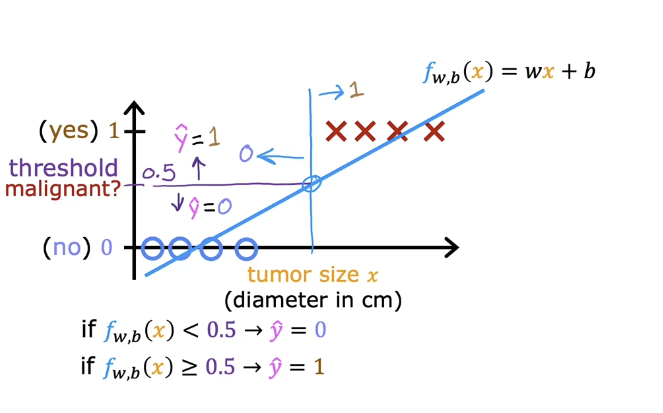
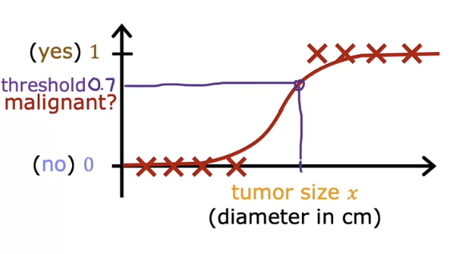
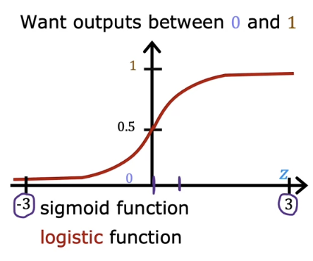
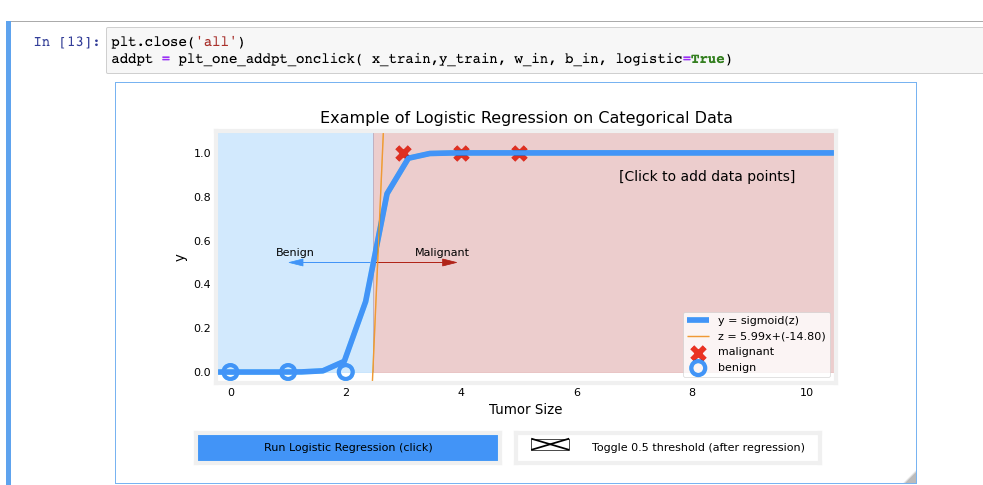

tags:: [[ai]]

- # Classification with logistic regression
	- Linear regression predicts a number
	- Classification is where y can only take on a handful of algorithms
	- Examples of classification problems
		- Is this email Spam? yes/no
		- Is the transaction fraudulent?
	- Binary classification is true/false
	- False is also called negative class, and true is called positive class
	- Consider a training set to determine if a tumor is malignant
	- You could plot your data, make a linear regression line, and a threshold
	- Plotting this, we plot malignant at y=1 and benign at 0
	- If the model outputs a value greater than the threshold value, consider it malignant
	- 
	- If we have outliers to the right, the dividing line, or decision boundary can shift too far right
	- Note: even though the name logistic regression has the word regression in it, it's used for binary classification
	- ## Classification lab
		- One variable vs two variable plot
		- 
		- In the first plot, positive results are red x and at y=1, negative results are blue O's at y=0
		- With linear regression, the values could have been anything, but with logistic regression, it's 0 or 1
		- The second graph shows shows two variables, where y is not available
		- This is when the model takes two things into account, for example, the first one may just look at size
		- A similar plot in linear regression would be 3 dimensional
	- ## Logistic Regression
	  collapsed:: true
		- Logistic regression will fit an s shaped curve.
		- {:height 325, :width 587}
		- ### Sigmoid function
			- Also called logistic function
			- The sigmoid function looks like this, where 0 is in the middle, unlike the last graph
			- 
			- $g(z)=\frac{1}{1+e^{-z}}$ which ranges between 0 and 1
			  id:: 640d5c6c-c03c-4d14-9789-c9af611ba2ab
			- When z is large, g(z) is about 1
			- When z is a small negative number, it's approzamately zero
			- When z=0, g(z) is about .5
			- ### Explaining Sigmoid function
				- remember $f_{\vec{w},b}(\vec{x})$
				- store this in $z$ where $z=\vec{w} \cdot \vec{x} + b$
				- Next step, pass value of z to sigmoid function
				- $g(z)=\frac{1}{1+e^{-z}}$
				- When you put these equations together, you get the logistic regression model
				- Fully expanded out is:
				- $f_{\vec{w},b}(\vec{x})=\frac{1}{1+e^{-(\vec{w} \cdot \vec{x} + b)}}$
				- This function inputs  the feature x, and outputs a number between 0 and 1
			- Think of logistic regression output as the probability the output will be 1
			- If you are predicting tumor, and the output is .7, then it means there's a 70% chance of being 1
			- So there's a 70% chance that it's malignant
			- What is the chance that it's not malignant?
			- It must be zero or one, so the numbers must add up to one: $P(y=0)+P(y=1)=1$
			- You may see this notation when reading about logistic regression
				- $f_{\vec{w},b}(\vec{x})=P(y=1|\vec{x};\vec{w},b)$
				- This means "probability of y=1, given the input feature x, and parameters w and b"
				- The semicolon means w and b are parameters that affect the computation, given the input $\vec{x}$
		-
	- ## Logistic Regression Lab
		- We start by using our linear regression model $f_{\mathbf{w},b}(\mathbf{x}^{(i)}) = \mathbf{w} \cdot  \mathbf{x}^{(i)} + b$, to predict $y$ given $x$
		- Since we're doing classifications, we want our output to be either 0 or 1
		- We can use the sigmoid function to map all input values to values between 0 and 1
		- The sigmoid function formula is $g(z) = \frac{1}{1+e^{-z}}$
		- The input z can be a single scalar value or a vector containing multiple values, and our implementation needs to cover both
		- numpy has a function `exp()` which allows you to calculate the exponential $e^z$ in input array z
			- #### vector input to `exp`
				- ```python
				  # Input is an array. 
				  input_array = np.array([1,2,3])
				  exp_array = np.exp(input_array)
				  #output exp_array = [ 2.72  7.39 20.09]
				  ```
			- #### Scalar input to `exp`
				- ```python
				  # Input is a single number
				  input_val = 1  
				  exp_val = np.exp(input_val)
				  # output exp_val = 2.7182
				  ```
		- ### Sigmoid Implementation
			- ```python
			  def sigmoid(z):
			      """
			      Compute the sigmoid of z
			  
			      Args:
			          z (ndarray): A scalar, numpy array of any size.
			  
			      Returns:
			          g (ndarray): sigmoid(z), with the same shape as z
			           
			      """
			  
			      g = 1/(1+np.exp(-z))
			     
			      return g
			  ```
		- 
		-