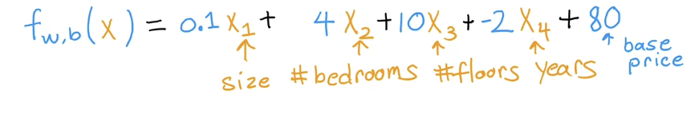

- # Overview
	- Extend linear regression to handle multiple input features.
	- Use vectorization to implement multiple linear regression
	- Use feature scaling, feature engineering, and polynomial regression to improve model training
	- Implement linear regression in code
- # Multiple features
	- [Coursera](https://www.coursera.org/learn/machine-learning/lecture/gFuSx/multiple-features)
	- Originally, we had a single feature x, the size, which we used to predict the price of the house
		- ((63dc7846-f4c2-44d4-8ad2-e1e4fb194d25))
		- What if we had multiple features (variables) to predict the price, such as number of bedrooms, floors, age, etc.
		- 
		- We will use the notation $x_j$ to show the jth feature, for example $x_1$ $x_2$, etc.
		- n is number of features
		- $\vec{x}^{(i)}$ is features of the ith training example, a list of numbers, or a vector. Also called a row vector
		- $\vec{x}^{(2)}=\begin{bmatrix}1416 & 3 &2 &40 \end{bmatrix}$ in the example above
		- ${x_j}^{(i)}$ is the value of feature j in ith training example, ex ${x_3}^{(2)}=2$
		- Previously $f_{w,b}(x)=wx+b$
		- Now, $f_{w,b}(x)=w_1x_1 + w_2x_2 + w_3x_3 + b$
		- 
		- 80 is the base price, assuming no size, bedrooms, etc
		- ## Model with n features
			- Now, $f_{w,b}(x)=w_1x_1 + w_2x_2 + ... + w_nx_n + b$
			- Simpler notation:
			- $\vec{w}=\begin{bmatrix}w_1 & w_2 & w_3 & ... & w_n \end{bmatrix}$
			- $\vec{x}=\begin{bmatrix}x_1 & x_2 & x_3 & ... & x_n \end{bmatrix}$
			- $f_{\vec{w},b}=(\vec{x})=\vec{w} \cdot \vec{x}$
			- $\cdot$ is dot product from linear algebra
- # Vectorization
	- Vectorization allows us to speed up calculations
	- indexing of arrays starts at 1 in linear algebra, use index of 0 in python
	- how do we compute something like this?
	- Now, $f_{w,b}(x)=w_1x_1 + w_2x_2 + ... + w_nx_n + b$
	- Without vectorization, like multiplying everying in a for loop, it's slow
	- ```python
	  f=0
	  for j in range(0,n):
	    f = f + w[j] * x[j]
	  f = f + b
	  ```
	- With vectorization we can use
	- `f=np.dot(w,x) + b`
	- This will run much faster, and the code is shorter
	- It's faster, because it's parallelized
	- ## Gradient Descent
		- `w=np.array([.5, 1.3, ... 3.5])`
		- `d=np.array([.3,.2, ... , 0.4])`
		- compute $w_j=w_j-.1d_j$ for j=1 through 16
		- (.1 is the learning rate)
		- Without vectorization, you would have to update all the weights one at a time in for loops
		- with vectorization, you can update all of them in parallel
- ((6406f1eb-83d3-41a7-8717-29633babc14a))
-