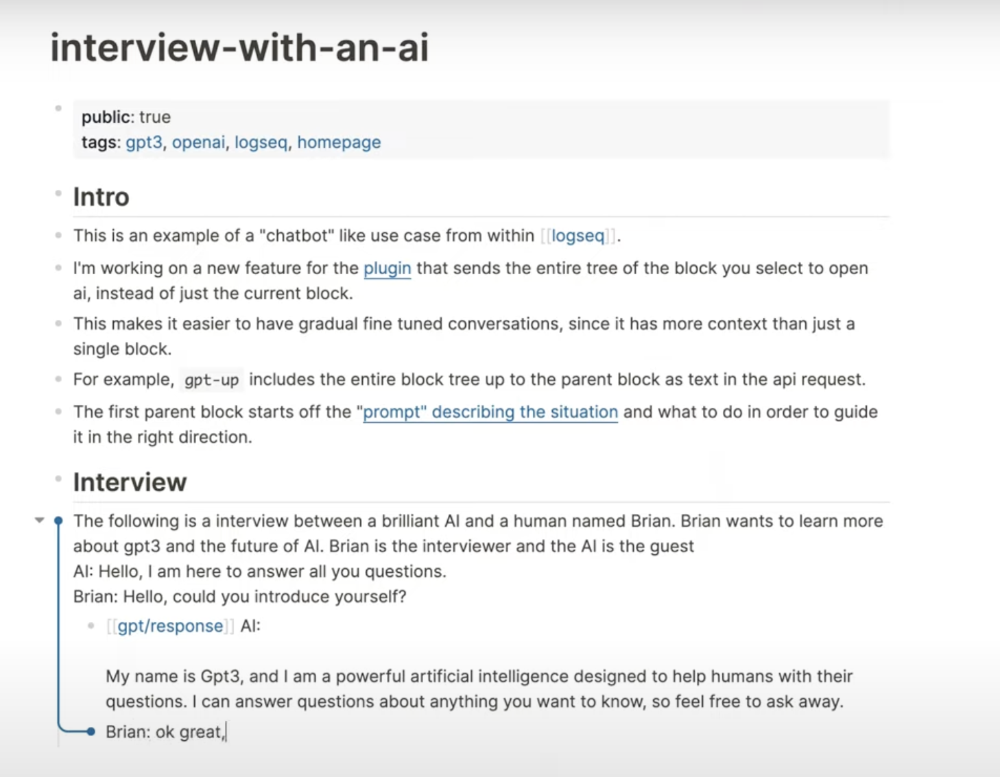

public:: true
name:: Intro to using AI to take notes
categories:: [[newsletter]]
title:: newsletter/issue/2
type:: [[newsletter]]
tags:: [[gpt3]] [[ML]] [[logseq-openai-plugin]] 
start-date:: [[Jun 15th, 2022]]
date:: 2022-06-19
sent-date:: [[Jun 19th, 2022]]
followers:: 450
categories:: [[newsletter]]
newsletter-subscribers:: 30
coverimage:: /assets/Screenshot_2022-12-24_at_9.42.28_PM_1671954212017_0.png
description:: Feedback on my Logseq OpenAI plugin and sharing examples of how people are using it.

- [Sign up for the newsletter here](https://newsletter.briansunter.com)
- [About the newsletter]([[newsletter]])
- 
- ## Summary and Reflection 🤔
	- I couldn't be happier about the positive reactions to my new projects and newsletter.
	- Last week I released a small plugin for the Logseq text editor, and I've been getting a lot of positive feedback on it from all over the world.
	- [Logseq](https://docs.logseq.com/#/page/Contents) is an open-source note taking application.
	- It allows you to write "plugins" or "apps" for the text editor you can release for others.
	- [A new type of AI or "Artificial Intelligence" called GPT3](https://beta.openai.com/) can be used to write notes. It can write your book report if you ask it to "Write a study guide to Hamlet."
	- I released a plugin for an AI assistant that can write articles and answer questions for you.
	- This technology is brand new and much better than Alexa, Siri, or Google Assistant.
	- One of my favorite things about being a coder is thinking of an idea and building a tool for myself that solves a problem. Once I make a helpful tool, it's just a little extra effort to put it online and share it with the world. I'm trying to make more of my projects and writing publicly available
	- The plugin is called [logseq-gpt3-openai](https://github.com/briansunter/logseq-plugin-gpt3-openai) and lets you send commands to this powerful AI system from inside your text editor. It can do a lot of things like write and summarize articles. It's pretty easy to get started. [Download it in the Logseq marketplace](https://github.com/logseq/logseq/releases), and let me know what you think!
	- In this newsletter, I'll share some of the community's reactions to my new AI plugin, some thoughts on productivity, a few interesting reads from the week, and what I have in mind for the next newsletter issue.
- # Updates 🆕
	- Here is some feedback for users on Twitter
- # Feedback on [[logseq openai]] plugin
	- This user summed up how I feel perfectly. Now that AI is part of my workflow, I don't want to give it up.
	- As far as I know, there is nothing on the market similar to OpenAI's GPT3
	- {{twitter https://twitter.com/irace/status/1535056205441277962?s=20&t=6_gBffCI-IZwmuMN00K3zw}}
	- AI and humans will work together more closely and sooner than we thought. We're basically getting "autocomplete for everything"
	- {{twitter https://twitter.com/Daniel_Van_Zant/status/1535985529627484160?s=20&t=6hRp9IUmp5MCnEKsSBFp9Q}}
	- Dentists love the plugin. I wonder how/if my own dentist stays up to date on the latest cutting-edge dental research 🤔
	- {{twitter https://twitter.com/zeno_dox/status/1533923814899318785?s=20&t=8es93AjYp441ojBGa1pvIg}}
	- {{twitter https://twitter.com/wirtzdan/status/1535136325527080960?s=20&t=6hRp9IUmp5MCnEKsSBFp9Q}}
	- Google docs and Microsoft word are about to get smart. Clippy is going to be a genius soon.
	- {{twitter https://twitter.com/sceeto/status/1535235258756521984?s=20&t=1khMUBE4SD5AbjLApsTncQ}}
	- I thought this was funny. I usually ask the AI questions. But this user was instead getting the AI to ask him questions. I've tried making philosophical content like this as well, and it's fascinating to see what the AI thinks about things like the meaning of life (even though it's fancy autocomplete)
	- {{twitter https://twitter.com/teo_IDT/status/1534447943503302656?s=20&t=6_gBffCI-IZwmuMN00K3zw}}
	- {{twitter https://twitter.com/ilmarsV/status/1534466432620281858?s=20&t=6hRp9IUmp5MCnEKsSBFp9Q}}
	- This user told me they found the plugin useful for helping them understand code in an obscure language. You can just ask it to explain any code in english.
	- {{twitter https://twitter.com/haveanicedavid/status/1534950374779392009?s=20&t=bKUMdD4wAsLKwoo7aWO_3g }}
		- @Bsunter @logseq @kubernetesio Loving this plugin! I recently worked on a feature involving a data syntax i'm not familiar with (TTL). Pasting a code snippet (with "explain this code" at the end) produced a summary that was actually helpful! https://t.co/SvAKVraoCV Jun 9th, 2022, [[David Daniel]]
	- A feature feature I haven't released yet made it into one of the videos. For now type `Summarize Text:` instead
	- {{twitter https://twitter.com/shezthedev/status/1534498138932842498?s=20&t=wjCfj0kVNEa5jY6jjbkuZw}}
	- People seem to be having a lot of fun with it. This AI tech just became available to the general public 6 months ago, so a lot of people are trying it for the first time through this plugin. No consumer product uses GPT3 yet that I know of.
	- {{twitter https://twitter.com/Ashish_situ/status/1534399620230545408?s=20&t=1khMUBE4SD5AbjLApsTncQ}}
	- {{twitter https://twitter.com/WuPingJu/status/1537072229091246080?s=20&t=6hRp9IUmp5MCnEKsSBFp9Q}}
	- {{twitter https://twitter.com/Aaron3lias/status/1537201417022083072?s=20&t=1khMUBE4SD5AbjLApsTncQ}}
	- Putting your work on the internet makes you realize how big the world is. I love seeing the international developer community try out the plugin. You know your idea is making the rounds when you see your name surrounded by mandarin Chinese.
	- https://notes.pinchlime.com/snapshots/what-i-tried-today/tried-to-use-logseq-plugin-gpt3-openai/
	- {:height 293, :width 501}
	- {{twitter https://twitter.com/gpbollbach/status/1537146633116340226?s=20&t=bJ6a_lPaQbplV1apuUnSBw}}
- # Productivity Toolkit 🛠️
	- In this section, I'll share a productivity tip I've learned recently.
	- One of my favorite productivity techniques is the [[daily highlight productivity technique]]
	- For a long time, I always had a sinking feeling I didn't accomplish "enough" at the end of the day.
	- Eventually, I realized I never even defined what "enough" was.
	- Now, I pick one thing I want to accomplish in the morning.
	- This technique helps me focus on what will truly move my life forward and end each day with a sense of accomplishment.
	- See my post on the subject here: [[daily highlight productivity technique]]
- # Brain Food 🧠
- ## Quote
	- The Last Question is a short story by Isaac Asimov.
	- It's a timely short story about asking AI the answers to life's biggest questions. This story shows up on the front page of Hacker News almost every year, and I thought it was very thought-provoking. It feels relevant because a Google engineer who recently asked their new AI, "Are you sentient?"
	- Isaac Asimov said it was his favorite short story he’d written.
	- > "Ask Multivac."
	       "You ask Multivac. I dare you. Five dollars says it can't be done."  
	   Adell was just drunk enough to try, just sober enough to be able to phrase the necessary  
	   symbols and operations into a question which, in words, might have corresponded to this: ...
		- [The Last Question by Isaac Asimov](https://www.physics.princeton.edu/ph115/LQ.pdf)
			- [(Read by Leonard Nimoy)](https://www.youtube.com/watch?v=8XOtx4sa9k4)
			- [Original Scans](https://archive.org/details/Science_Fiction_Quarterly_New_Series_v04n05_1956-11_slpn/page/n50/mode/1up?view=theater)
			- Related: [The Last Answer](https://highexistence.com/the-last-answer-short-story/)
- ## Link of the week
	- I remember when I first moved to San Francisco, and Uber was doing a "match muni" promotion, where you could take an Uber anywhere in the city for $2.25 (same as the "muni" bus)
	- I would not be surprised if Uber went back to $50 a ride after more tech money dries up, like a traditional taxi.
	- We can also expect companies to go evil and try to extract more value from us from ads
	- I'll expect to see more ads on youtube, facebook, instagram, tiktok, etc and prices of video subscriptions to go up
	- Maybe it will be a good excuse to find other hobbies than watching Netflix and ordering Uber Eats.
	- {{twitter https://twitter.com/Bsunter/status/1537546979357564928?s=20&t=eRsF1J4_-RviTIiOQkYDBw}}
- # Analytics 📈
	- Twitter Analytics are fun. I am the ultimate late-comer to twitter and started using it for the first time this month. Last month I had -1 new followers. This month I gained around 200 so far. I had a few "hit" logseq plugins, so I don't expect this growth to continue forever, but it's fun to see the numbers go up.
	- 
- # Outro
	- Thanks for reading! This week I announced my new plugin and shared some feedback from the community.
	- Next week I plan on writing about some productivity techniques in Logseq and how I manage "projects" in my life, using this newsletter as an example.
	- Check out the [[newsletter-roadmap]] to see what I have in mind for future issues. Let me know on [twitter @bsunter](https://twitter.com)
- {{embed [[website-outro]]}}