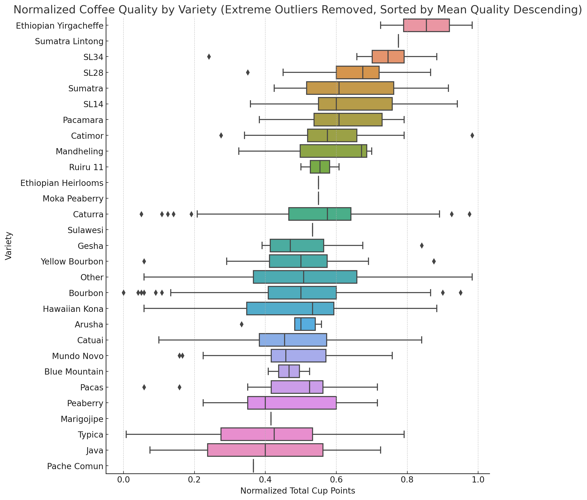
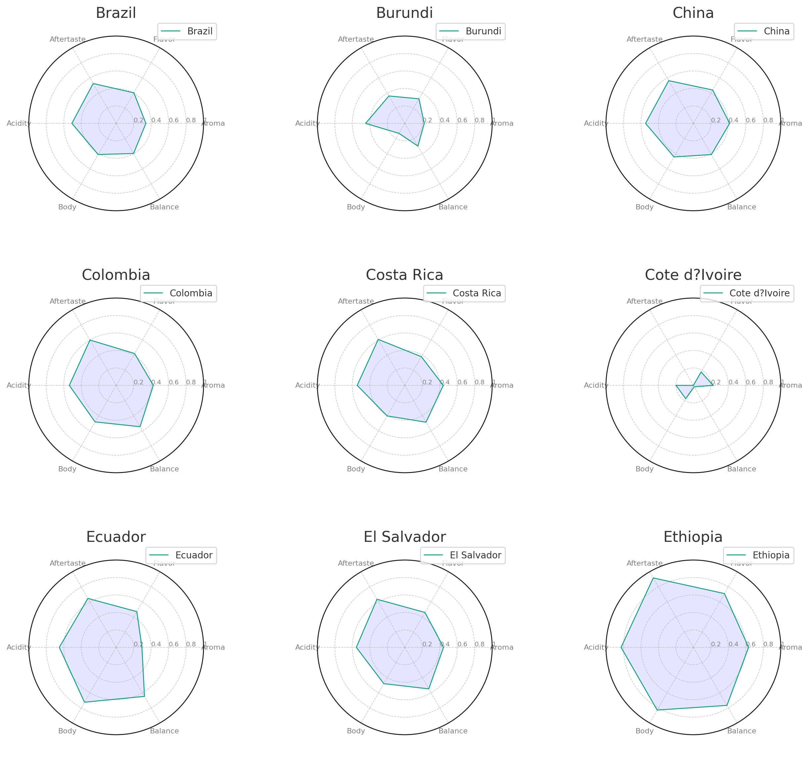

public:: true
tags:: [[newsletter]] [[logseq]] [[gpt]] [[AI]] 
categories:: [[newsletter]] 
coverimage:: /assets/image_1690426630484_0.png
date:: 2023-07-27
description:: Uploading a dataset about coffee and using ChatGPT to automatically clean the data, understand insights, and generate cool charts.
blogtitle:: Analyzing Coffee Quality with the ChatGPT Code Interpreter

- One of my favorite new features of [ChatGPT](https://chat.openai.com/) is the "[code interpreter](https://openai.com/blog/chatgpt-plugins#code-interpreter)," which allows ChatGPT to execute code and read data files you upload.
- You can upload a data file, then ask ChatGPT questions, and ChatGPT will write code to analyze the data and create visualizations based on your questions. Now you can produce excellent visualizations based on data with minimal effort.
- It's surprisingly intelligent, where ChatGPT will look at the structure of your data, automatically clean it, and decide how to analyze it.
- I found an interesting dataset on Kaggle called ["Coffee Quality Data"](https://www.kaggle.com/datasets/fatihb/coffexe-quality-data-cqi). It contains coffee reviews, with 100-point scores, along with information about the coffee, such as its country of origin, altitude, preparation method, and variety, and information about its flavor profile, such as acidity and sweetness.
- I'm interested in examining this dataset to answer questions like: "Which countries produce the best coffee?" and "What are the differences in flavor profiles between countries and preparation methods?
- 
- ## Loading and Cleaning Data
	- One of my favorite features of the ChatGPT code interpreter is its ability to clean data and do a preliminary analysis quickly.
	- The coffee dataset is of decent quality but has quite a few issues, like missing data, poorly formatted data, and low sample sizes for some data. This is usually a manual, laborious process and is inconvenient for quick exploratory analysis. The ChatGPT code interpreter does an excellent job of automatically detecting the most critical data and fixing problems.
	- It starts by loading the dataset and printing it to discover the most important columns of data.
	- ### Load, print, and preliminary analysis
		- ```python
		  # First, let's load and inspect the dataset
		  import pandas as pd
		  
		  # Load the data
		  df = pd.read_csv('/mnt/data/coffee_data.csv')
		  
		  # Display the first few rows of the dataframe
		  df.head()
		  ```
		- #+BEGIN_QUOTE
		  The dataset contains 44 columns. Here are a few key ones:
		  Species: The species of the coffee bean.
		  Owner: The owner of the coffee farm.
		  Country.of.Origin: The country where the coffee bean was grown.
		  Farm.Name: The name of the coffee farm.
		  Altitude: The altitude at which the coffee was grown.
		  Region: The region where the coffee was grown.
		  Processing.Method: The method used to process the coffee beans.
		  Aroma, Flavor, Aftertaste, Acidity, Body, Balance, Uniformity, Clean.Cup, Sweetness, Cupper.Points: These are the scores given to the coffee on various attributes by a professional coffee taster (cupper).
		  #+END_QUOTE
		- > Our target variable would be Total.Cup.Points as we are trying to find out what makes the best coffee. The higher the total cup points, the better the coffee is considered to be.
		- > For our analysis, we'll mainly focus on the factors that might affect the coffee quality, such as Country.of.Origin, Variety, Processing.Method, Altitude, and sensory profiles (Aroma, Flavor, Aftertaste, Acidity, Body, Balance).
	- ### Missing Values
		- It checks for missing values and decides how to handle them.
		- ```python
		  # Descriptive statistics
		  desc_stats = df.describe(include='all')
		  
		  # Checking for missing values
		  missing_values = df.isnull().sum()
		  
		  desc_stats, missing_values
		  ```
		- #+BEGIN_QUOTE
		  The dataset has some missing values in several columns:
		  
		  Owner: 7 missing values
		  Country.of.Origin: 1 missing value
		  Farm.Name: 356 missing values
		  Lot.Number: 1041 missing values 
		  #+END_QUOTE
		- It will drop columns with a high amount of missing data or come up with values for the missing data, such as median and mode, where appropriate.
- ## Analyzing Data
	- It starts with a quick analysis to show the distribution of the most important data points.
	- ### Distribution of Ratings
		- > The left plot shows the distribution of the total cup points, representing the coffee's overall quality. The distribution is approximately normal, with a slight skew towards higher scores, indicating that most of the coffee in this dataset is of good quality.
		- 
	- ### Initial Analysis
		- Next, ChatGPT does a more detailed analysis by automatically graphing what it thinks are the most important pieces of data.
		- #+BEGIN_QUOTE
		  Next, let's examine the relationships between coffee quality (`Total.Cup.Points`) and some potentially influential factors (`Country.of.Origin`, `Variety`, `Processing.Method`, `altitude_mean_meters`, and sensory profiles). We will use box plots to visualize these relationships. For the sake of clarity, we'll only consider the top 5 categories for `Country.of.Origin`, `Variety`, and `Processing.Method`. For sensory profiles, we'll use scatter plots to see the correlation with `Total.Cup.Points`.
		  #+END_QUOTE
		- 
		- > The visualizations suggest that:
		- > The highest average coffee quality is from the United States, Papua New Guinea, Ethiopia, Japan, and Kenya.
		- > The Yirgacheffe variety and the "Pulped natural / honey" processing method are associated with superior coffee quality.
		- > Aroma and flavor scores have a strong positive correlation with coffee quality.
		  Altitude does not exhibit a clear correlation with coffee quality.
	- ## Loading Data and Removing Outliers
		- The graph above was generated by this code, written by ChatGPT:
		- The first part loads the data
		- ```python
		  df = pd.read_csv('/mnt/data/coffee_data.csv')
		  
		  # Define a function to remove outliers
		  def remove_outliers(df, column):
		      Q1 = df[column].quantile(0.25)
		      Q3 = df[column].quantile(0.75)
		      IQR = Q3 - Q1
		  
		      df_no_outliers = df[~((df[column] < (Q1 - 1.5 * IQR)) | (df[column] > (Q3 + 1.5 * IQR)))]
		      return df_no_outliers
		  
		  # Remove rows where 'Total.Cup.Points' is 0
		  df_no_zero_quality = df[df['Total.Cup.Points'] != 0]
		  
		  # Calculate the mean Total.Cup.Points for each category and sort in descending order
		  top_countries_mean = df_no_zero_quality.groupby('Country.of.Origin')['Total.Cup.Points'].mean().sort_values(ascending=False).index[:5]
		  top_varieties_mean = df_no_zero_quality.groupby('Variety')['Total.Cup.Points'].mean().sort_values(ascending=False).index[:5]
		  df_method_mean = df_no_zero_quality.groupby('Processing.Method')['Total.Cup.Points'].mean().sort_values(ascending=False)
		  
		  # Remove outliers from 'altitude_mean_meters', 'Aroma', and 'Flavor'
		  df_no_outliers_altitude = remove_outliers(df_no_zero_quality, 'altitude_mean_meters')
		  df_no_outliers_aroma = remove_outliers(df_no_zero_quality, 'Aroma')
		  df_no_outliers_flavor = remove_outliers(df_no_zero_quality, 'Flavor')
		  ```
	- ## Generating Charts with Matplotlib and seaborn
		- The second part of the code generates the charts
		- ```python
		  # Set up the figure size
		  plt.figure(figsize=(18, 12))
		  
		  # Box plot for Country.of.Origin
		  plt.subplot(2, 3, 1)
		  sns.boxplot(x='Total.Cup.Points', y='Country.of.Origin', data=df_no_zero_quality[df_no_zero_quality['Country.of.Origin'].isin(top_countries_mean)], 
		              order=top_countries_mean)  # Sort by descending mean
		  plt.title('Coffee Quality by Country of Origin')
		  plt.xticks(rotation=30)
		  plt.xlim(80, 95)  # Set x-axis limit to focus on majority of data
		  
		  # Box plot for Variety
		  plt.subplot(2, 3, 2)
		  sns.boxplot(x='Total.Cup.Points', y='Variety', data=df_no_zero_quality[df_no_zero_quality['Variety'].isin(top_varieties_mean)], 
		              order=top_varieties_mean)  # Sort by descending mean
		  plt.title('Coffee Quality by Variety')
		  plt.xticks(rotation=30)
		  plt.xlim(80, 95)  # Set x-axis limit to focus on majority of data
		  
		  # Box plot for Processing.Method
		  plt.subplot(2, 3, 3)
		  sns.boxplot(x='Total.Cup.Points', y='Processing.Method', data=df_no_zero_quality, order=df_method_mean.index)
		  plt.title('Coffee Quality by Processing Method (Sorted by Mean Quality Descending)')
		  plt.xlim(80, 95)  # Set x-axis limit to focus on majority of data
		  
		  # Scatter plot for altitude_mean_meters
		  plt.subplot(2, 3, 4)
		  sns.scatterplot(x='altitude_mean_meters', y='Total.Cup.Points', data=df_no_outliers_altitude)
		  plt.title('Coffee Quality by Mean Altitude')
		  
		  # Scatter plot for Aroma
		  plt.subplot(2, 3, 5)
		  sns.scatterplot(x='Aroma', y='Total.Cup.Points', data=df_no_outliers_aroma)
		  plt.title('Coffee Quality by Aroma')
		  
		  # Scatter plot for Flavor
		  plt.subplot(2, 3, 6)
		  sns.scatterplot(x='Flavor', y='Total.Cup.Points', data=df_no_outliers_flavor)
		  plt.title('Coffee Quality by Flavor')
		  
		  # Show the plots
		  plt.tight_layout()
		  plt.show()
		  ```
	- ## Visualizations
		- I continued asking it questions to generate visualizations, such as "Generate a bar chart for top mean cup scores by country, sorted in descending order.
		- Here are some of my favorite visualizations
		- ## Coffee Quality by Country
			- 
			- {:height 642, :width 413}
			  id:: 2545645b-2567-4133-8beb-daf83af829e8
		- ## Coffee Quality by Variety
			- 
			- 
		- ## Coffee Quality by Altitude Range
			- The median coffee quality increases with altitude, suggesting that coffee grown at higher altitudes tends to have slightly higher quality.
			- 
			- ## Quality by processing method
			- 
			- ## Flavor Profile by Variety
				- How the different varieties compare on different flavor profiles, such as sweetness and acidity.
				- This uses an interesting chart called a "Radar Chart"
				- 
		- ## Flavor Profile by Country
			- 
			- 
			- 
			- 
			-
- # Conclusion
	- The code interpreter of ChatGPT has been proving immensely useful for exploratory data analysis.
	- I had some fun extracting insights and generating cool visualizations from the Kaggle coffee dataset.
	- ChatGPT was able to automate almost all of the data cleaning and code to generate visualizations.
	- I'm impressed with how intelligent the tool is and have had good results uploading datasets and asking questions about the data.
	- The main limitation is the Code Interpreter is limited to a handful of preinstalled libraries, but I could imagine this being extremely powerful when it's able to install and run any library.