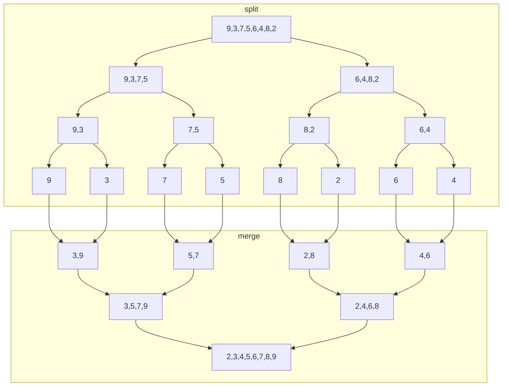

# Two way merge sort - iterative


{{ youtube 6pV2IF0fgKY }}

## Merge list


{{ ytime videoId="6pV2IF0fgKY" start="23" time="00:23" }} Merging is combining two sorted lists into a single sorted list

`a=[2,8,15,18]`

`b=[5,9,12,17]`

How can we combine them into a new sorted list `c`?

Create an index pointer for `a`,`b`, and `c`

{{ ytime videoId="6pV2IF0fgKY" start="84" time="01:24" }} Compare `a[i]` with `b[j]`

If `a[i]` is smaller than `b[j]`, copy `a[i]` into `c[k]` , then increment `i` and `k`

Repeat, and compare `a[i]` with `b[j]`, this time `b[j]` is smaller, so copy `b[j]` into `c[k]` and increment `j` and `k`.

Eventually, one of the lists will finish. When this happens, copy the remaining elements over from the unfinished list.

{{ ytime videoId="6pV2IF0fgKY" start="221" time="03:41" }} What is the time taken by this process? If one list has m elements, and the other has n elements, the time complexity is Θ(m+n), which is simplified to Θ(n)

### Algorithm for merge(a,b)


```js
function merge(a,b){
const i = 0;
const j = 0;
const k = 0;
const c = [];
while (i <= a.length && j <= b.length)
if (a[i] < b[j]){
  c[k]=a[i];
  i++;
} else {
  c[k]=b[j];
  j++;
}
k++
}
//copy remaining elements from a
for (; i<=a.length; i++){
c[k]=a[i];
k++;
}
//copy remaining elements from b
for (; j<=b.length; j++){
c[k]=b[j];
k++;
}
```

### Merging multiple lists - k-way-merge


`a=[4, 6, 12]`

`b=[3, 5, 9]`

`c=[8, 10, 16]`

`d=[2,4,18]`

{{ ytime videoId="6pV2IF0fgKY" start="632" time="10:32" }} it's called 4-way merge, k-way-merge, etc

There are multiple ways of doing this:

{{ ytime videoId="6pV2IF0fgKY" start="622" time="10:22" }} The first way is to merge the pairs of lists, then merge the merged lists

So we merge `a` and `b`, then we merge `c` and `d`, then we merge the merged lists


{{ ytime videoId="6pV2IF0fgKY" start="688" time="11:28" }} Or we can merge one list, then keep merging additional lists into it one at a time


## 2-way merge sort iterative


{{ ytime videoId="6pV2IF0fgKY" start="777" time="12:57" }} `a=[9,3,7,5,6,4,8,2]`

We need two sorted arrays for merging, but we can assume each element in the array is a single item list. In this there are 8 lists containing a single element. When there's a single element, the list is already sorted

We do two way merging, which is merging two lists at a time

{{ ytime videoId="6pV2IF0fgKY" start="876" time="14:36" }} Select first two "lists" `9 and 3` and merge into new list `[3,9]`

Continue first pass

`7 and 5` => `[5,7]`

`6 and 4` => `[4,6]`

`8 and 2` => `[2,8]`

{{ ytime videoId="6pV2IF0fgKY" start="934" time="15:34" }} So our first pass lists are `[3,9] [5,7] [4,6] [2,8]`

If there was a 9th element, it would be in a single item list

When we merge two lists, we store in a separate array

Now we merge our four lists

`[3,9] [5,7]` => `[3,5,7,9]`

`[4,6] [2,8]` => `[2,4,6,8]`

{{ ytime videoId="6pV2IF0fgKY" start="1042" time="17:22" }} Now in our third pass we merge the two sorted lists into the final list

`[3,5,7,9]` , `[2,4,6,8]` => `[2,3,4,5,6,7,8,9]`

{{ ytime videoId="6pV2IF0fgKY" start="1112" time="18:32" }} What is the time complexity? each pass does n amount of work

Each pass we reduce the number of lists by half. In this example there are 8 elements and 3 passes

8 elements divided by 2 is 4, then 4 divided by 2 is 2, then 2 elements divided by 2 is 1, then we stop

So when we divide by two each time, we do n work $log(n)$ times, so the time complexity is $n*log(n)$

# Merge sort algorithm - Recursive


{{ youtube mB5HXBb_HY8 }}

{{ ytime videoId="mB5HXBb_HY8" start="36" time="00:36" }} Merge sort is a recursive divide and conquer strategy, where we break down the solution into small problems, solve it, then combine the solutions to subproblems into the main problem

{{ ytime videoId="mB5HXBb_HY8" start="71" time="01:11" }} What is a small problem in merge sort? When there is just a single element

`arr = [9,3,7,5,6,4,8,2]`

## Algorithm


```js
function mergeSort(arr,lowIdx,highIdx){
if (lowIdx < highIdx){
  //there are at least two elements if they're not equal
  const midIdx = (lowIdx+highIdx)/2;
  mergeSort(arr,lowIdx,midIdx);
  mergeSort(arr,midIdx+1,highIdx);
  merge(arr,lowIdx,highIdx);
}
}
```



{{ ytime videoId="mB5HXBb_HY8" start="589" time="09:49" }} different than two way merge, where we take next two, next two, etc

{{ ytime videoId="mB5HXBb_HY8" start="1073" time="17:53" }} time complexity, assume overall time of function is T(n)

calculate mid is 1 unit of time

First mergeSort call is T(n/2)

Second mergeSort call is also T(n/2)

Merge call is n (linear)

Recurrence relation

$T(n) = \begin{cases} 1 & \text{when } n=1 \\ 2T(\frac{n}{2})+n & \text{when } n > 1 \end{cases}$

Using masters theorem:

a=2

b=2

f(n)=n

$log_b(a)=log_2(n)=1$

$n^k=n^1$

$log_2(2)=k$

{{ ytime videoId="mB5HXBb_HY8" start="1181" time="19:41" }} case 2 of masters theorem

Whatever f(n) is, multiply it by log(n), therefore $O(n*log(n))$

# Analysis


{{ youtube ak-pz7tS5DE }}

## Pros and cons of merge sort


### Pros


#### {{ ytime videoId="ak-pz7tS5DE" start="30" time="00:30" }} Good for very large lists


no other merges can handle this

#### {{ ytime videoId="ak-pz7tS5DE" start="124" time="02:04" }} Good for linked list


It uses merging, which works well for linked lists

can merge by adjusting the links, without creating new lists

#### External sorting


{{ ytime videoId="ak-pz7tS5DE" start="205" time="03:25" }} Can sort big files, like multi gb, by shuffling values into main memory, then putting them into a third file

#### Stable


{{ ytime videoId="ak-pz7tS5DE" start="317" time="05:17" }} consider when values are duplicated

`[8,6,4,3,8,5,9]`

More important for records that are "equal" but different

For example a list of records of students with their grades

If they're in a certain order in the original list, like two students with the same grade, they should remain in that order when sorted, even if they're equal

### Cons


#### {{ ytime videoId="ak-pz7tS5DE" start="446" time="07:26" }}  Extra space


Not in place sort

It requires extra space where the result has to be kept in a separate array

#### {{ ytime videoId="ak-pz7tS5DE" start="527" time="08:47" }} Slower for small lists


For example, insertion sort takes $O(n^2)$ and merge sort takes $O(nlog(n))$

However, when benchmarking we've found that insertion sort is faster

Insertion sort is faster when n < 15, also insertion sort is stable

Bubble sort is also stable, but insertion sort is better for linked lists

{{ ytime videoId="ak-pz7tS5DE" start="691" time="11:31" }} Recursive algorithms use a stack, and the stack size depends on the height of the merge tree. Height of merge sort is logn

Merge sort also uses auxilarry array, so space complexity is $O(n+log(n))$
