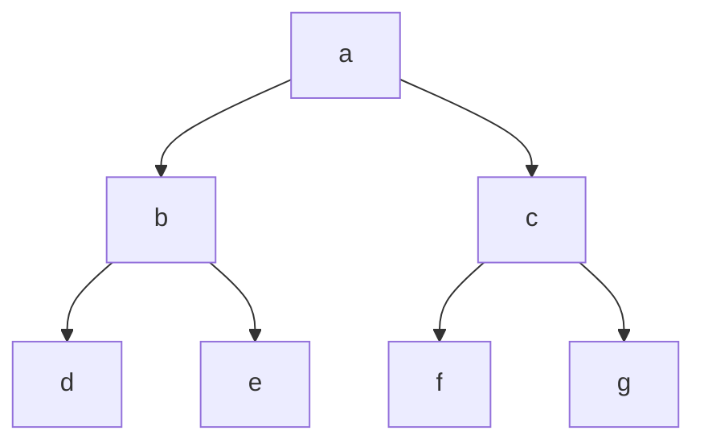
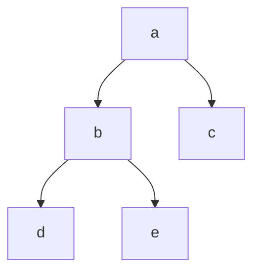
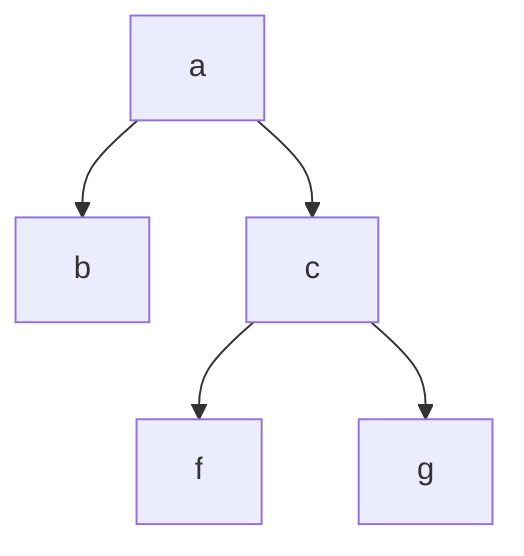

# Divide and Conquer


If a problem is large, divide the problem into subproblems, solve them, then recombine the solutions

The subproblems should be the same type of problems, for example, if the main problem is sorting, then the subproblems are sorting

## Examples of Divide and Conquer Problems

## [[binary search]]

## Finding Maximum and Minimum

## Merge Sort

## Quick Sort

## Strassen's Matrix Multiplication

# Recurrence Relation 1 (decreasing functions)



## Recursive function example

```js
function test(n){
	if (n> 0) {
	console.log(n);
	test(n-1);
    }
}
```

How many times is this function called?
`test(3)` -> prints "3"

`test(2)` -> prints "2"

`test(1)` -> prints "1"

`test(0)` -> does not print, or call itself again, since n is not greater than 0

Does work (printing) 3 times, but calls itself 4 times, where it doesn't print on the last time

If printing is one unit of time, then this takes 3 units of time

So if you pass `n` it will make `n+1` calls, and print `n` times

The time depends on the number of calls, so time complexity is $O(n)$

How do we find the recurrence relation?

$T(n) = \begin{cases} 1 & \text{when } n=1 \\ T(n-1)+1 & \text{when } n > 0 \end{cases}$

### $T(n)$ based on $T(n-1)$

The original equation

We know $T(n)=T(n-1)+1$

We can find $T(n)$ if we know $T(n-1)$

How do we find $T(n-1)$?

### $T(n)$ based on $T(n-2)$

Let's substitute $n-1$ into the equation for $T(n)$

Original equation $T(n)=T(n-1)+1$

Substitute $n-1$ in place of $n$ in the original equation for $T(n)$

$T(n-1)=T((n-1)-1)+1$

This simplifies to $T(n-1)=T(n-2)+1$

Now we can substitute $T(n-1)$ into the original equation for $T(n)$

$T(n) = [T(n-2)+1] +1$

This simplifies to $T(n) = T(n-2) +2$

So now $T(n)$ is in terms of $T(n-2)$ instead of being based on $T(n-1)$

### $T(n)$ based on $T(n-3)$

We can keep doing this

What about $T(n)$ in terms of $T(n-3)$?

Substitute $n-2$ into original equation

$T(n-2) = T((n-2) -1) + 1$

This simplifies to $T(n-2)=T(n-3)+1$

From before, we know how to write $T(n)$ in terms of $T(n-2)$, so we plug it in to find $T(n)$ in terms of $T(n-3)$

Previous equation: $T(n)=T(n-2)+2

Plug in $T(n-2)$ based on $T(n-3)$

$T(n) = [T(n-3) +1] + 2$

Simplifies to $T(n)=T(n-3)+3$

### General pattern

What if we wanted to continue for $k$ times?

We an see that the pattern is $T(n)=T(n-k)+k$

What is the smallest value we know, $T(0)=1$

Assume $n-k=0$

Therefore $n=k$

So when $(n-k)=0$ we can write the equation in terms of just $n$

$T(n)=T(n-n)+n$

Simplifies to $T(n)=T(0)+n

We know $T(0)=1$

So $T(n)=1+n$

## Recurrence Relation 2  (decreasing functions)



```js
function test(n){
  if (n>0){
    for (let i=0; i< n; i++){
      console.log(n);
    }
    test(n-1);
  }
}
```

Recurrence relation is $T(n) = T(n-1) + n$

$T(n) = \begin{cases} 1 & \text{when } n=1 \\ T(n-1)+n & \text{when } n > 0 \end{cases}$

For each iteration, it takes $n$ units of time, then calls itself -1

## Tree Method

[[draws/2022-12-01-13-33-20.excalidraw]]

We can see the amount of work is $n + (n-1) + (n-2) ... + 1$

To find the total amount of work we can use the [integer-sum-formula]()

$$\sum_{i=1}^n i = \frac{n(n + 1)}{2}$$

This simplifies to $O(n^2)$ for measuring time complexity

## Substitution Method

Original equation is $T(n) = T(n-1) + n$

Plug in $n-1$ into original equation $T$

$T(n-1)=T(n-2)+n-1$

Now we substitute this into the original equation to find $T(n)$ in terms of $T(n-2)$ instead of in terms of $T(n-1)$

$T(n)=[T(n-2)+n-1]+n$

Plug Plug in $n-2$ into original equation $T$

$T(n-2) = T(n-3) + n-2$

$T(n)=[T(n-3) + n-2] + (n-1) + n$

Simplify to

$T(n) = T(n-3) + (n-2) + (n-1) + n$

If we continue this for $k$ times

$T(n) = T(n-k) + (n - (k-1)) + (n - (k-2)) + ... + (n-1) + n$

Assume $n-k=0$ therefore $n=k$

Substitute $n$ for $k$

$T(n)=T(n-n) + T(n-n+1)+(n-n+2) + ... + (n-1) +n$

Simplify further

$T(n)=T(0) + 1 + 2 + 3 +... + (n-1) + n$

We can see $1 + 2 + 3 + (n-1) +n$ is the sum of natural numbers, which we can use the [integer-sum-formula]() to solve

$$\sum_{i=1}^n i = \frac{n(n + 1)}{2}$$

And we know $T(0) =1$

So the answer is $1 + \frac{n(n + 1)}{2}$

Which simplifies to $O(n^2)$ in Big O notation

# Recurrence Relation 3  (decreasing functions)



```js
function test(n){
  if (n>0){
    for (let i=1; i< n; i=i*2){
      console.log(n);
    }
    test(n-1);
  }
}
```

We know `(let i=1; i< n; i=i*2)` will execute $log(n)$ times

$T(n) = \begin{cases} 1 & \text{when } n=0 \\ T(n-1)+ log(n) & \text{when } n > 0 \end{cases}$

## Tree Method

[[draws/2022-12-05-15-12-40.excalidraw]]

Amount of work is $log(n) + log(n-1) + ... + log(2) + log(1)$

$log[n*(n-1) * log(n-2) ... + log(2) + log(1)]$

$log(n!)$ -> log n factorial

Equivalent to $O(nlog(n))$

## Substitution method

$T(n)=T(n-1) + log(n)$

Plug in n-2

$T(n)=[T(n-2)+log(n-1)] + log(n)$

$T(n)= [T(n-3)+log(n-2)]+log(n-1) + log(n)$

Assume $n-k=0$, therefore $n=k$

$T(n)=T(n-k) + log(1) + log(2) + ... + log(n-1) + log(n)$

Simplifies to

$T(n) = T(0) + log(n!)$

$T(n) = 1 + log(n!)$

$O(n log(n))$

## Directly Get Answer

We can see these patterns of Big O notation based on the recurrence relation

$T(n)=T(n-1) + 1$ -> $O(n)$

$T(n) = T(n-1) + n$ -> $O(n^2)$

$T(n) = T(n-1) + log(n)$ -> $O(nlog(n))$

$T(n) = T(n-1) + n^2$ -> $O(n^3)$

Just multiply the term after the + by n, since you know it will be repeated n times via recursion

What if it's not decreasing by 1? It still works

$T(n) = T(n-2) + 1 -> $n/2$ -> $O(n)$

$T(n) = T(n-100) + n$ -> $O(n^2)$

However, if there's a coeffecient on the function ,it's different though. $T(n) = 2*T(n-1) +1$

# Recurrence Relation 4 (decreasing)

```js
function test(n){
  if (n>0){
    console.log(n);
    test(n-1);
    test(n-1);
  }
}
```

$T(n)=2T(n-1)+1$

$T(n) = \begin{cases} 1 & \text{when } n=0 \\ 2T(n-1)+1 & \text{when } n > 0 \end{cases}$

## Tree Method

[[draws/2022-12-06-13-53-46.excalidraw]]

function called twice in first row

4 times in second row

8 times in third row

So the work done in each row is $2^k$

$1 + 2 + 2^2 + 2^3 + ... + 2^k = n^{k+1}-1$

$$a + ar + ar^2 + ar^3 + ... + ar^k = \frac{a(r^{k+1}-1)}{r-1} $$

In the series above, $a=1$ and $r=2$

So we can use the formula above to find the answer for our tree

$$ \frac{1(2^{k+1}-1)}{2-1} $$

Simplifies to $2^{k+1}-1$

Assume $n-k=0$, so $n=k$

$2^{n+1}-1$

So Big O is $O(2^n)$

## Subsitution Method

$T(n)=2T(n-1) + 1$

$T(n)=2[2T(n-2) +1] + 1$

$T(n) = 2^2T(n-2) + 2 + 1$

$T(n)=2^2[2T(n-3) +1] + 2 + 1$

$T(n) = 2^3 T(n-3) + 2^2 + 2 + 1$

$T(n)= 2^kT(n-k) + 2^{k-1}+2^{k-2} + ... + 2^2 + 2 + 1$

Assume $n-k=0$ $n=k$

$T(n) = 2^n T(0) + 1 + 2 + 2^2 + ... + 2^{k-1}$

$T(n) = 2^n * 1 + 2^k -1$

$T(n) = 2^n + 2^n -1$

$T(n) = 2^{n+1}-1$

$O(2^n)$

# Master's Theorem Decreasing Function



$T(n)=T(n-1) + 1$ -> $O(n)$

$T(n) = T(n-1) + n$ -> $O(n^2)$

$T(n) = T(n-1) + log(n)$ -> $O(nlog(n))$

$T(n) = 2T(n-1) + 1$ -> $O(2^n)$

$T(n) = 3T(n-1) + 1$ -> $O(3^n)$

$T(n) = 2T(n-1) + n$ -> $O(n * 3^n)$

## Master's Theorem

General form of recurrence relation

$T(n)=aT(n-b)+f(n)$

Assume

$a>0$

$b > 0$

$f(n)=O(n^k)$ where $k ≥ 0$

### Case 1  $a=1$

For example $T(n)=T(n-1) + 1$

Then $O(n^{k+1})$

also can be thought of as $O(n*f(n))$

### Case 2 $a>1$

For example $T(n) = 2T(n-1) + 1$

Then $O(n^k * a^n)$

### Case 3 $a>1$

If you're decreasing by more than 1, for example  $T(n) = 2T(n-2) + 1$

Then $O(n^k * a^{\frac{n}{b}})$

What if $a<1$  for example .5

Then $O(n^k)$ or $O(f(n))$

# Recurrence Relation 1 (Dividing)



```js
function test(n){
  if (n>1){
    console.log(n);
    test(n/2);
  }
}
```

When a function takes a parameter n, it can make it smaller by either subtracting like $n-1$ or dividing like $n/2$ or $\sqrt{n}$

Amount of work is $T(n)=T(n/2) + 1$

## Recurrence Relation Dividing

$T(n) = \begin{cases} 1 & \text{when } n=1 \\ 2T(n/2)+n & \text{when } n > 1 \end{cases}$

## Tree Method

[[draws/2022-12-09-14-05-14.excalidraw]]

1 unit of work per level, k steps, which is how many levels

Assume $\frac{n}{2^k}=1$

Simplify to $n=2^k$

Then simplify again to $k=log_2(n)$, which is the number of levels

Since there's one unit of work per level, the number of levels is the total units of work

$O(log(n))$

## Substitution Method

Original Equation $T(n)=T(n/2)+1$

Plug in $n/2$

$T(n/2)=T(n/2^2) + 1$

$T(n)=[T(n/2^2)+1]+1$

$T(n)=T(n/2^2) + 2$

$T(n)=T(n/2^3) + 3$

Generalized to

$T(n)=T(n/2^k)+k$

Assume $\frac{n}{2^k}=1$

$n=2^k$ and $k=log(n)$

$T(n)=T(1)+log(n)$

$T(n) = 1 + log(n)$

Answer $O(log(n)$

# Recurrence Relation 2 (Dividing)



## Recurrence Relation

$T(n) = \begin{cases} 1 & \text{when } n=1 \\ T(n/2)+n & \text{when } n > 1 \end{cases}$

## Tree Method


Each level does $\frac{n}{2^k}$ amount of work

So for each level, $n + \frac{n}{2} + \frac{n}{2^2} + \frac{n}{2^3} + ... + \frac{n}{2^k}$

$\displaystyle n \sum_{i=0}^k \frac{1}{2^i}$

This simplifies to n * 1

so answer is $O(n)$

## Substitution Method

$T(n)=T(n/2)+n$

$T(n)=[T(n/2^2) + n/2 ]+ n$

$T(n)=T(n/2^2) + n/2 + n$

$T(n)=T(n/2^3) + n/2^2 + n/2 + n$

$T(n) = T(n/2^k)+T(n/2^{k-1}) + T(n/2^{k-2}) + ... + n/2 + n$

Assume $\frac{n}{2^k}=1$

$n=2^k$

$k=log(n)$

$T(n) = T(1) + n[\frac{1}{2^{k-1}} + \frac{1}{2^{k-2}} + ... + 1/2 + 1]$

$T(n) = 1 + n[1 + 1]$

$T(n) = 1 + 2n$

Answer $O(n)$

# Recurrence Relation 3 (Dividing)

``` js
function test(n){
  if (n>1){
    for (let i=0; i< n; i++){
      console.log(n);
    }
    test(n/2);
    test(n/2)
  }
}
```

The recurrence relation is $T(n)=2T(n/2) + n$

$T(n) = \begin{cases} 1 & \text{when } n=1 \\ 2T(n/2)+n & \text{when } n 1 0 \end{cases}$

## Tree Method

[[draws/2022-12-04-19-48-18.excalidraw]]

Each row adds up to $n$ amount of work

2nd row as 2 $n/2$s

3rd row has 4 $n/4$s

each row is $\frac{n}{2^k}$

How many rows are there? and in each row how much work is being done?

so n work being done k times

Assume $\frac{n}{2^k}=1$

$n=2^k$

$k=log(n)$

So total amount of work is $n*log(n)$

## Substitution Method

$T(n)=2T(n/2)+n$

Plug in $(n/2)$

$T(n/2)=2T(n/2^2) + n/2$

Substitute $T(n/2)$ into the original equation

$T(n) = 2[2T(n/2^2) + n/2] + n$

Repeat for k times

$T(n)=2^k * T(\frac{n}{2^k}) + kn$

Assume $T(\frac{n}{2^k})=T(1)$

$\frac{n}{2^k}=1$

$k=log(n)$

# Master's Theorem Dividing 1



$T(n)=a * T(\frac{n}{b}) + f(n)$

Assume $a>=1$ and $b>1$

$f(n)=O(n^k*log(n)^p)$

## Case 1

if $log_b(a) > k$ then $O(n^{log_b(a)})$

## Case 2

if $log_b(a) = k$

### Case 2.1

if $p>-1$ then $O(n^k*log(n)^{p+1})$

### Case 2.2

if $p = -1$ then $O(n^k*log(log(n))$

### Case 2.3

if $p <-1$ then $O(n^k)$

## Case 3

if $log_b(a) > k$

### Case 3.1

if $p>=0$ then $O(n^k*log(n)^p)$

### Case 3.2

if $p <0$ then $O(n^k)$

## Examples

### Case 1

### Example 1

$T(n) = 2T(n/2)+1$

$a=2$

$b=2$

$f(n)=O(1)$

$f(n)=O(n^0*log(n)^0)$

$k=0$, $p=0$

$log_2(2)=1$ which is bigger than $k$ so it is case 1

$O(n^1)$

### Example 2

$T(n)=4T(n/2)+n$

$log_2(4)=2$, $k=1$, $p=0$

$log_2(4) = 2$ which is bigger than k (1) so case 1

$O(n^2)$

### Example 3

$T(n)=8T(n/2)+n$

$log_2(8)=3$ > $k=1$

Also case 1, so $O(n^3)$

### Example 4

$T(n)=8T(n/2)+n^2$

$log_2(8)=3$ > $k=2$

Still case 1, so $O(n^3)$

### Example 5

$T(n)=9T(n/3)+1$

$log_3(9)=2$ > $k=0$

case 1, so $O(n^2)$

### Case 2

### Example 1

$T(n)=2T(n/2)+n$

$log_2(2)=1$ and $k=1$

They're equal so case 2

No $log(n)$ in $f(n)$, which is just $n$ (original formula $f(n)=O(n^k*log(n)^p)$

so $p=0$

$O(n*log(n))$

### Example 2

$T(n)=4T(n/2)+n^2$

$log_2(4)=2$ and $k=2$

They're equal so case 2

so $p=0$

$O(n^2*log(n))$

### Example 3

$T(n)=4T(n/2)+n^2*log(n)$

$log_2(4)=2$ and $k=2$

They're equal so case 2

so $p=1$

$O(n^2*log(n)^2)$

### Example 4

$T(n)=8T(n/2)+n^3$

$log_2(8)=3$ and $k=3$

They're equal so case 2

so $p=0$

$O(n^3*log(n))$

### Example 5

$T(n)=2T(n/2)+\frac{n}{log(n)}$

Remember $\frac{n}{log(n)}$ is the same as $n*log(n)^{-1}$

$log_2(2)=1$ and $k=1$

They're equal so case 2

In this case $p=-1$ since it's in denominator

So case 2.2

$O(n*log(log(n))$

### Example 6

$T(n)=2T(n/2)+\frac{n}{log(n)^2}$

Remember $\frac{n}{log(n)}$ is the same as $n*log(n)^{-2}$

$log_2(2)=1$ and $k=1$

They're equal so case 2

In this case $p=-2$ since it's in denominator

So case 2.3

$O(n^1)$ or $O(n)$

### Case 3

### Example 1

$T(n)=T(n/2) + n^2$

$log_2(1) = 0$ < $k=2$

So case 3.1

So $O(n^2)$

### Example 2

$T(n)=T(n/2) + n^2*log(n)$

$log_2(3) = 2$ < $k=2$

So case 3.1, take the entire $f(n)$

So $O(n^2*log(n))$

### Example 3

If log is in denominator, then case 3.2

$T(n)=T(n/2) + \frac{n^3}{log(n)}$

$log_2(3) = 2$ < $k=2$

So case 3.2, so just take $n^3$

So $O(n^3)$

# Master's Theorem Dividing 2



## Case 1 Examples

$T(n)=2T(n/2)+1$ -> $O(n^1)$

$T(n)=4T(n/2)+1$ -> $O(n^2)$

$T(n)=4T(n/2)+n^1$ -> $O(n^2)$

$T(n)=8T(n/2) + n^2$ -> $O(n^3)$

$T(n)=16T(n/2)+n^2$ -> $O(n^4)$

## Case 2

$T(n)=T(n/2) + 1$ -> $O(log(n)$

$T(n)=2T(n/2) + n$ -> $O(n*log(n))$

$T(n) = 2T(n/2) + n*log(n)$ -> $O(n*log(n)^2)$

$T(n) = 4T(n/2) +n^2$ -> $O(n^2*log(n))$

$T(n)=2T(n/2) + {n*log(n)}^2$ -> $O(n^2*log(n)^3)$

$T(n) = 2T(n/2) + \frac{n}{log(n)}$ -> $O(n*log(log(n))$

$T(n) = 2T(n/2) + \frac{n}{log(n)^2}$ -> $O(n)$


## Case 3

$T(n)=T(n/2)+n^1$ -> $O(n)$

$T(n) = 2T(n/2) + n^2$ -> $O(n^2)$

$T(n) = 2T(n/2) + n^2*log(n)$ -> $O(n^2*log(n))$

$T(n)=4T(n/2) + n^3*log(n)^2$ -> $O(n^3*log(n)^2)$

$T(n)=2T(n/2)+ \frac{n^2}{log(n)}$ -> $O(n^2)$

# Root Function (Recurrence Relation)



``` js
function test(n){
  if(n>2) {
    stmt
    test(Math.sqrt(n))
  }
```

$T(n) = \begin{cases} 1 & \text{when } n=2 \\ T(\sqrt{n})+1 & \text{when } n > 2 \end{cases}$

$T(n)=T(n^{\frac{1}{2}})+1$

$T(n)=T(n^{\frac{1}{2^2}})+2$

$T(n)=T(n^{\frac{1}{2^3}})+3$

Continue for k times

$T(n)=T(n^{\frac{1}{2^k}})+k$

Assume n is in powers of 2

$T(2^m)=T(2^{\frac{m}{2^k}}) + k$

Assume $T(n^{\frac{m}{2^k}}=T(2^1)$

$\frac{m}{2^k}=1$

$m=2^k$ and $k=log_2(m)$

$n=2^m$ and $m=log_2(n)$

$k=log(log_2(n))$

$O(log(log_2(n))$

# Binary Search Iterative



You can do binary search recursively or iteratively

[00:25](https://youtu.be/C2apEw9pgtw?t=25) binary search uses the divide and conquer strategy
Divide and conquer is breaking problem into subproblems, then combine them to get solution to main problem

[00:50](https://youtu.be/C2apEw9pgtw?t=50) List must be in sorted order to perform binary search

[01:17](https://youtu.be/C2apEw9pgtw?t=77) We need two index pointers, `low` and `high`

Suppose we want to search for key element 42 in this list

`[3,6,8,12,14,17,25,29,31,36,42,47,53,55,62]`

`middle` is the floor of $\frac{\text{low} + \text{high}}{2}$

His examples used starting index of 1, but I changed it to index starting at 0 in these notes. I also changed end index to length-1


`low` is index 0 and `high` is index 14, so `mid` is 7

The number at index 7 is 29

[02:43](https://youtu.be/C2apEw9pgtw?t=163) The number 42 which we're searching for is greater than 29, so  the new `low` becomes `mid + 1`, which is 8;

Now `low` = 8 and `high` = `14`

$\frac{8+14}{2} = 11$ so the new `mid` is 11

[03:22](https://youtu.be/C2apEw9pgtw?t=202) The number at index 11 is 47

The number 42 which we're searching for is less than `7`, so the new `high` becomes `mid - 1`, which is 10

Now `low` = 8 and `high`=10

$\frac{8+10}{2} = 9$ so the new `mid` is 9

The number at index 9 is 36

[04:03](https://youtu.be/C2apEw9pgtw?t=243) The number 42 which we're searching for is greater than 36, so  the new `low` becomes `mid + 1`, which is 10;

Now both `low` = 10 and `high`= 10

$\frac{10+10}{2} = 10$ so the new `mid` is 10

[04:44](https://youtu.be/C2apEw9pgtw?t=284) The number at index 10 is 42, which is the number we're searching for.

[04:52](https://youtu.be/C2apEw9pgtw?t=292)  How many comparisons have we done? 4

If we had been doing linear search it would have taken 11 comparisons

 This implementation has a subtle bug, where it fails for very large arrays. See this [blog post](https://ai.googleblog.com/2006/06/extra-extra-read-all-about-it-nearly.html) about this bug.

`int mid =(low + high) / 2;` (incorrect)
vs
`int mid = low + ((high - low) / 2);` (correct)
 

## Implementation

```js
//returns index of value or -1
function binarySearch(array, key){
  let low=0;
  let high = array.length-1;
  const mid = (low+high)/2;
  while (low <= high){
  if (array[mid]===key){
    return mid;
  } else if (key < array[mid]){
  	high = mid-1;
  } else {
    low = mid+1;
  }
  }
  return -1;
}
```

## Visualize as Binary Search Tree

[13:35](https://youtu.be/C2apEw9pgtw?t=815) This can be arranged as a binary search tree


What is the worst case number of comparisons when searching for an element?

If you don't find it, you'll search until you reach the bottom of the tree.

The height of the tree is $log_2(n)$ where n is the number of elements

[18:43](https://youtu.be/C2apEw9pgtw?t=1123) So if there are 16 elements then $log_2(16)=4$ , so the height of the tree is 4 levels and the worst case number of comparisons will be 4

So worst case is $O(log(n))$ and best case is $O(1)$, when the element you're looking for is the root.

# Binary Search Recursive



`[3,6,8,12,14,17,25,29,31,36,42,47,53,55,62]`

When using divide and conquer, we divide into smaller problems then recombine

So we should define what defines a "small" problem when using divide and conquer

In this case a "small" problem is when there is only a single element, or when `low` and `high` are equal.

Then when we have a single element, if the element is the target value, otherwise return -1

If the problem is large we make it smaller based on some logic.

```js
function recursiveBinarySearch(array, key, low, high){
	if (low === high){
      if (array[low]===key){
        return low;
      } else {
        return -1;
      }
    } else {
      const mid = (low + high)/2;
      if (array[mid]===key){
        return mid;
      } else if (key < array[mid]){
        return recursiveBinarySearch(array, key, low, mid-1);
      } else {
        return recursiveBinarySearch(array, key, mid+1, high);
      }
    }
}
```

## Recurrence Relation

[04:57](https://youtu.be/uEUXGcc2VXM?t=297) Calculating mid, checking if `mid` = `key`, and checking if `array[mid]` is greater or less than target each take one unit of time.

[05:08](https://youtu.be/uEUXGcc2VXM?t=308) When calling the recursive function it called itself with $T(n/2)$

[05:26](https://youtu.be/uEUXGcc2VXM?t=326) When list size is one, it just makes one comparation, so each is one unit of time

$T(n) = \begin{cases} 1 & \text{when } n=1 \\ T(\frac{n}{2})+1 & \text{when } n > 1 \end{cases}$

By applying master's theorem, we know the time complexity is $O(log(n))$

We use case 2 from the master's theorem

We can think of the recurrence relation as $T(n)=1*T(\frac{n}{2}) + 1$

Remember the master's theorem $T(n)=a * T(\frac{n}{b}) + f(n)$

In this equation $a=1$ and $b=2$

$log_1(2)=0$

The $f(n)$ from the master's theorem is $1$ in this equation, because $n^0$, so we know $k$ is 0 and $p$ is 0

if $log_b(a) = k$ is true, $log_1(2)=0$,  so we know it's case 2

$p>-1$ so we know it's case 2.1 of master's theorem

Case 2.1 is  $O(n^k*log(n)^{p+1})$

$O(n^0*log(n)^{0+1})$

$O(1 * log(n)^1)$

$O(log(n))$

# Heap - Heap Sort - Heapify - Priority Queues



## Array Representation of Binary Tree

`[a,b,c,d,e,f,g]`



[03:01](https://youtu.be/HqPJF2L5h9U?t=181) You can store a binary tree as an array

When storing a binary tree we need store the elements as well as the relationship between the element


## Binary Tree Representation Formula

He uses an array index starting at 1, but I converted it to an array with a 0 index


if a node is at index `i`

the left child is at index `2*i+1`

The right child is at index `2*i+2`

The parent is at `Math.floor((i-1)/2)`

## Examples

[04:05](https://youtu.be/HqPJF2L5h9U?t=245) what is the left child of `b` which is at index 1?

The left child index is `2*1+1` = 3, and the element at index 3 is `d`

[04:27](https://youtu.be/HqPJF2L5h9U?t=267) What is the right child of `b` which is at index 1?

The right child index is `2*1+2` = 4, and the element at index 4 is `e`

[04:56](https://youtu.be/HqPJF2L5h9U?t=296) What is the parent of `f` which is at index 5?

The parent child index is `Math.floor((5-1)/2)` = 2, and the element at index 2 is `c`

You can also think about filling them level by level

### Missing nodes at the end



`[a,b,c,d,e]`

leave out the missing elements at the end.

### Gaps

[05:58](https://youtu.be/HqPJF2L5h9U?t=358) Imagine filling it level by level, but leave a gap



`[a,b,c,null,null,d,e]`

children of b are missing, so leave a gap

## Complete Binary Tree

### Full Binary Tree


[07:30](https://youtu.be/HqPJF2L5h9U?t=450) a Full binary tree has the maximum number of nodes for its height, you can't add another node without increasing its height

[08:17](https://youtu.be/HqPJF2L5h9U?t=497) The number of nodes in a full binary tree with height $h$ is $2^{h+1}-1$

### Complete Binary Tree

[08:32](https://youtu.be/HqPJF2L5h9U?t=512) When represented as an array, a complete binary tree doesn't have any gaps

#### Complete Binary Tree Example


Its array representation is `[a,b,c,d,e,f,g]` and it has no gaps, so it's a complete binary tree

#### Non complete binary tree


[08:52](https://youtu.be/HqPJF2L5h9U?t=532) Its array representation is`[a,b,c,null,null,d,e]` and has gaps, so it is not a complete binary tree.

Every full binary tree is also a complete binary tree

## Heap

## Insert and Delete

## Heap Sort

## Heapify

## Priority Queue
