# Heap - Heap Sort - Heapify - Priority Queues



## Array Representation of Binary Tree

`[a,b,c,d,e,f,g]`

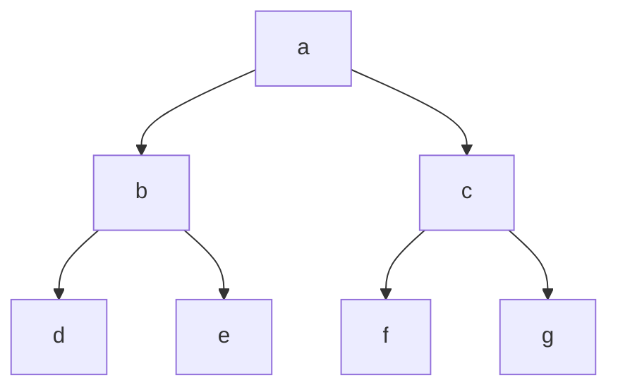

 You can store a binary tree as an array

When storing a binary tree we need store the elements as well as the relationship between the element

## Binary Tree Representation Formula

He uses an array index starting at 1, but I converted it to an array with a 0 index


if a node is at index `i`

the left child is at index `2*i+1`

The right child is at index `2*i+2`

The parent is at `Math.floor((i-1)/2)`

## Examples

 what is the left child of `b` which is at index 1?

The left child index is `2*1+1` = 3, and the element at index 3 is `d`

 What is the right child of `b` which is at index 1?

The right child index is `2*1+2` = 4, and the element at index 4 is `e`

 What is the parent of `f` which is at index 5?

The parent child index is `Math.floor((5-1)/2)` = 2, and the element at index 2 is `c`

You can also think about filling them level by level

### Missing nodes at the end

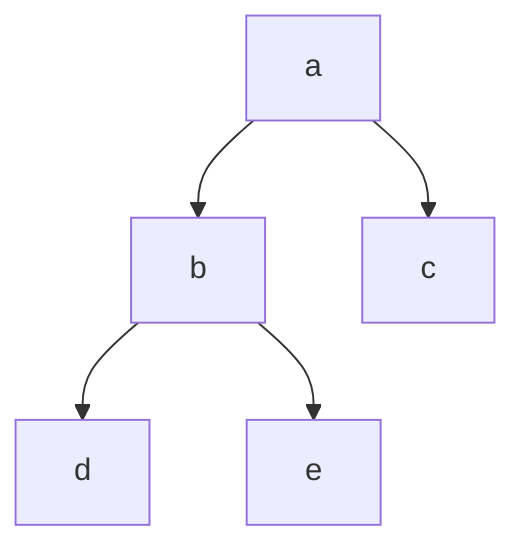

`[a,b,c,d,e]`

leave out the missing elements at the end.

### Gaps

 Imagine filling it level by level, but leave a gap

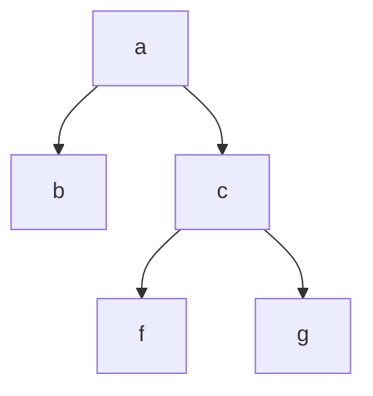

`[a,b,c,null,null,d,e]`

children of b are missing, so leave a gap

## Complete Binary Tree

### Full Binary Tree


 a Full binary tree has the maximum number of nodes for its height, you can't add another node without increasing its height

 The number of nodes in a full binary tree with height $h$ is $2^{h+1}-1$

### Complete Binary Tree

 When represented as an array, a complete binary tree doesn't have any gaps

#### Complete Binary Tree Example


Its array representation is `[a,b,c,d,e,f,g]` and it has no gaps, so it's a complete binary tree

#### Non complete binary tree


 Its array representation is`[a,b,c,null,null,d,e]` and has gaps, so it is not a complete binary tree.

Every full binary tree is also a complete binary tree

## Heap

  A heap is a complete binary tree

Max heap is a complete binary tree where every node is greater than or equal than its descendants. The largest node is the root

Min heap is a complete binary tree where every node is smaller than it's descendants. The smallest node is the root.

## Insert

 We want to insert an element into a max heap

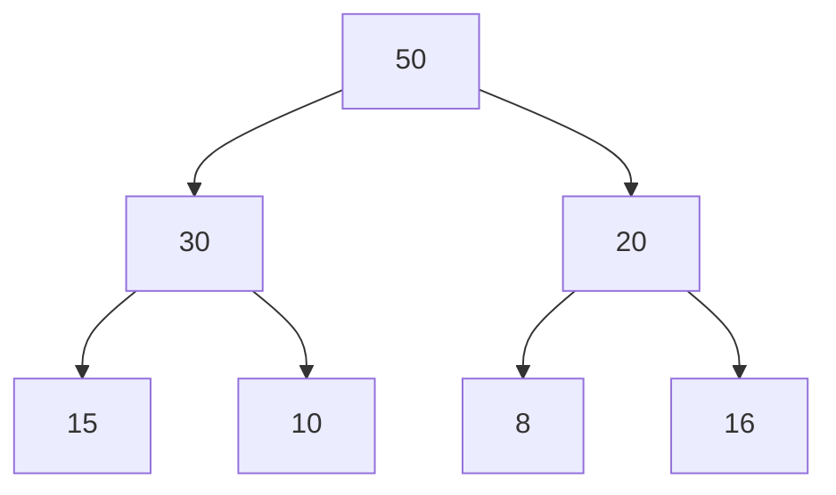

Array representation = `[50,30,20,15,10,8,16]`

Let's try inserting `60`

The root should have the largest element so the root should be `60`

We need to maintain completeness while inserting

 We start by inserting `60` at the end of the array, which corresponds to the bottom left element of the complete binary tree. `[50,30,20,15,10,8,16,60]`

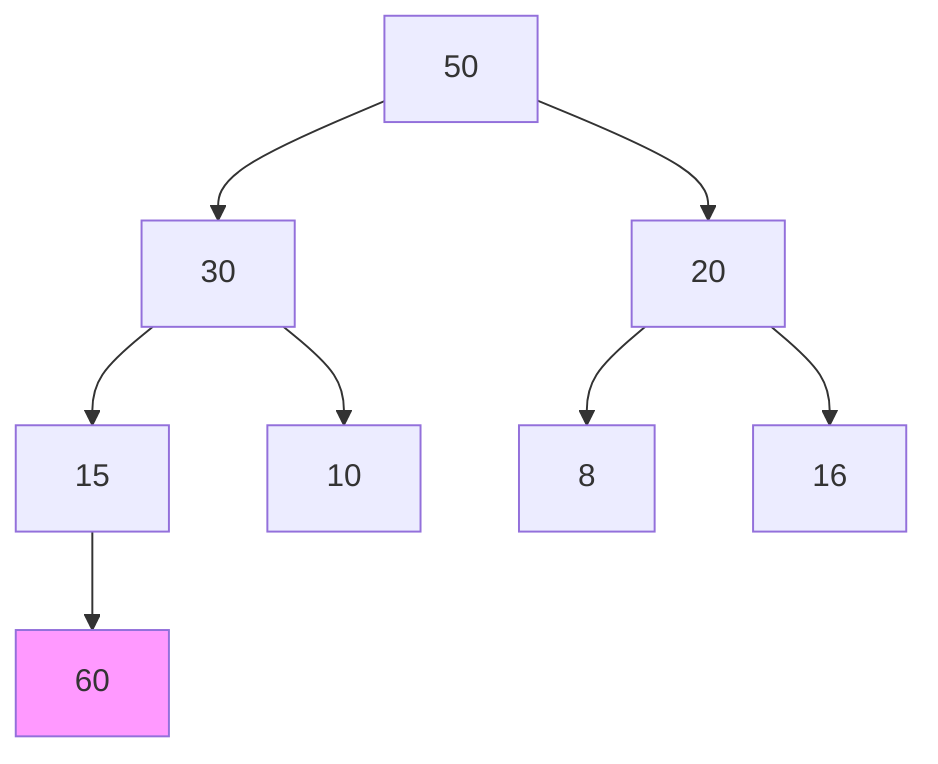

Swap upward with parents until the correct height

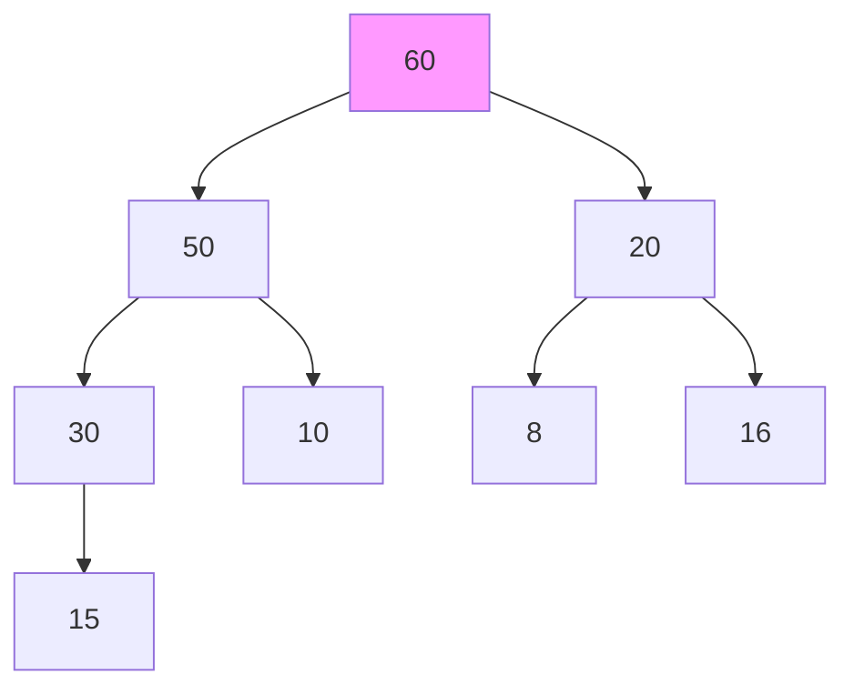

`[60,50,20,30,10,8,16,15]`

We add new element as leaf, then adjusts it's ancestors upward

 How much time does it take? The maximum number of swaps, which is the height of a complete binary tree, which is $O(log(n))$

## Delete

 You should only delete root element

Imagine picking an apple at the top of a pyramid at the supermarket

We delete `50`


`[50,30,20,15,10,8,16]`

Remove 50, and replace with last element of the binary tree, 16

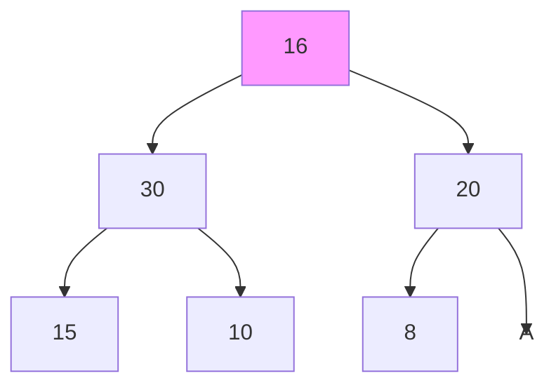

 Now we adjust the elements from the root towards leaf, maintaining complete binary property

Check 16's child elements, which child is greater? `30` so swap with `30`

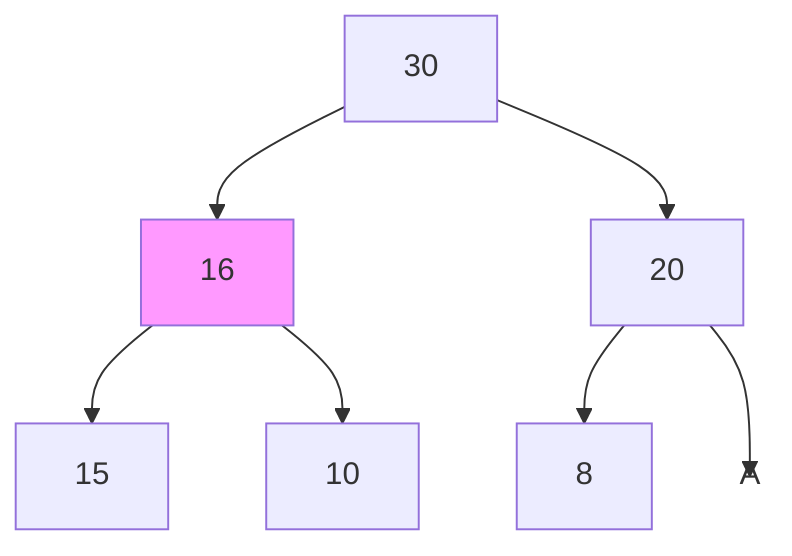

Check 16's child elements, which child is greater? `15` so swap with `15`

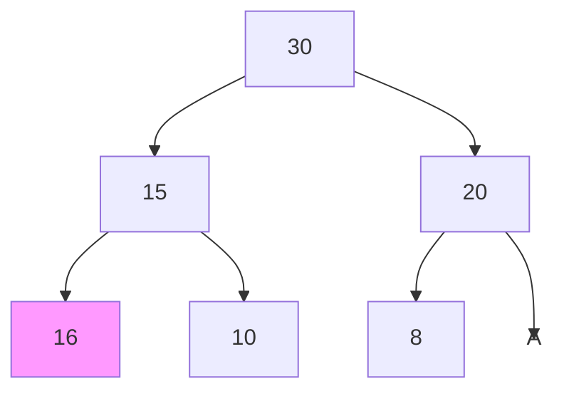

## Heap Sort

 If you keep deleting, the next largest element goes to the top in max heap. In min heap the next smallest comes to the top

After deleting the largest element, we have a "free space" at the end

Before deleting

`[50,30,20,15,10,8,16]`

After deleting

`[30,10,20,15,10,8,null]`

 We can keep the element we removed at at the end of the array to preserve it

`[30,10,20,15,10,8,50]`

Let's delete again, removing 30

`[20,16,10,15,8,null,50]`

But we preserve 30 at the end of the heap

`[20,16,10,15,8,30,50]`

We can see that we're sorting the array by deleting the largest element, and filling it in at the free space at the end of the new array

### How to do heap sort

 Heap sort has two steps, create a heap from an array by inserting the elements one by one

Then delete the elements one by one

### Heap Sort Example

### Create Heap

 These are the unsorted set of elements `[10,20,15,30,40]`

Assume `10` is the root of the heap

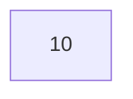

Now insert second element `20`

`[10,20]`

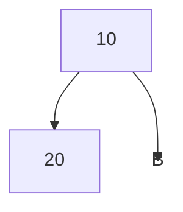

Compare with ancestor, 20 is greater, so swap

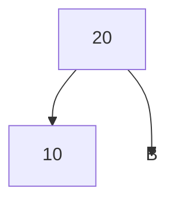

`[20,10]`

Now insert the third element `15`

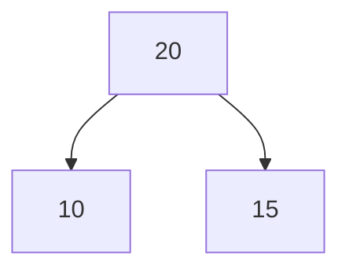

Compare with parent, it's smaller, so we don't need to adjust

`[20,10,15]`

Now insert the fourth element `30`

`[20,10,15,30]`

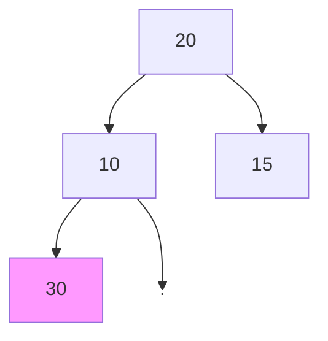

Adjust the element by comparing to parent, greater than 10 so swap

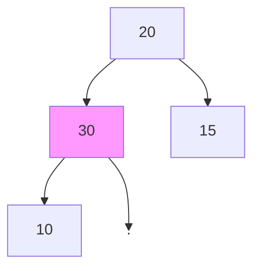

Adjust the element by comparing to parent, greater than 20 so swap

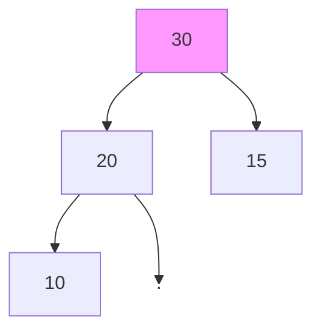

Sorted, so now elements are `[30,20,15,10]`

Now insert the fifth element `40`

`[30,20,15,10,40]`

```mermaid
graph TD
A[30]-->B[20]
A[30]-->D[15]
B[20]-->E[10]
B[20]-->C[40]
style C fill:#f9f
```

Compare with parent and swap upward

```mermaid
graph TD
A[30]-->B[20]
A[30]-->D[15]
B[40]-->E[10]
B[40]-->C[20]
style B fill:#f9f
```

Swap upward again

```mermaid
graph TD
A[40]-->B[20]
A[40]-->D[15]
B[30]-->E[10]
B[30]-->C[20]
style A fill:#f9f
```

Now the heap is `[40,20,15,10,20]`

Every element was inserted at next free space and moved upward

We inserted n elements, each element was moved up the height of the binary tree

So we have $n$ elements moved up by height $log(n)$ so time complexity to build heap is $n*log(n)$

### Delete all elements

```mermaid
graph TD
A[40]-->B[20]
A[40]-->D[15]
B[30]-->E[10]
B[30]-->C[20]
```

`[40,20,15,10,20]`

 40 gets deleted and 20 takes it's place at the root

```mermaid
graph TD
A[20]-->B[30]
A[20]-->D[15]
B[30]-->E[10]
B[30]-->C[.]
style A fill:#f9f
style C display: none
```

`[20,30,15,10]`

Now we need to adjust the binary tree by swapping downward

 Check where of the children of 20 are greater, than swap

`30` is greater, so swap `20` and `30`

```mermaid
graph TD
A[30]-->B[20]
A[30]-->D[15]
B[20]-->E[10]
B[20]-->C[.]
style B fill:#f9f
style C display: none
```

Compare `20` with `10`, don't need to swap

`[30,20,15,10]` `[40]`, keeping `40` at the end

```mermaid
graph TD
A[30]-->B[20]
A[30]-->D[15]
B[20]-->E[10]
B[20]-->C[.]
style C display: none
```

 `30` get's deleted and the last element `10` takes its place at the root

```mermaid
graph TD
A[10]-->B[20]
A[10]-->D[15]
style A fill:#f9f
style C display: none
```

`[10,20,15]`

Now adjust by comparing with children

Swap `10`, with `20`

```mermaid
graph TD
A[20]-->B[10]
A[20]-->D[15]
style B fill:#f9f
style C display: none
```

Now this is in map heap form, so we stop

`20,10,15` and our reserved elements `[30,40]`

```mermaid
graph TD
A[20]-->B[10]
A[20]-->D[15]
style C display: none
```

Now we delete `20` and replace with `15`

```mermaid
graph TD
A[15]-->B[10]
A[15]-->C[.]
style C display: none
style A fill:#f9f
```

We don't need to adjust since the child is smaller

`15,10` is the new heap and our reserved elements `[20,30,40]`

```mermaid
graph TD
A[15]-->B[10]
A[15]-->C[.]
style C display: none
```

Now delete `15` and replace with `10`

```mermaid
graph TD
A[10]
style C display: none
```

We don't need to adjust since there's just one element

Our heap is `[10]` and our reserved elements at the end are `[15,20,30,40]`

So together now the array is sorted `10,15,20,30,40`

## Heapify

 Heapify is a procedure for creating a heap from a binary tree

```mermaid
graph TD
10-->20
10-->15
20-->12
20-->40
15-->25
15-->18
```

Array representation `[10,20,15,12,40,25,18]`

 It's similar to creating a heap from scratch. Before we saw when creating a heap from scratch, we insert from the root and adjust down. However, in heapify we adjust upwards.

We start with a complete binary tree, but it isn't a max heap

 In heapify we go from right to left, instead of left to right in creating a heap

 When going from right to left, we adjust downward, similar to deletion

 Start with element `18` and look at it's descendents. It's a leaf with no children, so alone it is a heap. Continuing on we see the same with `25`, `40`, and `12`

 We get to `15` and adjust downards. We compare it to it's children and swap. Which child is greater? `25` is greater, so we swap with `15`. `25` goes up and `15` goes down, in its place

```mermaid
graph TD
10-->20
10-->25
20-->12
20-->40
25-->15
25-->18
style 25 fill:#f9f
```

 Now we're on `20`, Compare with children. `40` is greater, so swap `20` with `40`

```mermaid
graph TD
10-->40
10-->25
40-->12
40-->20
25-->15
25-->18
style 40 fill:#f9f
```

 Now we get to the first element, the root

 We compare 40 with it's children, and swap 10 with 40

```mermaid
graph TD
40-->10
40-->25
10-->12
10-->20
25-->15
25-->18
style 40 fill:#f9f
```

 We continue heapifying down, and check `10`'s children. `20` is greater so we swap with `10`

```mermaid
graph TD
40-->20
40-->25
20-->12
20-->10
25-->15
25-->18
style 20 fill:#f9f
```

 What is the time taken by heapify? $O(n)$

 The earlier procedure for creating a heap was $O(n*log(n))$, which is slower than heapify

## Priority Queue

 Elements have priority, and inserted and deleted based on element

 Elements with the highest priority is removed

 In a numeric array, the priority is based on the number itself

 We can say that the highest priority is the smallest number, or we can say the largest number has the highest priority, depending on the use case. We can do either method of priority

 The time for insert or delete for a a regular array is $O(n)$ because we have to shift the elements

 The time for insert or delete for a priority queue is $O(log(n))$ which is faster than a normal array


